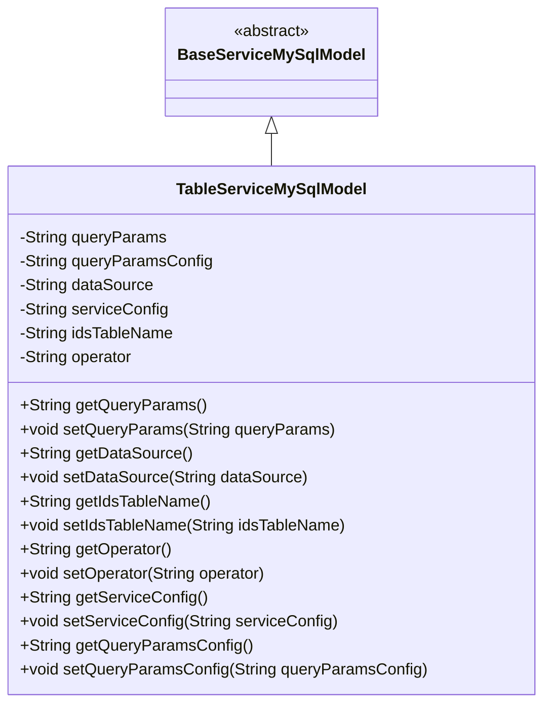

# 基础信息

|      |      |
|------|------|
| 名称 | TableServiceMySqlModel |
| 编码语言 | .java |
| 代码路径 | WeFe/serving/serving-service/src/main/java/com/welab/wefe/serving/service/database/entity/TableServiceMySqlModel.java |
| 包名 | com.welab.wefe.serving.service.database.entity |
| 依赖项 | ['javax.persistence.Column', 'javax.persistence.Entity', 'javax.persistence.Table'] |
| 概述说明 | 表服务MySQL模型类，包含查询参数、数据源、服务配置等字段，用于存储JSON格式的配置信息及操作者等数据。 |

# 说明

这是一个名为TableServiceMySqlModel的Java实体类，映射到数据库表table_service。它继承自BaseServiceMySqlModel，包含六个主要字段：queryParams存储查询参数配置，queryParamsConfig存储查询配置描述，dataSource和serviceConfig以JSON格式存储SQL配置，idsTableName记录关联表名，operator存储操作者信息。所有字段都有对应的getter和setter方法，并标注了数据库列映射关系。

# 类列表 Class Summary

| 名称   | 类型  | 说明 |
|-------|------|-------------|
| TableServiceMySqlModel | class | MySQL表服务实体类，包含查询参数配置、SQL配置、操作者等字段，用于存储JSON格式数据源和服务配置信息。 |

## 类 TableServiceMySqlModel

|      |      |
|------|------|
| 访问范围 | @Entity(name = "table_service");@Table(name = "table_service");public |
| 类型 | class |
| 名称 | TableServiceMySqlModel |
| 说明 | MySQL表服务实体类，包含查询参数配置、SQL配置、操作者等字段，用于存储JSON格式数据源和服务配置信息。 |

### UML类图

这段代码描述了一个名为TableServiceMySqlModel的实体类，它继承自BaseServiceMySqlModel基类。该类主要用于存储和操作与数据库表服务相关的配置信息，包括查询参数、数据源配置、服务配置等字段，每个字段都有对应的getter和setter方法。类上使用了JPA的@Entity和@Table注解，表明这是一个数据库实体类，映射到名为"table_service"的数据库表。所有字段都通过@Column注解与数据库表的列进行映射，其中包含JSON格式的数据存储字段。

### 内部方法调用关系图

```mermaid
graph TD
    A["类TableServiceMySqlModel"]
    B["继承: BaseServiceMySqlModel"]
    C["属性: String queryParams"]
    D["属性: String queryParamsConfig"]
    E["属性: String dataSource"]
    F["属性: String serviceConfig"]
    G["属性: String idsTableName"]
    H["属性: String operator"]
    I["方法: getQueryParams()"]
    J["方法: setQueryParams(String)"]
    K["方法: getDataSource()"]
    L["方法: setDataSource(String)"]
    M["方法: getIdsTableName()"]
    N["方法: setIdsTableName(String)"]
    O["方法: getOperator()"]
    P["方法: setOperator(String)"]
    Q["方法: getServiceConfig()"]
    R["方法: setServiceConfig(String)"]
    S["方法: getQueryParamsConfig()"]
    T["方法: setQueryParamsConfig(String)"]

    A --> B
    A --> C
    A --> D
    A --> E
    A --> F
    A --> G
    A --> H
    A --> I
    A --> J
    A --> K
    A --> L
    A --> M
    A --> N
    A --> O
    A --> P
    A --> Q
    A --> R
    A --> S
    A --> T
```

这段代码定义了一个名为TableServiceMySqlModel的实体类，继承自BaseServiceMySqlModel，主要用于数据库表table_service的映射。类中包含7个私有属性，分别对应数据库表中的列，每个属性都有对应的getter和setter方法。这些属性包括查询参数配置(queryParams)、查询配置参数描述(queryParamsConfig)、数据源配置(dataSource)、服务配置(serviceConfig)、ID表名(idsTableName)和操作者(operator)。所有属性都通过JPA注解与数据库表字段进行映射。

### 字段列表 Field List

| 名称  | 类型  | 说明 |
|-------|-------|------|
| operator | String | 数据库字段映射：operator属性对应表中的operator列。 |
| serialVersionUID = -151994449884740867L | long | 定义了一个私有静态不可变的序列化版本ID，值为-151994449884740867L。 |
| dataSource | String | 定义私有字符串变量dataSource，映射数据库列名data_source。 |
| queryParamsConfig | String | 数据库字段映射，存储查询参数配置的字符串类型私有变量。 |
| queryParams | String | 数据库字段映射：queryParams对应表列query_params，类型为String。 |
| idsTableName | String | 数据库字段映射：私有字符串变量idsTableName对应表列名ids_table_name。 |
| serviceConfig | String | 数据库字段映射：serviceConfig对应表列service_config，类型为String。 |

### 方法列表

| 名称  | 类型  | 说明 |
|-------|-------|------|
| setIdsTableName | void | 设置ID表名称的方法，将参数值赋给类成员变量idsTableName。 |
| setDataSource | void | 定义方法setDataSource，用于设置类成员变量dataSource的值。 |
| setQueryParams | void | 这是一个Java方法，用于设置类的queryParams成员变量值。方法接受一个字符串参数，并将其赋值给类的queryParams属性。 |
| getIdsTableName | String | 获取idsTableName的方法，返回字符串类型的表名。 |
| getOperator | String | 获取操作符的方法，返回operator字符串。 |
| getDataSource | String | 获取数据源的方法，返回字符串类型的数据源变量。 |
| getQueryParams | String | 获取查询参数字符串的方法。 |
| setOperator | void | 这是一个Java方法，用于设置operator变量的值。方法接受一个字符串参数operator，并将其赋值给类的成员变量this.operator。 |
| getServiceConfig | String | 获取服务配置字符串的方法。 |
| setServiceConfig | void | 这是一个Java方法，用于设置类的serviceConfig属性值。方法接收一个字符串参数，并将其赋值给类的成员变量。 |
| getQueryParamsConfig | String | 获取查询参数配置的方法，返回字符串类型的queryParamsConfig。 |
| setQueryParamsConfig | void | 这是一个Java方法，用于设置查询参数配置的字符串值。方法名为setQueryParamsConfig，接受一个字符串参数queryParamsConfig，并将其赋值给类的同名成员变量。 |

