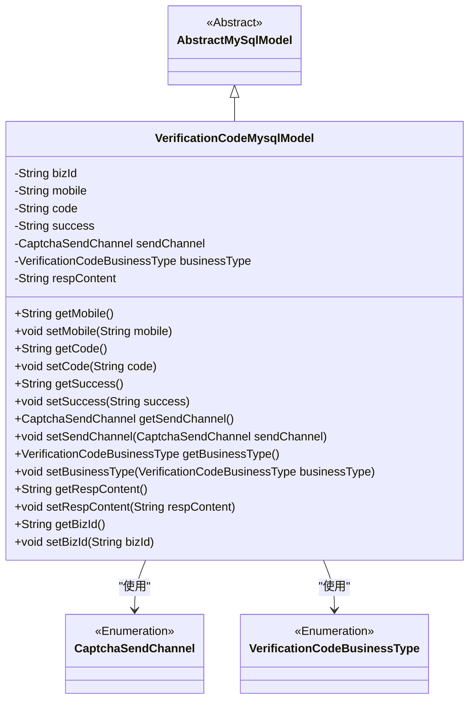

# 基础信息

|      |      |
|------|------|
| 名称 | VerificationCodeMysqlModel |
| 编码语言 | .java |
| 代码路径 | WeFe/serving/serving-service/src/main/java/com/welab/wefe/serving/service/database/entity/VerificationCodeMysqlModel.java |
| 包名 | com.welab.wefe.serving.service.database.entity |
| 依赖项 | ['com.welab.wefe.common.verification.code.common.CaptchaSendChannel', 'com.welab.wefe.common.verification.code.common.VerificationCodeBusinessType', 'javax.persistence.Entity', 'javax.persistence.EnumType', 'javax.persistence.Enumerated'] |
| 概述说明 | 这是一个验证码实体类，包含业务ID、手机号、验证码、发送状态、发送渠道、业务类型和响应内容等字段，用于存储和管理验证码相关信息。 |

# 说明

该内容定义了一个名为VerificationCodeMysqlModel的JPA实体类，用于存储验证码相关信息。实体包含业务ID、手机号、验证码、发送状态、发送渠道、业务类型及响应内容等字段。其中发送渠道和业务类型使用枚举类型存储。类提供了各字段的getter和setter方法，并继承自AbstractMySqlModel基类。该实体映射到数据库表verification_code。

# 类列表 Class Summary

| 名称   | 类型  | 说明 |
|-------|------|-------------|
| VerificationCodeMysqlModel | class | 验证码实体类，包含业务ID、手机号、验证码、发送状态、发送渠道、业务类型及响应内容等字段。 |

## 类 VerificationCodeMysqlModel

|      |      |
|------|------|
| 访问范围 | @Entity(name = "verification_code");public |
| 类型 | class |
| 名称 | VerificationCodeMysqlModel |
| 说明 | 验证码实体类，包含业务ID、手机号、验证码、发送状态、发送渠道、业务类型及响应内容等字段。 |

### UML类图

这段代码定义了一个名为VerificationCodeMysqlModel的实体类，用于存储验证码相关信息，继承自抽象类AbstractMySqlModel。该类包含多个字段如业务ID、手机号、验证码、发送状态等，并提供了对应的getter和setter方法。其中sendChannel和businessType是枚举类型字段，分别表示验证码发送渠道和业务类型。该类通过JPA注解标记为数据库实体，用于持久化存储验证码数据。

### 内部方法调用关系图

```mermaid
graph TD
    A["类VerificationCodeMysqlModel"]
    B["继承: AbstractMySqlModel"]
    C["属性: String bizId"]
    D["属性: String mobile"]
    E["属性: String code"]
    F["属性: String success"]
    G["属性: CaptchaSendChannel sendChannel"]
    H["属性: VerificationCodeBusinessType businessType"]
    I["属性: String respContent"]
    J["方法: getMobile/setMobile"]
    K["方法: getCode/setCode"]
    L["方法: getSuccess/setSuccess"]
    M["方法: getSendChannel/setSendChannel"]
    N["方法: getBusinessType/setBusinessType"]
    O["方法: getRespContent/setRespContent"]
    P["方法: getBizId/setBizId"]

    A --> B
    A --> C
    A --> D
    A --> E
    A --> F
    A --> G
    A --> H
    A --> I
    A --> J
    A --> K
    A --> L
    A --> M
    A --> N
    A --> O
    A --> P
```

这段代码定义了一个名为VerificationCodeMysqlModel的实体类，用于存储验证码相关信息。该类继承自AbstractMySqlModel，包含多个属性如bizId、mobile、code等，以及对应的getter和setter方法。其中sendChannel和businessType是枚举类型属性，分别表示验证码发送渠道和业务类型。该类主要用于持久化验证码数据到MySQL数据库，提供了完整的数据访问接口。

### 字段列表 Field List

| 名称  | 类型  | 说明 |
|-------|-------|------|
| respContent | String | 私有字符串变量respContent。 |
| serialVersionUID = -2617756476649365818L | long | 声明一个私有静态不可变的长整型序列化版本ID。 |
| bizId | String | 私有字符串类型变量bizId |
| businessType | VerificationCodeBusinessType | 定义枚举类型字段businessType，使用字符串值存储。 |
| sendChannel | CaptchaSendChannel | 枚举类型字段sendChannel，使用字符串形式存储枚举值。 |
| success | String | 私有字符串变量success |
| code | String | 私有字符串变量code。 |
| mobile | String | 声明一个私有字符串变量mobile。 |

### 方法列表

| 名称  | 类型  | 说明 |
|-------|-------|------|
| getCode | String | 这是一个Java方法，返回字符串类型的code变量值。 |
| setRespContent | void | 设置响应内容的方法，将参数respContent赋值给类的respContent成员变量。 |
| setSendChannel | void | 设置发送验证码的通道方法，参数为发送通道类型。 |
| getRespContent | String | 获取响应内容的公共方法，返回字符串类型变量respContent。 |
| setBusinessType | void | 设置业务类型的方法，参数为VerificationCodeBusinessType类型，赋值给当前对象的businessType属性。 |
| getSendChannel | CaptchaSendChannel | 获取验证码发送通道的方法。 |
| setSuccess | void | 定义了一个公共方法setSuccess，用于设置字符串类型的success属性值。 |
| getSuccess | String | 获取成功状态的方法，返回字符串类型的success值。 |
| getMobile | String | 获取手机号的方法，返回字符串类型变量mobile。 |
| getBusinessType | VerificationCodeBusinessType | 获取业务类型的方法，返回VerificationCodeBusinessType对象。 |
| setCode | void | 设置字符串类型的code值。 |
| setMobile | void | 定义了一个公共方法setMobile，用于设置mobile属性的值。 |
| getBizId | String | 方法返回字符串类型变量bizId的值。 |
| setBizId | void | 设置业务ID的方法，将参数bizId赋值给当前对象的bizId字段。 |

