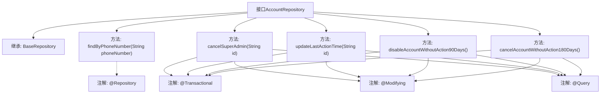

# 基础信息

|      |      |
|------|------|
| 名称 | AccountRepository |
| 编码语言 | .java |
| 代码路径 | WeFe/serving/serving-service/src/main/java/com/welab/wefe/serving/service/database/repository/AccountRepository.java |
| 包名 | com.welab.wefe.serving.service.database.repository |
| 依赖项 | ['org.springframework.data.jpa.repository.Modifying', 'org.springframework.data.jpa.repository.Query', 'org.springframework.stereotype.Repository', 'org.springframework.transaction.annotation.Transactional', 'com.welab.wefe.serving.service.database.entity.AccountMySqlModel', 'com.welab.wefe.serving.service.database.repository.base.BaseRepository'] |
| 概述说明 | AccountRepository接口扩展BaseRepository，提供通过手机号查询账号、取消超级管理员权限、更新最后操作时间、禁用90天未活动账号及注销180天未活动账号的功能。 |

# 说明

AccountRepository是一个继承BaseRepository的接口，包含多个账户管理操作。提供按手机号查询账户功能，支持取消超级管理员权限和更新最后操作时间。还包含定时任务方法：自动禁用90天未活动的账户（标记为禁用并添加审核备注），以及自动注销180天未活动的账户（标记为注销并添加审核备注）。所有更新操作均使用事务管理并自动清除缓存。

# 类列表 Class Summary

| 名称   | 类型  | 说明 |
|-------|------|-------------|
| AccountRepository | interface | AccountRepository接口扩展BaseRepository，提供通过手机号查询账号、取消超级管理员权限、更新最后操作时间、禁用90天未活动账号及注销180天未活动账号的功能。 |


## 类 AccountRepository

|      |      |
|------|------|
| 访问范围 | @Repository;public |
| 类型 | interface |
| 名称 | AccountRepository |
| 说明 | AccountRepository接口扩展BaseRepository，提供通过手机号查询账号、取消超级管理员权限、更新最后操作时间、禁用90天未活动账号及注销180天未活动账号的功能。 |


### UML类图

```mermaid
classDiagram
    class BaseRepository~T, ID~ {
        <<Interface>>
    }

    class AccountRepository {
        <<Interface>>
        +AccountMySqlModel findByPhoneNumber(String phoneNumber)
        +void cancelSuperAdmin(String id)
        +void updateLastActionTime(String id)
        +int disableAccountWithoutAction90Days()
        +int cancelAccountWithoutAction180Days()
    }

    BaseRepository <|-- AccountRepository : 继承
    // AccountRepository 接口扩展了 BaseRepository，提供了针对账户管理的数据库操作
    // 包含按手机号查询、取消管理员权限、更新最后操作时间、自动禁用和注销不活跃账户等功能
```

类图描述：该图展示了AccountRepository接口继承BaseRepository泛型接口的层级关系。AccountRepository作为数据访问层接口，提供了5个核心方法：通过手机号查询账户、取消超级管理员权限、更新最后操作时间、自动禁用90天未活动账户、自动注销180天未活动账户。所有方法都涉及数据库修改操作，并通过注解实现了事务管理和SQL语句定制。


### 内部方法调用关系图



该流程图展示了AccountRepository接口的结构和功能。接口继承自BaseRepository，包含5个核心方法：按手机号查询账户、取消超级管理员权限、更新最后操作时间、禁用90天未活动账户和注销180天未活动账户。每个数据库修改操作都标注了@Transactional、@Modifying和@Query注解，体现了Spring Data JPA的声明式事务管理特性。流程图清晰呈现了接口的继承关系、方法定义和注解应用，特别突出了涉及账户状态变更的定时任务方法。

### 字段列表 Field List

| 名称  | 类型  | 说明 |
|-------|-------|------|

### 方法列表

| 名称  | 类型  | 说明 |
|-------|-------|------|
| cancelAccountWithoutAction180Days | int | 使用原生SQL更新长时间未操作的账户，标记为取消并添加审核备注，返回影响行数。 |
| findByPhoneNumber | AccountMySqlModel | 通过手机号查询账户信息的MySQL模型方法。 |
| updateLastActionTime | void | 使用原生SQL更新账户最后操作时间，自动清除缓存，支持事务。 |
| disableAccountWithoutAction90Days | int | 使用原生SQL更新90天无操作账户，设置enable为false并添加audit_comment标记，自动清除缓存。 |
| cancelSuperAdmin | void | 取消指定ID账户的超管和管理角色。使用事务注解确保操作原子性，自动清除缓存。 |


