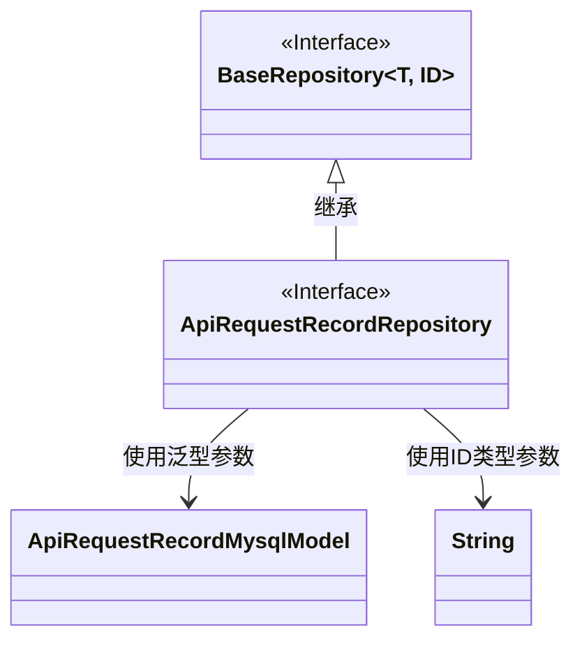
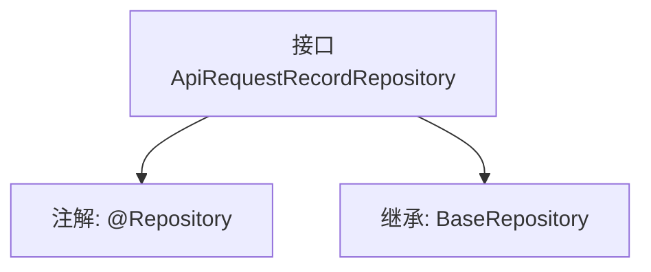

# 基础信息

|      |      |
|------|------|
| 名称 | ApiRequestRecordRepository |
| 编码语言 | .java |
| 代码路径 | WeFe/serving/serving-service/src/main/java/com/welab/wefe/serving/service/database/repository/ApiRequestRecordRepository.java |
| 包名 | com.welab.wefe.serving.service.database.repository |
| 依赖项 | ['com.welab.wefe.serving.service.database.entity.ApiRequestRecordMysqlModel', 'com.welab.wefe.serving.service.database.repository.base.BaseRepository', 'org.springframework.stereotype.Repository'] |
| 概述说明 | 接口ApiRequestRecordRepository继承BaseRepository，用于操作ApiRequestRecordMysqlModel数据，主键类型为String。 |

# 说明

该内容定义了一个名为ApiRequestRecordRepository的Spring数据仓库接口，使用@Repository注解标识。该接口继承自BaseRepository泛型基类，指定了实体类型为ApiRequestRecordMysqlModel，主键类型为String。这表明它是一个用于操作数据库表的基础数据访问层组件，专用于处理ApiRequestRecordMysqlModel类型数据的持久化操作。

# 类列表 Class Summary

| 名称   | 类型  | 说明 |
|-------|------|-------------|
| ApiRequestRecordRepository | interface | 接口ApiRequestRecordRepository继承BaseRepository，用于操作ApiRequestRecordMysqlModel数据，主键类型为String。 |

## 类 ApiRequestRecordRepository

|      |      |
|------|------|
| 访问范围 | @Repository;public |
| 类型 | interface |
| 名称 | ApiRequestRecordRepository |
| 说明 | 接口ApiRequestRecordRepository继承BaseRepository，用于操作ApiRequestRecordMysqlModel数据，主键类型为String。 |

### UML类图

这段类图展示了ApiRequestRecordRepository接口继承自泛型接口BaseRepository的关系。BaseRepository是一个带有两个泛型参数(T和ID)的接口，ApiRequestRecordRepository通过继承并指定T为ApiRequestRecordMysqlModel、ID为String来实现具体化。图中清晰呈现了接口间的继承关系以及泛型参数的具体类型绑定，体现了Spring Data JPA中Repository接口的典型设计模式。

### 内部方法调用关系图

这段代码定义了一个Spring Data JPA的Repository接口，用于操作数据库中的ApiRequestRecordMysqlModel实体。该接口通过@Repository注解标记为Spring管理的组件，并继承了BaseRepository接口，从而获得了基础的CRUD操作方法。BaseRepository的泛型参数指定了实体类型为ApiRequestRecordMysqlModel，主键类型为String。这种设计遵循了Spring Data的规范，无需实现具体方法即可获得标准数据库操作能力。

### 字段列表 Field List

| 名称  | 类型  | 说明 |
|-------|-------|------|

### 方法列表

| 名称  | 类型  | 说明 |
|-------|-------|------|

