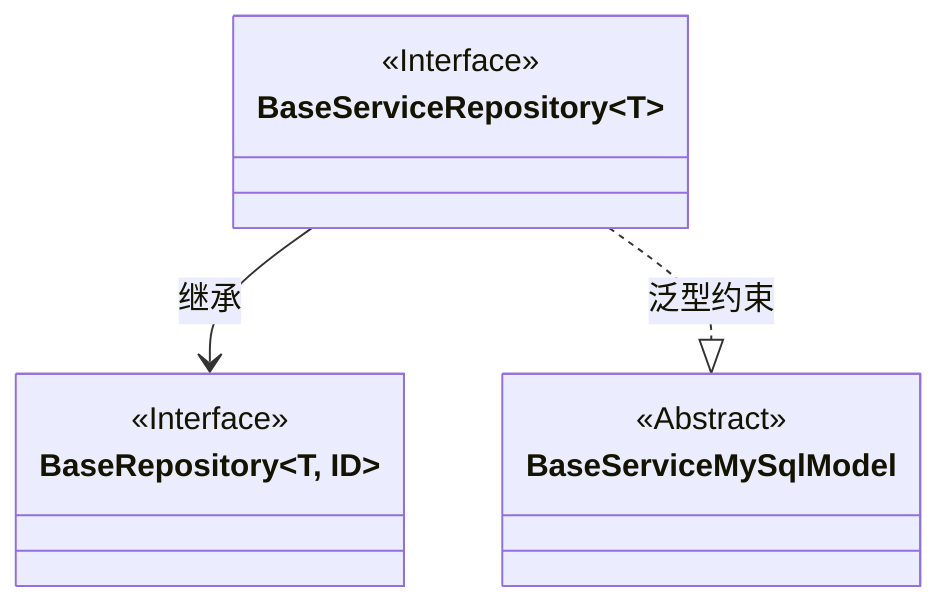
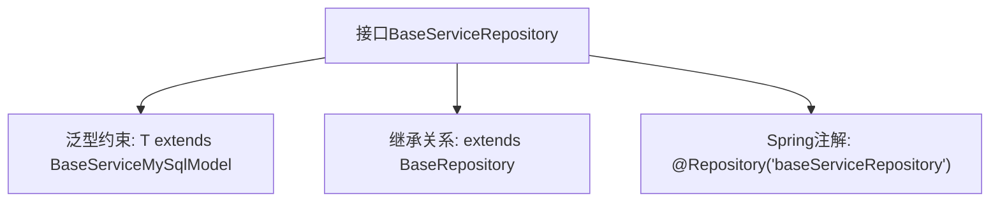

# 基础信息

|      |      |
|------|------|
| 名称 | BaseServiceRepository |
| 编码语言 | .java |
| 代码路径 | WeFe/serving/serving-service/src/main/java/com/welab/wefe/serving/service/database/repository/BaseServiceRepository.java |
| 包名 | com.welab.wefe.serving.service.database.repository |
| 依赖项 | ['org.springframework.stereotype.Repository', 'com.welab.wefe.serving.service.database.entity.BaseServiceMySqlModel', 'com.welab.wefe.serving.service.database.repository.base.BaseRepository'] |
| 概述说明 | 接口BaseServiceRepository继承BaseRepository，泛型T需继承BaseServiceMySqlModel，使用@Repository注解命名。 |

# 说明

该内容定义了一个名为BaseServiceRepository的Java接口，使用@Repository注解标记为Spring的仓库组件，并指定了组件名称为"baseServiceRepository"。该接口继承自BaseRepository泛型接口，限定泛型类型T必须继承自BaseServiceMySqlModel类，同时指定主键类型为String。这是一个典型的Spring Data仓库接口定义，用于数据库操作。

# 类列表 Class Summary

| 名称   | 类型  | 说明 |
|-------|------|-------------|
| BaseServiceRepository | interface | 接口BaseServiceRepository继承BaseRepository，泛型T需继承BaseServiceMySqlModel，使用@Repository注解命名为baseServiceRepository。 |

## 类 BaseServiceRepository

|      |      |
|------|------|
| 访问范围 | @Repository("baseServiceRepository");public |
| 类型 | interface |
| 名称 | BaseServiceRepository |
| 说明 | 接口BaseServiceRepository继承BaseRepository，泛型T需继承BaseServiceMySqlModel，使用@Repository注解命名为baseServiceRepository。 |

### UML类图

这段类图展示了BaseServiceRepository接口继承自BaseRepository接口，并使用泛型约束T必须继承BaseServiceMySqlModel。BaseRepository是一个泛型接口，接受类型参数T和ID，而BaseServiceRepository通过@Repository注解标记为Spring仓库组件。图中清晰体现了接口间的继承关系和泛型约束，其中BaseServiceMySqlModel作为抽象基类约束了泛型参数T的类型范围。

### 内部方法调用关系图

该流程图展示了BaseServiceRepository接口的结构，它是一个带泛型参数的Spring数据仓库接口。通过@Repository注解声明为Spring组件，并继承自BaseRepository基类，其中泛型T被约束为BaseServiceMySqlModel的子类，主键类型固定为String。这种设计常用于实现基于Spring Data的通用数据库操作模板。

### 字段列表 Field List

| 名称  | 类型  | 说明 |
|-------|-------|------|

### 方法列表

| 名称  | 类型  | 说明 |
|-------|-------|------|

