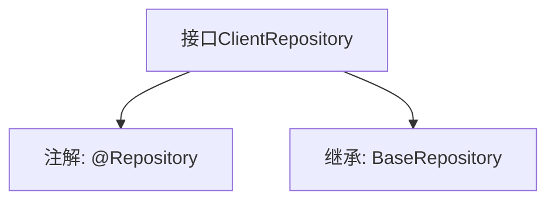

# 基础信息

|      |      |
|------|------|
| 名称 | ClientRepository |
| 编码语言 | .java |
| 代码路径 | WeFe/serving/serving-service/src/main/java/com/welab/wefe/serving/service/database/repository/ClientRepository.java |
| 包名 | com.welab.wefe.serving.service.database.repository |
| 依赖项 | ['com.welab.wefe.serving.service.database.entity.ClientMysqlModel', 'com.welab.wefe.serving.service.database.repository.base.BaseRepository', 'org.springframework.stereotype.Repository'] |
| 概述说明 | 客户端仓库接口，继承基础仓库类，操作ClientMysqlModel实体，主键类型为String。 |

# 说明

该内容定义了一个名为ClientRepository的Spring数据仓库接口，使用@Repository注解标记。该接口继承自BaseRepository泛型基类，指定了实体类型为ClientMysqlModel，主键类型为String。这表明它是一个用于操作ClientMysqlModel实体数据的持久层组件，遵循Spring Data的仓库模式设计。

# 类列表 Class Summary

| 名称   | 类型  | 说明 |
|-------|------|-------------|
| ClientRepository | interface | 客户端数据仓库接口，继承基础仓库类，操作ClientMysqlModel实体，主键类型为String。 |


## 类 ClientRepository

|      |      |
|------|------|
| 访问范围 | @Repository;public |
| 类型 | interface |
| 名称 | ClientRepository |
| 说明 | 客户端数据仓库接口，继承基础仓库类，操作ClientMysqlModel实体，主键类型为String。 |


### UML类图

```mermaid
classDiagram
    class BaseRepository~T, ID~ {
        <<Interface>>
    }
    class ClientRepository {
        <<Interface>>
    }
    BaseRepository <|-- ClientRepository : 继承
    // ClientRepository 继承自泛型接口 BaseRepository，指定 ClientMysqlModel 和 String 作为类型参数
```

这段类图展示了 ClientRepository 接口继承自泛型接口 BaseRepository 的关系。BaseRepository 是一个带有两个类型参数 T 和 ID 的泛型接口，而 ClientRepository 通过继承将其特化为使用 ClientMysqlModel 和 String 作为具体类型参数。这种设计允许 ClientRepository 复用 BaseRepository 定义的通用数据访问方法，同时保持类型安全性。


### 内部方法调用关系图



该流程图展示了Spring Data JPA中一个典型的Repository接口定义。ClientRepository通过@Repository注解标记为持久层组件，并继承BaseRepository获得基础CRUD操作能力，泛型参数指定实体类型为ClientMysqlModel、主键类型为String。这种设计遵循了Spring Data的"接口即实现"范式，无需手动编写实现类即可自动生成数据库操作逻辑。

### 字段列表 Field List

| 名称  | 类型  | 说明 |
|-------|-------|------|

### 方法列表

| 名称  | 类型  | 说明 |
|-------|-------|------|


