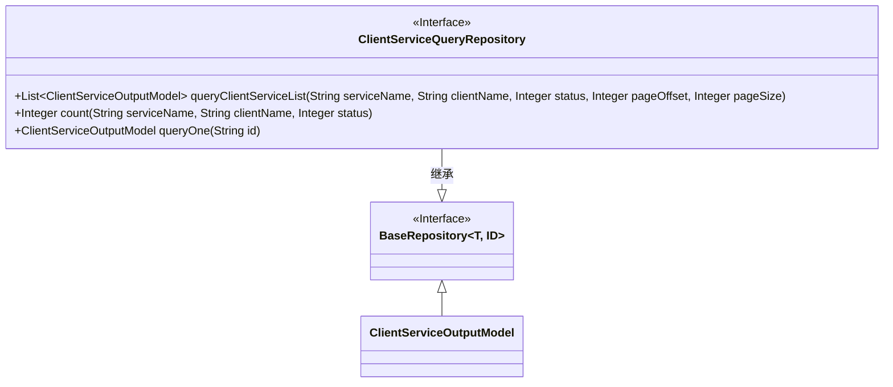
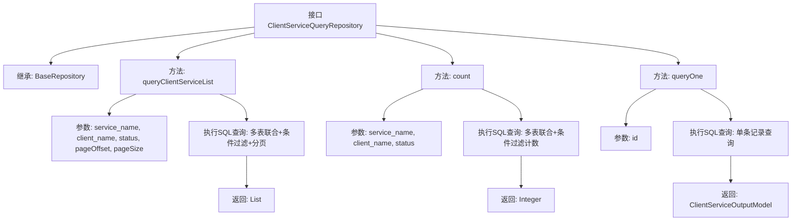

# 基础信息

|      |      |
|------|------|
| 名称 | ClientServiceQueryRepository |
| 编码语言 | .java |
| 代码路径 | WeFe/serving/serving-service/src/main/java/com/welab/wefe/serving/service/database/repository/ClientServiceQueryRepository.java |
| 包名 | com.welab.wefe.serving.service.database.repository |
| 依赖项 | ['com.welab.wefe.serving.service.database.entity.ClientServiceOutputModel', 'com.welab.wefe.serving.service.database.repository.base.BaseRepository', 'org.springframework.data.jpa.repository.Query', 'org.springframework.data.repository.query.Param', 'org.springframework.stereotype.Repository', 'java.util.List'] |
| 概述说明 | ClientServiceQueryRepository接口提供客户服务数据查询功能，包含分页查询列表、统计总数和按ID查询详情三个方法，使用原生SQL实现多表联合查询和条件过滤。 |

# 说明

该代码定义了一个名为ClientServiceQueryRepository的Spring Data JPA仓库接口，继承自BaseRepository。接口包含三个主要方法：queryClientServiceList用于分页查询客户端服务列表，支持按服务名称、客户端名称和状态筛选；count方法用于计算符合筛选条件的记录总数；queryOne方法根据ID查询单个客户端服务的详细信息。所有方法均使用原生SQL查询，涉及client_service、service、client和fee_config表的联合查询，返回ClientServiceOutputModel类型的数据。

# 类列表 Class Summary

| 名称   | 类型  | 说明 |
|-------|------|-------------|
| ClientServiceQueryRepository | interface | ClientServiceQueryRepository接口提供客户服务数据查询功能，包含分页查询列表、统计总数和按ID查询详情三个方法，使用原生SQL实现多表联合查询和条件过滤。 |

## 类 ClientServiceQueryRepository

|      |      |
|------|------|
| 访问范围 | @Repository;public |
| 类型 | interface |
| 名称 | ClientServiceQueryRepository |
| 说明 | ClientServiceQueryRepository接口提供客户服务数据查询功能，包含分页查询列表、统计总数和按ID查询详情三个方法，使用原生SQL实现多表联合查询和条件过滤。 |

### UML类图

这段代码展示了一个Spring Data JPA的Repository接口`ClientServiceQueryRepository`，它继承了`BaseRepository`接口并提供了三个自定义查询方法。类图清晰地展示了接口间的继承关系，其中`ClientServiceQueryRepository`通过扩展`BaseRepository`获得了基本的CRUD操作能力，同时添加了三个原生SQL查询方法：分页查询客户端服务列表`queryClientServiceList`、计数查询`count`和单条记录查询`queryOne`。所有方法都使用`@Query`注解直接定义SQL语句，通过`@Param`绑定参数，体现了JPA对复杂查询的支持能力。

### 内部方法调用关系图

该流程图展示了ClientServiceQueryRepository接口的结构和功能。该接口继承自BaseRepository，包含三个核心方法：queryClientServiceList实现多表联合查询、条件过滤和分页功能；count方法提供符合条件记录数的统计；queryOne通过ID查询单条记录。每个方法都清晰标注了输入参数、SQL操作类型和返回结果，完整呈现了该数据访问层的查询能力。

### 字段列表 Field List

| 名称  | 类型  | 说明 |
|-------|-------|------|

### 方法列表

| 名称  | 类型  | 说明 |
|-------|-------|------|
| count | Integer | SQL查询统计满足条件的客户服务记录数，支持按服务名、客户名和状态筛选。 |
| queryClientServiceList | List<ClientServiceOutputModel> | 查询客户服务列表的SQL语句，支持按服务名、客户名和状态筛选，分页排序返回结果。 |
| queryOne | ClientServiceOutputModel | SQL查询通过ID获取客户端服务信息，包括服务名、客户名、状态、类型、IP和URL。使用左连接关联service和client表。 |

