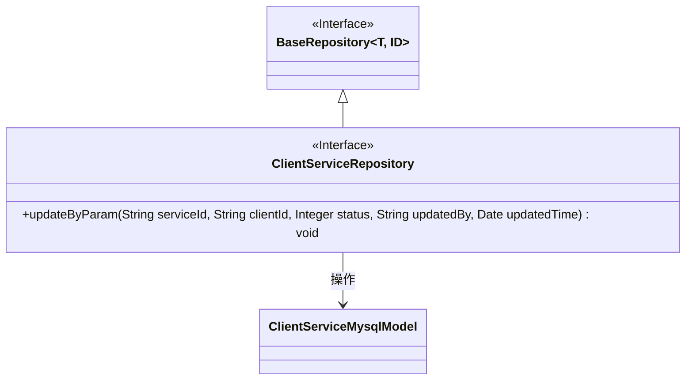
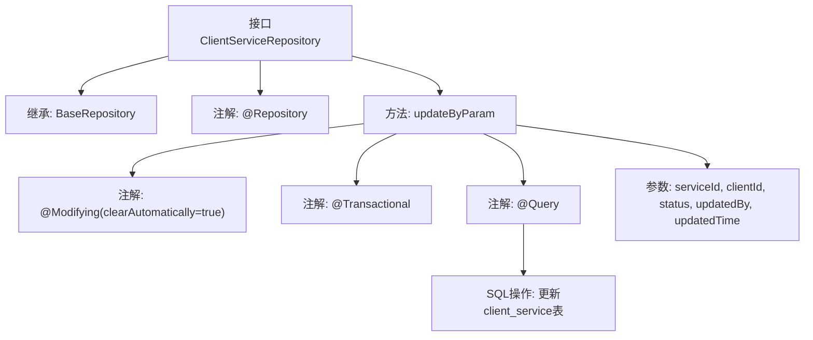

# 基础信息

|      |      |
|------|------|
| 名称 | ClientServiceRepository |
| 编码语言 | .java |
| 代码路径 | WeFe/serving/serving-service/src/main/java/com/welab/wefe/serving/service/database/repository/ClientServiceRepository.java |
| 包名 | com.welab.wefe.serving.service.database.repository |
| 依赖项 | ['com.welab.wefe.serving.service.database.entity.ClientServiceMysqlModel', 'com.welab.wefe.serving.service.database.repository.base.BaseRepository', 'org.springframework.data.jpa.repository.Modifying', 'org.springframework.data.jpa.repository.Query', 'org.springframework.data.repository.query.Param', 'org.springframework.stereotype.Repository', 'org.springframework.transaction.annotation.Transactional', 'java.util.Date'] |
| 概述说明 | 客户端服务仓库接口，扩展基础仓库，提供根据服务ID、客户ID更新状态、修改人和时间的原生SQL方法。 |

# 说明

该代码定义了一个名为ClientServiceRepository的Spring Data JPA仓库接口，继承自BaseRepository，操作ClientServiceMysqlModel实体类，主键类型为String。接口包含一个原生SQL更新方法updateByParam，用于根据serviceId和clientId更新记录的状态status、更新人updatedBy和更新时间updatedTime字段。方法使用了@Modifying和@Transactional注解确保事务性操作，并自动清除持久化上下文。参数通过@Param注解绑定到SQL语句中的命名参数。

# 类列表 Class Summary

| 名称   | 类型  | 说明 |
|-------|------|-------------|
| ClientServiceRepository | interface | 客户端服务仓库接口，继承基础仓库，提供原生SQL更新方法，通过服务ID、客户ID等参数更新状态、修改人和时间。 |

## 类 ClientServiceRepository

|      |      |
|------|------|
| 访问范围 | @Repository;public |
| 类型 | interface |
| 名称 | ClientServiceRepository |
| 说明 | 客户端服务仓库接口，继承基础仓库，提供原生SQL更新方法，通过服务ID、客户ID等参数更新状态、修改人和时间。 |

### UML类图

类图描述：该图展示了一个继承自泛型接口BaseRepository的ClientServiceRepository接口，其中BaseRepository带有两个泛型参数T和ID。ClientServiceRepository接口定义了一个updateByParam方法，用于更新ClientServiceMysqlModel实体的状态信息。箭头表示ClientServiceRepository依赖于ClientServiceMysqlModel实体类进行操作。

### 内部方法调用关系图

该流程图展示了`ClientServiceRepository`接口的结构和关键方法`updateByParam`的执行逻辑。接口继承自`BaseRepository`，通过`@Query`注解定义原生SQL更新操作，包含事务管理和自动清除缓存配置。方法接收5个参数，执行时会根据条件更新`client_service`表中的指定字段。整个流程体现了Spring Data JPA的声明式数据库操作特性。

### 字段列表 Field List

| 名称  | 类型  | 说明 |
|-------|-------|------|

### 方法列表

| 名称  | 类型  | 说明 |
|-------|-------|------|
| updateByParam | void | 更新client_service表中指定serviceId和clientId的记录，设置status、updatedBy和updatedTime字段。使用原生SQL，支持事务和自动清除缓存。 |

