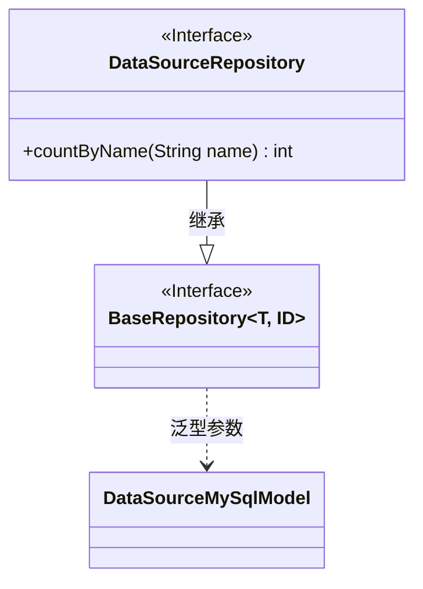
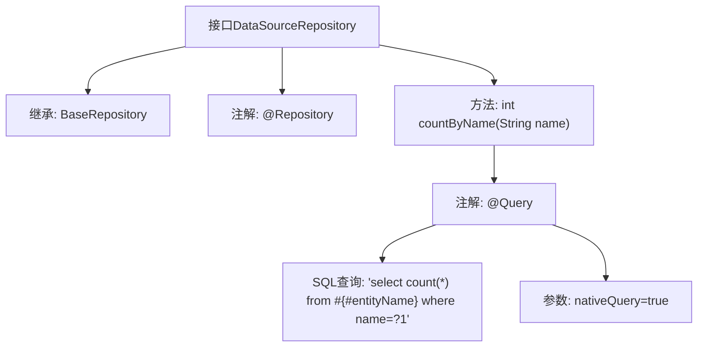

# 基础信息

|      |      |
|------|------|
| 名称 | DataSourceRepository |
| 编码语言 | .java |
| 代码路径 | WeFe/serving/serving-service/src/main/java/com/welab/wefe/serving/service/database/repository/DataSourceRepository.java |
| 包名 | com.welab.wefe.serving.service.database.repository |
| 依赖项 | ['org.springframework.data.jpa.repository.Query', 'org.springframework.stereotype.Repository', 'com.welab.wefe.serving.service.database.entity.DataSourceMySqlModel', 'com.welab.wefe.serving.service.database.repository.base.BaseRepository'] |
| 概述说明 | DataSourceRepository接口继承BaseRepository，提供按名称统计数量的方法countByName，使用原生SQL查询。 |

# 说明

这是一个名为DataSourceRepository的Spring Data JPA仓库接口，继承自BaseRepository，泛型参数指定了实体类型为DataSourceMySqlModel，主键类型为String。接口中定义了一个统计方法countByName，使用@Query注解指定原生SQL查询，统计表中name字段等于输入参数的记录总数。方法接收一个String类型的name参数，返回统计结果的整数值。该接口标记了@Repository注解，表明这是一个Spring管理的持久层组件。

# 类列表 Class Summary

| 名称   | 类型  | 说明 |
|-------|------|-------------|
| DataSourceRepository | interface | DataSourceRepository接口继承BaseRepository，通过@Query注解实现按名称统计数量的原生SQL查询方法countByName。 |

## 类 DataSourceRepository

|      |      |
|------|------|
| 访问范围 | @Repository;public |
| 类型 | interface |
| 名称 | DataSourceRepository |
| 说明 | DataSourceRepository接口继承BaseRepository，通过@Query注解实现按名称统计数量的原生SQL查询方法countByName。 |

### UML类图

这段代码展示了一个Spring Data JPA的仓库接口设计。DataSourceRepository接口继承自泛型接口BaseRepository，指定了实体类型DataSourceMySqlModel和主键类型String。该接口自定义了一个原生SQL查询方法countByName，用于统计指定名称的记录数。类图清晰地反映了接口继承关系和泛型参数绑定，体现了Spring Data JPA的典型仓库模式设计。

### 内部方法调用关系图

这段代码定义了一个Spring Data JPA的Repository接口DataSourceRepository，继承自BaseRepository并指定了实体类型和主键类型。接口通过@Repository注解标记为Spring组件，包含一个使用@Query注解的自定义查询方法countByName，该方法执行原生SQL查询统计指定名称的记录数。流程图展示了接口的继承关系、注解配置和查询方法的定义逻辑。

### 字段列表 Field List

| 名称  | 类型  | 说明 |
|-------|-------|------|

### 方法列表

| 名称  | 类型  | 说明 |
|-------|-------|------|
| countByName | int | 查询方法：统计指定名称的记录数，使用原生SQL查询。 |

