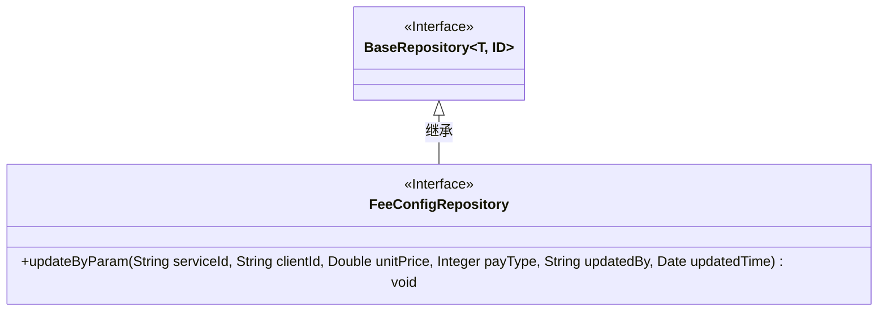
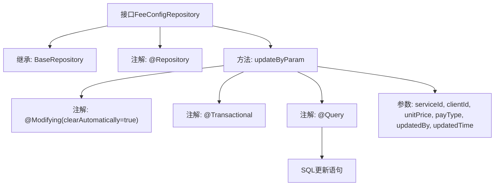

# 基础信息

|      |      |
|------|------|
| 名称 | FeeConfigRepository |
| 编码语言 | .java |
| 代码路径 | WeFe/serving/serving-service/src/main/java/com/welab/wefe/serving/service/database/repository/FeeConfigRepository.java |
| 包名 | com.welab.wefe.serving.service.database.repository |
| 依赖项 | ['com.welab.wefe.serving.service.database.entity.FeeConfigMysqlModel', 'com.welab.wefe.serving.service.database.repository.base.BaseRepository', 'org.springframework.data.jpa.repository.Modifying', 'org.springframework.data.jpa.repository.Query', 'org.springframework.data.repository.query.Param', 'org.springframework.stereotype.Repository', 'org.springframework.transaction.annotation.Transactional', 'java.util.Date'] |
| 概述说明 | FeeConfigRepository接口扩展BaseRepository，提供通过serviceId和clientId更新unitPrice、payType等字段的原生SQL方法，支持自动清除缓存和事务管理。 |

# 说明

FeeConfigRepository是一个继承BaseRepository的Spring Data JPA接口，用于操作FeeConfigMysqlModel实体。它包含一个原生SQL更新方法updateByParam，通过serviceId和clientId作为条件，更新unitPrice、payType、updatedBy和updatedTime字段。方法使用了@Modifying和@Transactional注解确保事务性操作，并自动清除持久化上下文。参数通过@Param注解绑定到SQL语句中的命名参数。

# 类列表 Class Summary

| 名称   | 类型  | 说明 |
|-------|------|-------------|
| FeeConfigRepository | interface | FeeConfigRepository接口扩展BaseRepository，提供通过serviceId和clientId更新unitPrice、payType等字段的原生SQL方法，支持自动清除缓存和事务管理。 |

## 类 FeeConfigRepository

|      |      |
|------|------|
| 访问范围 | @Repository;public |
| 类型 | interface |
| 名称 | FeeConfigRepository |
| 说明 | FeeConfigRepository接口扩展BaseRepository，提供通过serviceId和clientId更新unitPrice、payType等字段的原生SQL方法，支持自动清除缓存和事务管理。 |

### UML类图

类图描述：该图展示了一个Spring Data JPA的仓储接口设计。FeeConfigRepository接口继承自泛型接口BaseRepository，并添加了特定的更新方法updateByParam。通过@Repository和@Modifying等注解标注其仓储特性，使用原生SQL查询实现参数化更新操作。图中清晰体现了接口继承关系和特定业务方法的定义。

### 内部方法调用关系图

这段代码定义了一个Spring Data JPA的Repository接口FeeConfigRepository，用于操作FeeConfigMysqlModel实体。该接口继承了BaseRepository，提供了基本的CRUD操作。其中定义了一个updateByParam方法，使用@Modifying和@Transactional注解标记为更新操作，并通过@Query注解指定了原生SQL更新语句，用于根据serviceId和clientId更新unitPrice、payType等字段。方法接收6个参数，分别对应SQL语句中的变量。整个流程展示了从接口定义到具体SQL操作的完整映射关系。

### 字段列表 Field List

| 名称  | 类型  | 说明 |
|-------|-------|------|

### 方法列表

| 名称  | 类型  | 说明 |
|-------|-------|------|
| updateByParam | void | 更新fee_config表记录，根据serviceId和clientId修改unitPrice、payType、updatedBy和updatedTime字段。使用原生SQL，事务处理并自动清除缓存。 |

