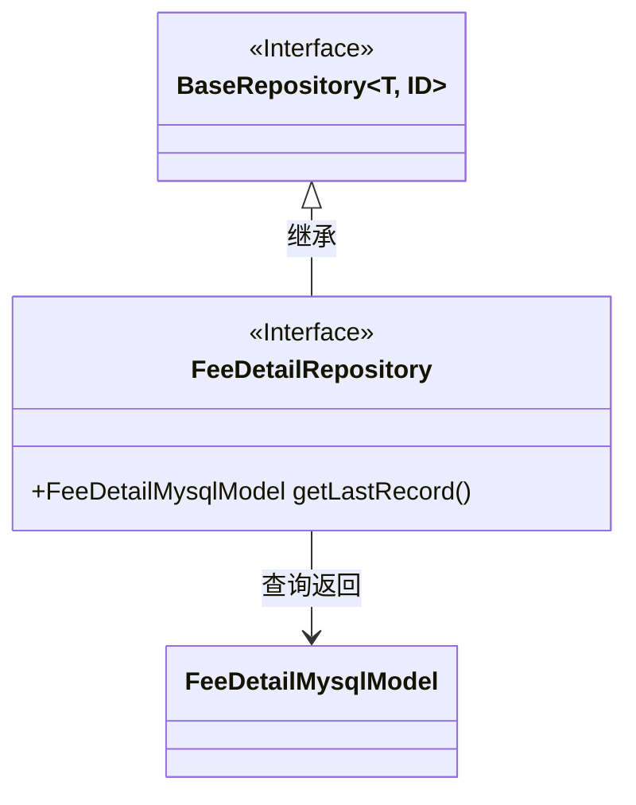
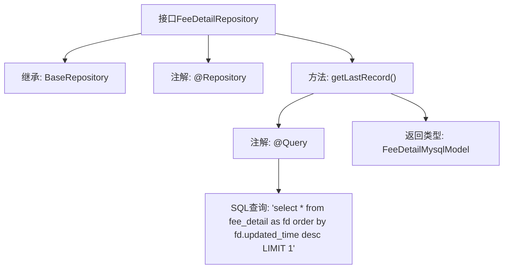

# 基础信息

|      |      |
|------|------|
| 名称 | FeeDetailRepository |
| 编码语言 | .java |
| 代码路径 | WeFe/serving/serving-service/src/main/java/com/welab/wefe/serving/service/database/repository/FeeDetailRepository.java |
| 包名 | com.welab.wefe.serving.service.database.repository |
| 依赖项 | ['com.welab.wefe.serving.service.database.entity.FeeDetailMysqlModel', 'com.welab.wefe.serving.service.database.repository.base.BaseRepository', 'org.springframework.data.jpa.repository.Query', 'org.springframework.stereotype.Repository'] |
| 概述说明 | FeeDetailRepository接口继承BaseRepository，用于操作FeeDetailMysqlModel数据。包含原生SQL查询方法getLastRecord，按updated_time降序获取fee_detail表最后一条记录。 |

# 说明

FeeDetailRepository是一个继承自BaseRepository的Spring数据仓库接口，用于操作FeeDetailMysqlModel实体类，主键类型为String。该接口包含一个原生SQL查询方法getLastRecord，通过updated_time降序排序并限制返回1条记录，用于获取fee_detail表中的最后一条数据。方法使用@Query注解指定查询语句，并设置nativeQuery为true表示使用原生SQL。

# 类列表 Class Summary

| 名称   | 类型  | 说明 |
|-------|------|-------------|
| FeeDetailRepository | interface | FeeDetailRepository接口继承BaseRepository，通过原生SQL查询获取fee_detail表中按updated_time降序排列的最后一条记录。 |

## 类 FeeDetailRepository

|      |      |
|------|------|
| 访问范围 | @Repository;public |
| 类型 | interface |
| 名称 | FeeDetailRepository |
| 说明 | FeeDetailRepository接口继承BaseRepository，通过原生SQL查询获取fee_detail表中按updated_time降序排列的最后一条记录。 |

### UML类图

该类图展示了一个Spring Data JPA仓库接口的继承关系。FeeDetailRepository接口继承自泛型接口BaseRepository，指定FeeDetailMysqlModel作为实体类型，String作为ID类型。接口定义了一个原生SQL查询方法getLastRecord()，用于按更新时间降序获取fee_detail表中的最后一条记录。图中清晰体现了接口继承关系和实体类型依赖，符合JPA仓库的标准设计模式。

### 内部方法调用关系图

该流程图描述了FeeDetailRepository接口的结构和功能。该接口继承自BaseRepository，带有@Repository注解，包含一个通过@Query注解定义的方法getLastRecord()，该方法执行原生SQL查询，按updated_time降序获取fee_detail表的最后一条记录，并返回FeeDetailMysqlModel类型的对象。整个流程清晰展示了接口的继承关系、注解使用和核心查询方法的实现方式。

### 字段列表 Field List

| 名称  | 类型  | 说明 |
|-------|-------|------|

### 方法列表

| 名称  | 类型  | 说明 |
|-------|-------|------|
| getLastRecord | FeeDetailMysqlModel | 查询fee_detail表按更新时间降序排列的第一条记录。 |

