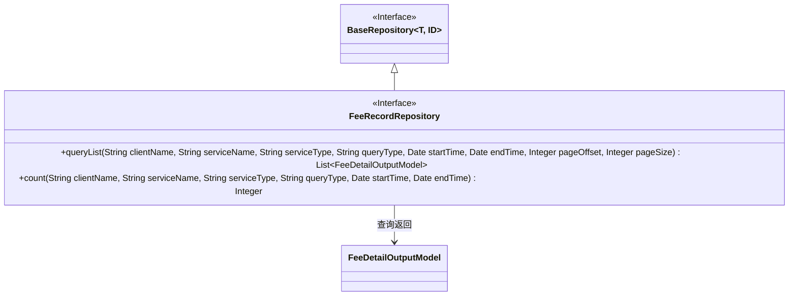
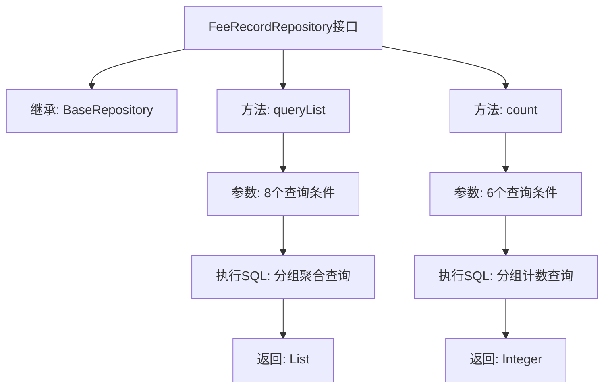

# 基础信息

|      |      |
|------|------|
| 名称 | FeeRecordRepository |
| 编码语言 | .java |
| 代码路径 | WeFe/serving/serving-service/src/main/java/com/welab/wefe/serving/service/database/repository/FeeRecordRepository.java |
| 包名 | com.welab.wefe.serving.service.database.repository |
| 依赖项 | ['com.welab.wefe.serving.service.database.entity.FeeDetailOutputModel', 'com.welab.wefe.serving.service.database.repository.base.BaseRepository', 'org.springframework.data.jpa.repository.Query', 'org.springframework.data.repository.query.Param', 'org.springframework.stereotype.Repository', 'java.util.Date', 'java.util.List'] |
| 概述说明 | FeeRecordRepository接口扩展BaseRepository，提供查询计费详情列表和计数的原生SQL方法，支持多条件筛选和分页。 |

# 说明

FeeRecordRepository是一个Spring数据仓库接口，继承自BaseRepository，用于管理FeeDetailOutputModel类型数据。它提供了两个核心方法：queryList方法通过复杂SQL查询获取分页的计费详情列表，支持按客户名称、服务名称、服务类型筛选，并可指定时间范围和查询粒度，结果按时间降序排列；count方法则计算满足相同条件的记录总数。两个方法都使用原生SQL实现，包含动态条件处理逻辑，其中queryList方法对结果进行了分组聚合计算，包含服务ID、客户ID等关键字段的汇总统计。

# 类列表 Class Summary

| 名称   | 类型  | 说明 |
|-------|------|-------------|
| FeeRecordRepository | interface | FeeRecordRepository接口扩展BaseRepository，提供查询计费详情列表和计数的原生SQL方法，支持按客户名、服务名、类型、时间范围等条件筛选和分页。 |

## 类 FeeRecordRepository

|      |      |
|------|------|
| 访问范围 | @Repository;public |
| 类型 | interface |
| 名称 | FeeRecordRepository |
| 说明 | FeeRecordRepository接口扩展BaseRepository，提供查询计费详情列表和计数的原生SQL方法，支持按客户名、服务名、类型、时间范围等条件筛选和分页。 |

### UML类图

该代码定义了一个FeeRecordRepository接口，继承自BaseRepository泛型接口，主要用于处理计费详情数据的查询。接口包含两个核心方法：queryList用于分页查询符合条件的计费详情列表，count用于统计符合条件的数据总数。通过@Query注解使用原生SQL语句实现复杂查询逻辑，支持按服务名称、客户名称、服务类型等多条件筛选，并能按时间范围和分组条件进行聚合统计。接口标记为@Repository，表明这是一个数据访问层组件。

### 内部方法调用关系图

该流程图展示了FeeRecordRepository接口的结构和功能。该接口继承自BaseRepository，包含两个核心方法：queryList用于执行带分页的分组聚合查询，接收8个参数并返回费用明细列表；count方法用于计算满足条件的记录总数，接收6个参数并返回计数值。两个方法都使用原生SQL实现复杂查询逻辑，涉及条件过滤、日期范围处理、模糊搜索和分组统计等功能。

### 字段列表 Field List

| 名称  | 类型  | 说明 |
|-------|-------|------|

### 方法列表

| 名称  | 类型  | 说明 |
|-------|-------|------|
| count | Integer | 查询fee_detail表，按条件统计记录数，支持服务名、客户名、服务类型、时间范围筛选，并按服务ID、客户ID、费用配置ID和创建时间分组。 |
| queryList | List<FeeDetailOutputModel> | SQL查询汇总费用明细，按服务、客户、配置和时间分组，支持条件筛选和分页。返回总请求次数、总费用等聚合数据。 |

