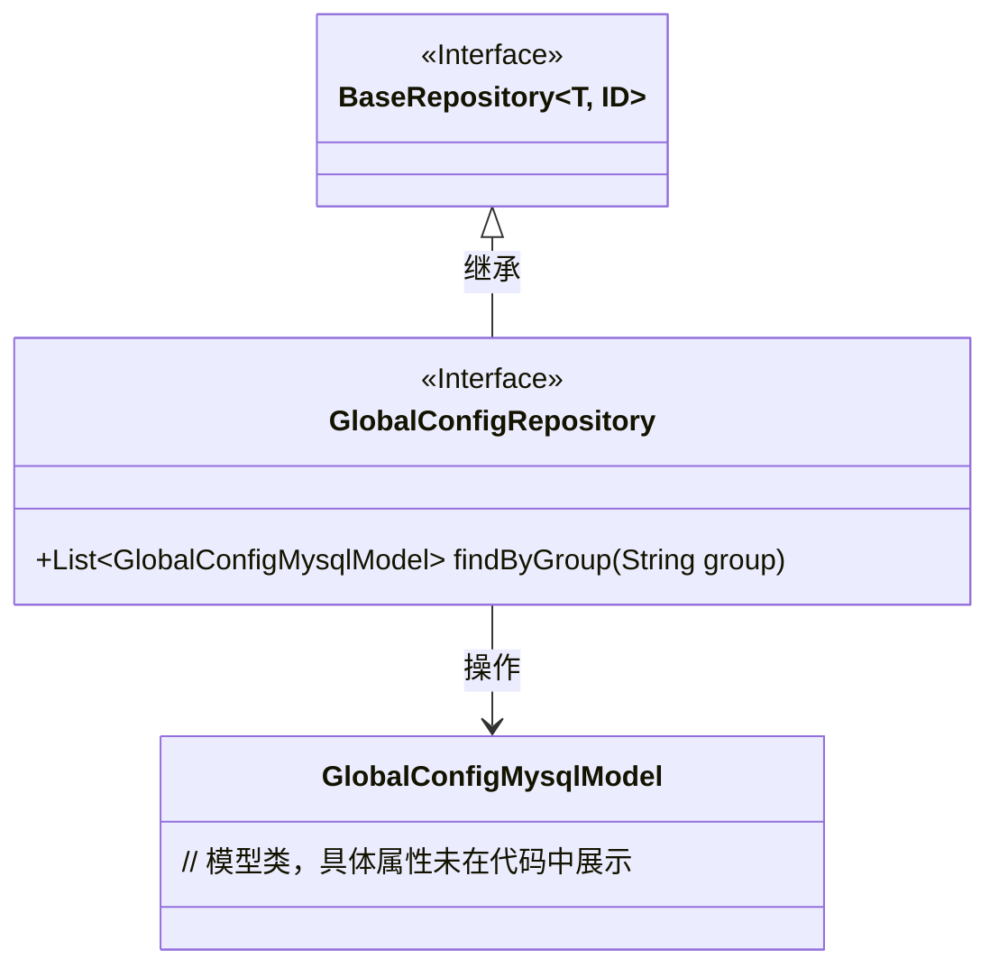
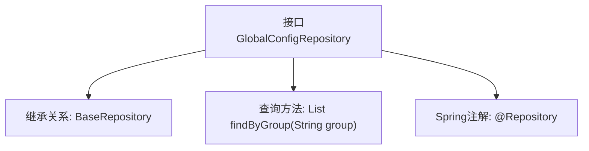

# 基础信息

|      |      |
|------|------|
| 名称 | GlobalConfigRepository |
| 编码语言 | .java |
| 代码路径 | WeFe/serving/serving-service/src/main/java/com/welab/wefe/serving/service/database/repository/GlobalConfigRepository.java |
| 包名 | com.welab.wefe.serving.service.database.repository |
| 依赖项 | ['com.welab.wefe.serving.service.database.entity.GlobalConfigMysqlModel', 'com.welab.wefe.serving.service.database.repository.base.BaseRepository', 'org.springframework.stereotype.Repository', 'java.util.List'] |
| 概述说明 | 这是一个Spring Data JPA仓库接口，继承基础仓库并定义按组查询方法。 |

# 说明

该代码片段定义了一个名为GlobalConfigRepository的Spring数据仓库接口，继承自BaseRepository基类。该接口使用@Repository注解标识为Spring管理的仓库组件，操作的数据模型为GlobalConfigMysqlModel，主键类型为String。接口中声明了一个自定义查询方法findByGroup，用于根据group字段查询并返回匹配的GlobalConfigMysqlModel对象列表。

# 类列表 Class Summary

| 名称   | 类型  | 说明 |
|-------|------|-------------|
| GlobalConfigRepository | interface | 这是一个Spring的Repository接口，继承自BaseRepository，用于操作GlobalConfigMysqlModel数据，提供按group字段查询的功能。 |

## 类 GlobalConfigRepository

|      |      |
|------|------|
| 访问范围 | @Repository;public |
| 类型 | interface |
| 名称 | GlobalConfigRepository |
| 说明 | 这是一个Spring的Repository接口，继承自BaseRepository，用于操作GlobalConfigMysqlModel数据，提供按group字段查询的功能。 |

### UML类图

这段类图展示了Spring Data JPA中的仓库接口设计。GlobalConfigRepository接口继承自泛型接口BaseRepository，指定了实体类型GlobalConfigMysqlModel和主键类型String。该接口自定义了按group字段查询的方法findByGroup，遵循Spring Data的查询派生规则。图中清晰呈现了接口继承关系、泛型参数绑定以及仓库与实体模型之间的操作依赖，体现了JPA仓库模式的标准结构。

### 内部方法调用关系图

这段代码定义了一个Spring Data JPA仓库接口GlobalConfigRepository，它继承了BaseRepository并指定了实体类型GlobalConfigMysqlModel和主键类型String。接口通过@Repository注解标记为Spring管理的组件，并声明了一个自定义查询方法findByGroup，用于根据group字段查询配置列表。该流程图清晰地展示了接口的继承关系、核心方法和Spring注解的层级结构。

### 字段列表 Field List

| 名称  | 类型  | 说明 |
|-------|-------|------|

### 方法列表

| 名称  | 类型  | 说明 |
|-------|-------|------|
| findByGroup | List<GlobalConfigMysqlModel> | 根据组名查询全局配置MySQL模型列表。 |

