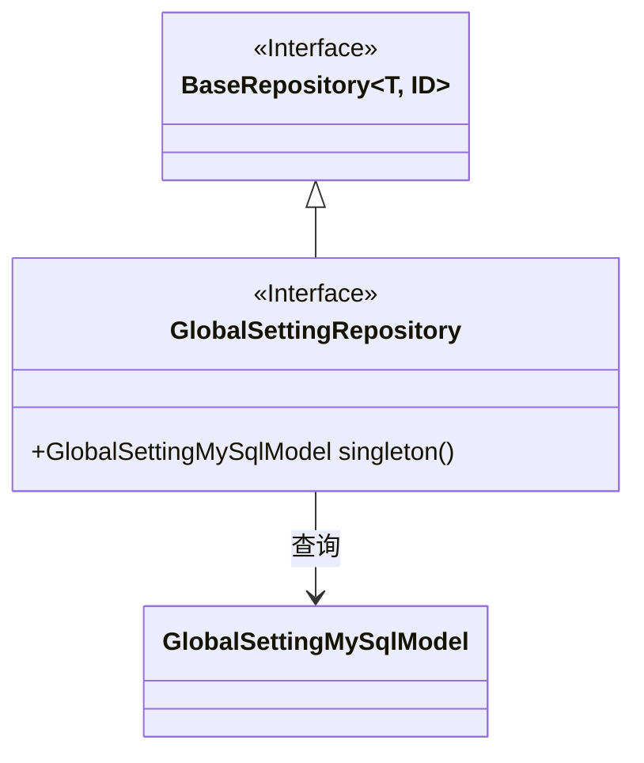
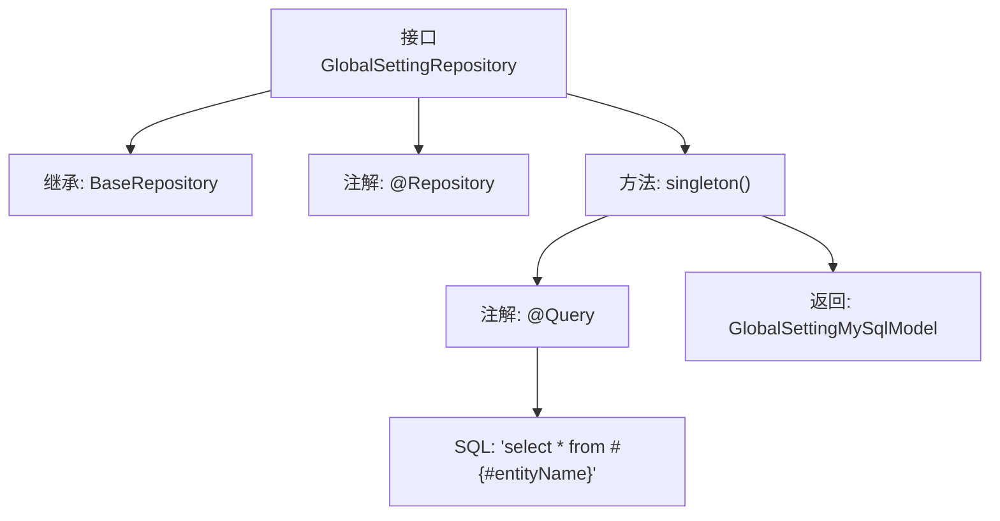

# 基础信息

|      |      |
|------|------|
| 名称 | GlobalSettingRepository |
| 编码语言 | .java |
| 代码路径 | WeFe/serving/serving-service/src/main/java/com/welab/wefe/serving/service/database/repository/GlobalSettingRepository.java |
| 包名 | com.welab.wefe.serving.service.database.repository |
| 依赖项 | ['com.welab.wefe.serving.service.database.entity.GlobalSettingMySqlModel', 'com.welab.wefe.serving.service.database.repository.base.BaseRepository', 'org.springframework.data.jpa.repository.Query', 'org.springframework.stereotype.Repository'] |
| 概述说明 | GlobalSettingRepository接口继承BaseRepository，通过@Query注解实现单例查询方法singleton()，返回GlobalSettingMySqlModel。 |

# 说明

这是一个名为GlobalSettingRepository的Spring Data JPA仓库接口，使用@Repository注解标记。它继承自BaseRepository，泛型参数指定实体类型为GlobalSettingMySqlModel，主键类型为String。接口中定义了一个名为singleton的查询方法，通过@Query注解指定原生SQL查询语句"select * from #{#entityName}"，用于获取单例模式的全局设置数据。方法返回GlobalSettingMySqlModel实体对象。注释说明该方法用于查找单例记录。

# 类列表 Class Summary

| 名称   | 类型  | 说明 |
|-------|------|-------------|
| GlobalSettingRepository | interface | GlobalSettingRepository接口继承BaseRepository，通过@Query注解实现单例查询，返回GlobalSettingMySqlModel。 |

## 类 GlobalSettingRepository

|      |      |
|------|------|
| 访问范围 | @Repository;public |
| 类型 | interface |
| 名称 | GlobalSettingRepository |
| 说明 | GlobalSettingRepository接口继承BaseRepository，通过@Query注解实现单例查询，返回GlobalSettingMySqlModel。 |

### UML类图

该类图展示了GlobalSettingRepository接口继承自泛型接口BaseRepository，并定义了查询单例数据的方法。GlobalSettingRepository通过JPA注解实现原生SQL查询，返回GlobalSettingMySqlModel实体对象。BaseRepository作为父接口提供基础CRUD操作，两个接口形成清晰的层级关系，体现了Spring Data JPA的Repository设计模式。

### 内部方法调用关系图

这段代码定义了一个Spring Data JPA的Repository接口GlobalSettingRepository，它继承自BaseRepository并标注了@Repository注解。核心是通过@Query注解定义了一个native SQL查询方法singleton()，用于查询并返回单例的GlobalSettingMySqlModel实体。流程图展示了接口的继承关系、方法定义及注解配置的完整结构，特别突出了自定义原生SQL查询的实现方式。

### 字段列表 Field List

| 名称  | 类型  | 说明 |
|-------|-------|------|

### 方法列表

| 名称  | 类型  | 说明 |
|-------|-------|------|
| singleton | GlobalSettingMySqlModel | 查询数据库表中所有记录，返回单例实体对象。 |

