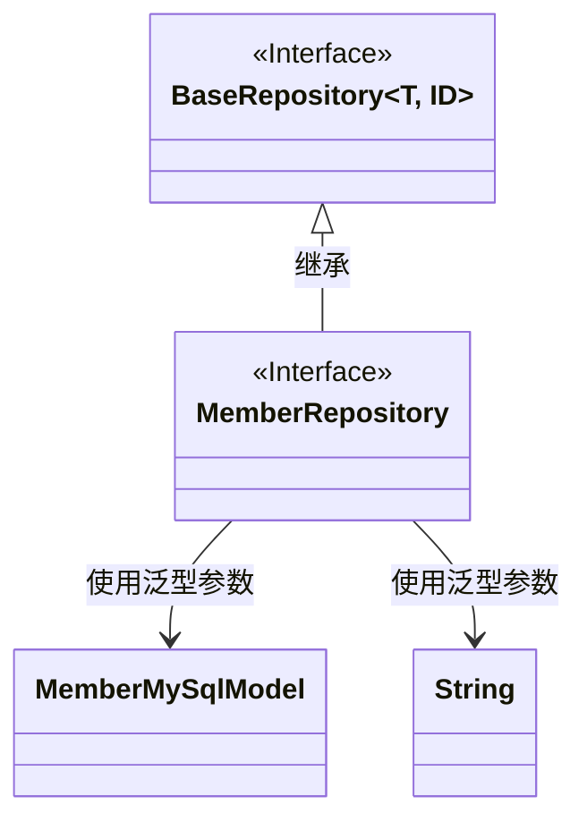
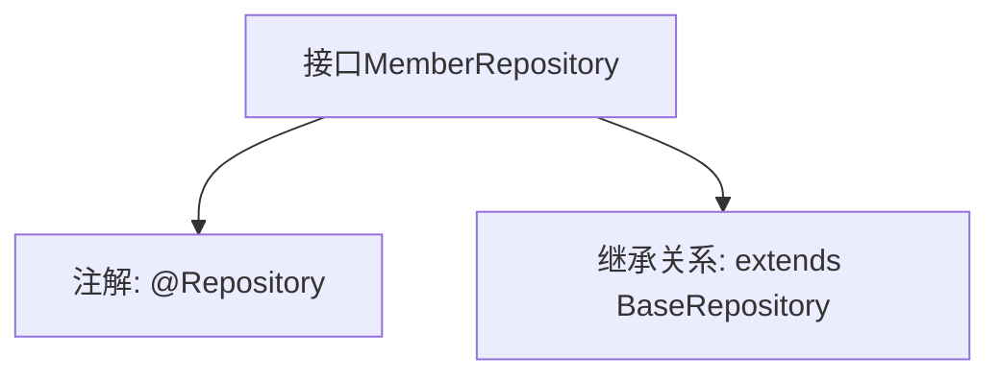

# 基础信息

|      |      |
|------|------|
| 名称 | MemberRepository |
| 编码语言 | .java |
| 代码路径 | WeFe/serving/serving-service/src/main/java/com/welab/wefe/serving/service/database/repository/MemberRepository.java |
| 包名 | com.welab.wefe.serving.service.database.repository |
| 依赖项 | ['com.welab.wefe.serving.service.database.entity.MemberMySqlModel', 'com.welab.wefe.serving.service.database.repository.base.BaseRepository', 'org.springframework.stereotype.Repository'] |
| 概述说明 | 成员仓库接口继承基础仓库，操作MemberMySqlModel类型数据，主键为String类型。 |

# 说明

该代码片段定义了一个名为MemberRepository的Spring数据仓库接口，使用@Repository注解标识。该接口继承自BaseRepository泛型基类，指定了实体类型为MemberMySqlModel，主键类型为String。这表明该仓库用于操作MemberMySqlModel类型的数据实体，并提供了基础的CRUD操作功能。

# 类列表 Class Summary

| 名称   | 类型  | 说明 |
|-------|------|-------------|
| MemberRepository | interface | 这是一个Spring Data JPA的MemberRepository接口，继承自BaseRepository，用于操作MemberMySqlModel类型的数据，主键类型为String。 |

## 类 MemberRepository

|      |      |
|------|------|
| 访问范围 | @Repository;public |
| 类型 | interface |
| 名称 | MemberRepository |
| 说明 | 这是一个Spring Data JPA的MemberRepository接口，继承自BaseRepository，用于操作MemberMySqlModel类型的数据，主键类型为String。 |

### UML类图

这段类图展示了MemberRepository接口继承自泛型接口BaseRepository的关系。BaseRepository是一个带有两个泛型参数(T和ID)的接口，MemberRepository通过继承将其特化为使用MemberMySqlModel作为实体类型、String作为ID类型的具体实现。MemberMySqlModel是一个普通的数据模型类，与MemberRepository通过泛型参数关联。整个结构体现了Spring Data JPA中常见的仓库接口设计模式。

### 内部方法调用关系图

这段流程图展示了MemberRepository接口的结构。该接口被@Repository注解标记，表明它是一个Spring数据访问层的组件。同时它继承了BaseRepository泛型接口，指定了实体类型为MemberMySqlModel，主键类型为String。这种设计模式是Spring Data JPA的典型用法，通过继承基础仓库接口自动获得CRUD操作能力，无需手动实现基础数据访问方法。

### 字段列表 Field List

| 名称  | 类型  | 说明 |
|-------|-------|------|

### 方法列表

| 名称  | 类型  | 说明 |
|-------|-------|------|

