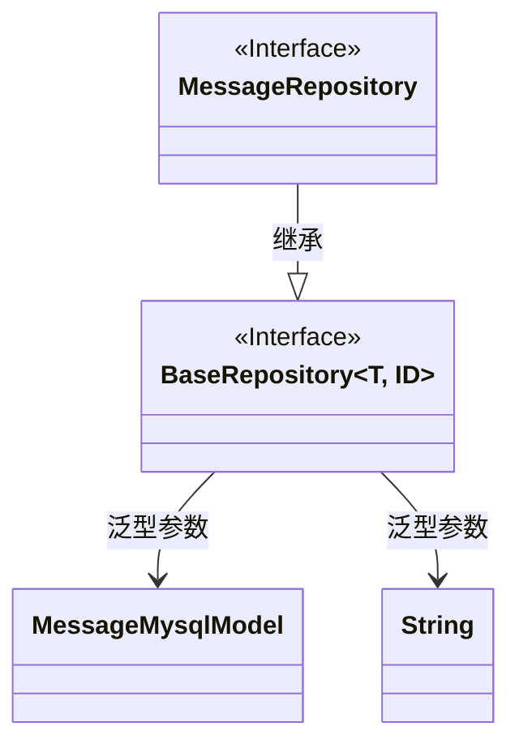
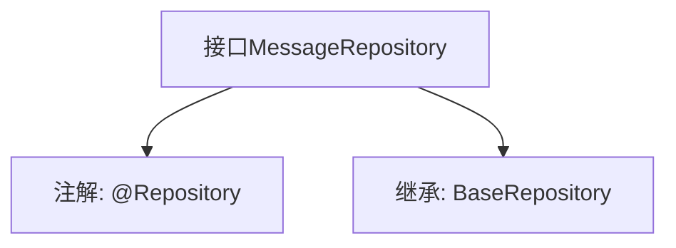

# 基础信息

|      |      |
|------|------|
| 名称 | MessageRepository |
| 编码语言 | .java |
| 代码路径 | WeFe/serving/serving-service/src/main/java/com/welab/wefe/serving/service/database/repository/MessageRepository.java |
| 包名 | com.welab.wefe.serving.service.database.repository |
| 依赖项 | ['org.springframework.stereotype.Repository', 'com.welab.wefe.serving.service.database.entity.MessageMysqlModel', 'com.welab.wefe.serving.service.database.repository.base.BaseRepository'] |
| 概述说明 | 消息仓库接口继承基础仓库，操作消息模型和字符串类型主键。 |

# 说明

该内容定义了一个名为MessageRepository的Spring数据仓库接口，使用@Repository注解标记。该接口继承自BaseRepository泛型基类，指定了实体类型为MessageMysqlModel，主键类型为String。这表明它是一个用于操作MessageMysqlModel实体数据的持久层组件，遵循Spring Data的仓库模式设计。

# 类列表 Class Summary

| 名称   | 类型  | 说明 |
|-------|------|-------------|
| MessageRepository | interface | 消息仓库接口，继承基础仓库类，操作消息模型，主键类型为字符串。 |

## 类 MessageRepository

|      |      |
|------|------|
| 访问范围 | @Repository;public |
| 类型 | interface |
| 名称 | MessageRepository |
| 说明 | 消息仓库接口，继承基础仓库类，操作消息模型，主键类型为字符串。 |

### UML类图

该类图展示了一个Spring Data JPA的仓储接口设计。MessageRepository接口继承自泛型接口BaseRepository，指定MessageMysqlModel作为实体类型，String作为ID类型。BaseRepository被标记为接口，包含标准CRUD操作，而MessageRepository作为具体仓储接口，可通过继承获得基础数据库操作能力。这种设计遵循了Spring Data的Repository模式，实现了数据访问层的抽象。

### 内部方法调用关系图

这段代码定义了一个名为MessageRepository的Spring数据仓库接口，使用@Repository注解标识其为持久层组件。该接口继承了BaseRepository泛型接口，指定了实体类型为MessageMysqlModel，主键类型为String。流程图清晰地展示了接口的注解和继承关系，体现了Spring Data JPA中通过扩展基础仓库接口快速实现CRUD操作的典型模式。

### 字段列表 Field List

| 名称  | 类型  | 说明 |
|-------|-------|------|

### 方法列表

| 名称  | 类型  | 说明 |
|-------|-------|------|

