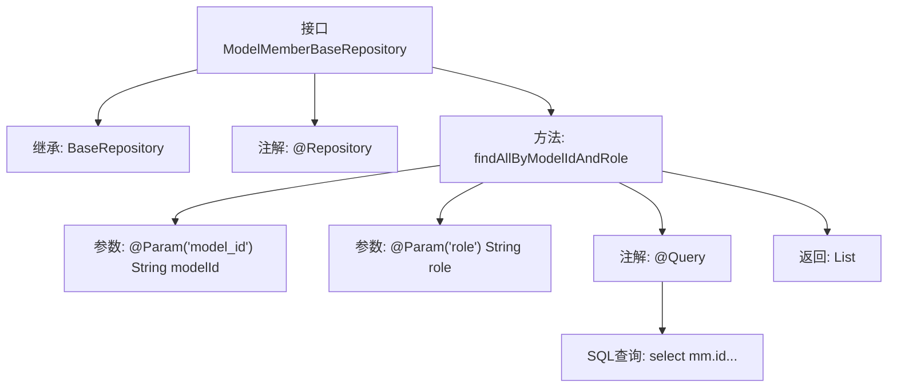

# 基础信息

|      |      |
|------|------|
| 名称 | ModelMemberBaseRepository |
| 编码语言 | .java |
| 代码路径 | WeFe/serving/serving-service/src/main/java/com/welab/wefe/serving/service/database/repository/ModelMemberBaseRepository.java |
| 包名 | com.welab.wefe.serving.service.database.repository |
| 依赖项 | ['com.welab.wefe.serving.service.database.entity.ModelMemberBaseModel', 'com.welab.wefe.serving.service.database.repository.base.BaseRepository', 'org.springframework.data.jpa.repository.Query', 'org.springframework.data.repository.query.Param', 'org.springframework.stereotype.Repository', 'java.util.List'] |
| 概述说明 | ModelMemberBaseRepository接口扩展BaseRepository，提供通过modelId和role查询ModelMemberBaseModel列表的native SQL方法。 |

# 说明

这是一个名为ModelMemberBaseRepository的Spring Data JPA仓库接口，继承自BaseRepository，用于操作ModelMemberBaseModel类型数据，主键类型为String。接口定义了一个原生SQL查询方法findAllByModelIdAndRole，通过模型ID和角色查询数据。查询会返回包含id、model_id、member_id、role和api字段的结果列表，数据来自model_member表左连接member表，条件为model_id和role匹配指定参数。方法使用@Query注解配置SQL语句，并通过@Param绑定参数。

# 类列表 Class Summary

| 名称   | 类型  | 说明 |
|-------|------|-------------|
| ModelMemberBaseRepository | interface | 该代码定义了一个Spring Data JPA仓库接口，用于查询模型成员数据。通过原生SQL查询，根据模型ID和角色筛选结果，返回包含成员ID、模型ID、角色和API信息的列表。 |


## 类 ModelMemberBaseRepository

|      |      |
|------|------|
| 访问范围 | @Repository;public |
| 类型 | interface |
| 名称 | ModelMemberBaseRepository |
| 说明 | 该代码定义了一个Spring Data JPA仓库接口，用于查询模型成员数据。通过原生SQL查询，根据模型ID和角色筛选结果，返回包含成员ID、模型ID、角色和API信息的列表。 |


### UML类图

```mermaid
classDiagram
    class BaseRepository~T, ID~ {
        <<Interface>>
    }

    class ModelMemberBaseRepository {
        <<Interface>>
        +List~ModelMemberBaseModel~ findAllByModelIdAndRole(String modelId, String role)
    }

    BaseRepository <|-- ModelMemberBaseRepository
    // ModelMemberBaseRepository 继承自泛型接口 BaseRepository
    // 提供根据modelId和role查询ModelMemberBaseModel列表的方法
```

这段代码展示了一个Spring Data JPA仓库接口ModelMemberBaseRepository，它继承自泛型基础接口BaseRepository，专门处理ModelMemberBaseModel类型数据。接口定义了一个原生SQL查询方法findAllByModelIdAndRole，通过模型ID和角色联合查询模型成员信息，并关联member表获取API字段。该设计体现了JPA仓库模式的数据访问层抽象，通过注解配置实现复杂查询。


### 内部方法调用关系图



这段代码展示了一个Spring Data JPA仓库接口ModelMemberBaseRepository，它继承自BaseRepository并标注了@Repository注解。核心功能是通过原生SQL查询（@Query注解定义）根据model_id和role参数联合查询model_member和member表，返回ModelMemberBaseModel列表。流程图清晰呈现了接口的继承关系、方法定义、参数注解及SQL查询的关联逻辑。

### 字段列表 Field List

| 名称  | 类型  | 说明 |
|-------|-------|------|

### 方法列表

| 名称  | 类型  | 说明 |
|-------|-------|------|
| findAllByModelIdAndRole | List<ModelMemberBaseModel> | 查询模型成员信息，根据模型ID和角色筛选，返回ID、模型ID、成员ID、角色和API字段。 |


