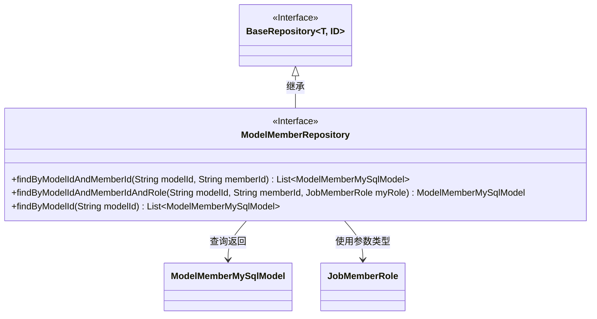
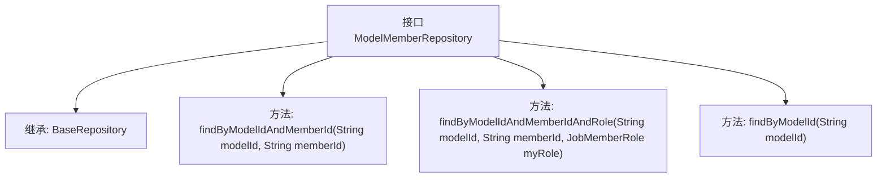

# 基础信息

|      |      |
|------|------|
| 名称 | ModelMemberRepository |
| 编码语言 | .java |
| 代码路径 | WeFe/serving/serving-service/src/main/java/com/welab/wefe/serving/service/database/repository/ModelMemberRepository.java |
| 包名 | com.welab.wefe.serving.service.database.repository |
| 依赖项 | ['com.welab.wefe.common.wefe.enums.JobMemberRole', 'com.welab.wefe.serving.service.database.entity.ModelMemberMySqlModel', 'com.welab.wefe.serving.service.database.repository.base.BaseRepository', 'org.springframework.stereotype.Repository', 'java.util.List'] |
| 概述说明 | ModelMemberRepository接口扩展BaseRepository，提供按modelId、memberId及role查询ModelMemberMySqlModel的方法。 |

# 说明

这是一个名为ModelMemberRepository的Spring数据仓库接口，继承自BaseRepository，操作ModelMemberMySqlModel实体类，主键类型为String。接口提供了三个查询方法：1) 根据modelId和memberId查询符合条件的ModelMemberMySqlModel列表；2) 根据modelId、memberId和角色myRole查询单个ModelMemberMySqlModel；3) 根据modelId查询ModelMemberMySqlModel列表。所有方法都通过方法命名约定自动生成查询逻辑。

# 类列表 Class Summary

| 名称   | 类型  | 说明 |
|-------|------|-------------|
| ModelMemberRepository | interface | ModelMemberRepository接口扩展BaseRepository，提供按modelId、memberId及role查询ModelMemberMySqlModel的方法。 |

## 类 ModelMemberRepository

|      |      |
|------|------|
| 访问范围 | @Repository;public |
| 类型 | interface |
| 名称 | ModelMemberRepository |
| 说明 | ModelMemberRepository接口扩展BaseRepository，提供按modelId、memberId及role查询ModelMemberMySqlModel的方法。 |

### UML类图

这段代码展示了一个Spring Data JPA仓库接口`ModelMemberRepository`，它继承了`BaseRepository`泛型接口，专门用于操作`ModelMemberMySqlModel`实体类。该接口定义了三个查询方法：通过模型ID和成员ID组合查询、通过模型ID/成员ID/角色三条件查询，以及仅通过模型ID查询。类图清晰地展示了接口继承关系、返回类型依赖和参数类型依赖，体现了Spring Data JPA通过方法命名自动生成查询的特性，其中`ModelMemberMySqlModel`是持久化实体，`JobMemberRole`是枚举类型的参数。

### 内部方法调用关系图

这段代码定义了一个Spring Data JPA的Repository接口ModelMemberRepository，它继承了BaseRepository接口并指定了泛型类型为ModelMemberMySqlModel和String。该接口声明了三个查询方法：根据modelId和memberId查询多条记录、根据modelId、memberId和角色查询单条记录，以及根据modelId查询多条记录。这些方法将由Spring Data JPA自动实现，用于对数据库中的ModelMemberMySqlModel实体进行查询操作。

### 字段列表 Field List

| 名称  | 类型  | 说明 |
|-------|-------|------|

### 方法列表

| 名称  | 类型  | 说明 |
|-------|-------|------|
| findByModelIdAndMemberId | List<ModelMemberMySqlModel> | 根据模型ID和成员ID查询成员列表。 |
| findByModelIdAndMemberIdAndRole | ModelMemberMySqlModel | 根据模型ID、成员ID和角色查询成员信息。 |
| findByModelId | List<ModelMemberMySqlModel> | 根据模型ID查询成员列表的方法。 |

