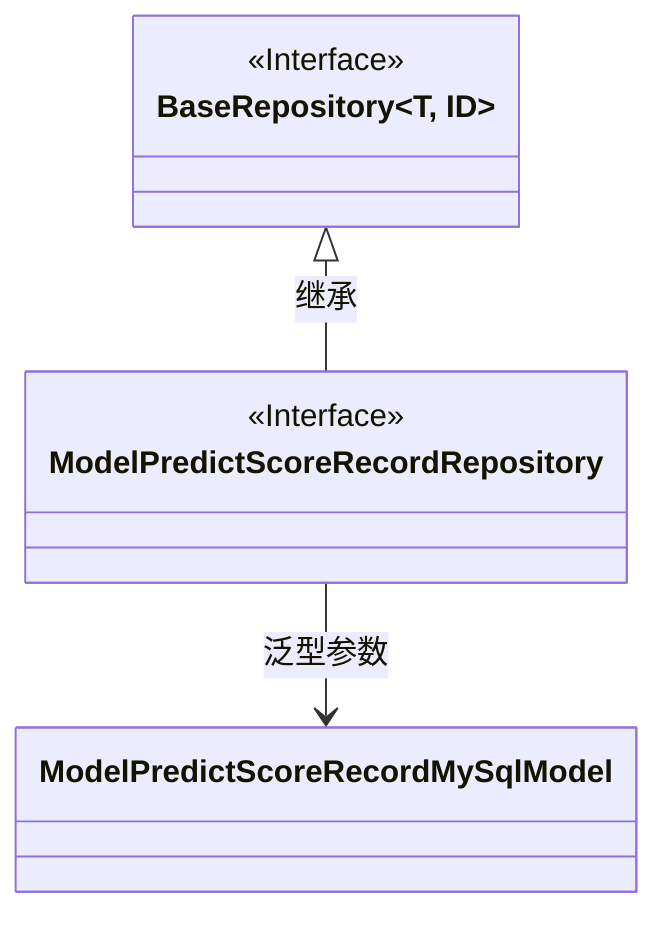
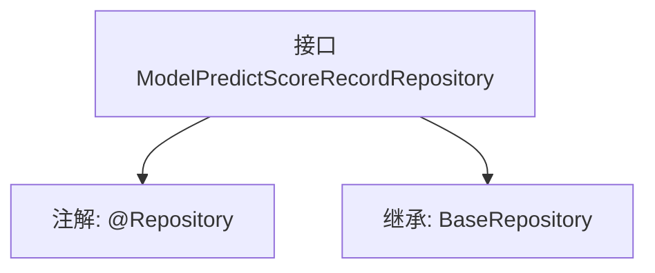

# 基础信息

|      |      |
|------|------|
| 名称 | ModelPredictScoreRecordRepository |
| 编码语言 | .java |
| 代码路径 | WeFe/serving/serving-service/src/main/java/com/welab/wefe/serving/service/database/repository/ModelPredictScoreRecordRepository.java |
| 包名 | com.welab.wefe.serving.service.database.repository |
| 依赖项 | ['com.welab.wefe.serving.service.database.entity.ModelPredictScoreRecordMySqlModel', 'com.welab.wefe.serving.service.database.repository.base.BaseRepository', 'org.springframework.stereotype.Repository'] |
| 概述说明 | 这是一个Spring数据仓库接口，继承基础仓库类，用于操作ModelPredictScoreRecordMySqlModel实体，主键类型为String。 |

# 说明

该内容描述了一个名为ModelPredictScoreRecordRepository的Spring数据仓库接口，使用@Repository注解标记。该接口继承自BaseRepository泛型基类，指定了实体类型为ModelPredictScoreRecordMySqlModel，主键类型为String。这表明它是一个用于操作数据库模型预测得分记录的持久层组件。

# 类列表 Class Summary

| 名称   | 类型  | 说明 |
|-------|------|-------------|
| ModelPredictScoreRecordRepository | interface | 这是一个Spring Data JPA仓库接口，用于操作ModelPredictScoreRecordMySqlModel实体，继承自BaseRepository，主键类型为String。 |

## 类 ModelPredictScoreRecordRepository

|      |      |
|------|------|
| 访问范围 | @Repository;public |
| 类型 | interface |
| 名称 | ModelPredictScoreRecordRepository |
| 说明 | 这是一个Spring Data JPA仓库接口，用于操作ModelPredictScoreRecordMySqlModel实体，继承自BaseRepository，主键类型为String。 |

### UML类图

这段代码展示了一个Spring Data JPA的仓库接口`ModelPredictScoreRecordRepository`，它继承了泛型接口`BaseRepository`，指定了实体类型为`ModelPredictScoreRecordMySqlModel`和主键类型为`String`。类图中清晰地体现了接口继承关系和泛型参数绑定，其中`BaseRepository`作为父接口带有泛型参数，子接口通过继承并指定具体类型参数来实现特定领域的持久化操作。

### 内部方法调用关系图

这段代码定义了一个Spring Data JPA仓库接口ModelPredictScoreRecordRepository，该接口通过@Repository注解被Spring管理，并继承了BaseRepository接口，指定了实体类型为ModelPredictScoreRecordMySqlModel，主键类型为String。这种设计模式是Spring Data JPA的标准用法，用于简化数据库操作。

### 字段列表 Field List

| 名称  | 类型  | 说明 |
|-------|-------|------|

### 方法列表

| 名称  | 类型  | 说明 |
|-------|-------|------|

