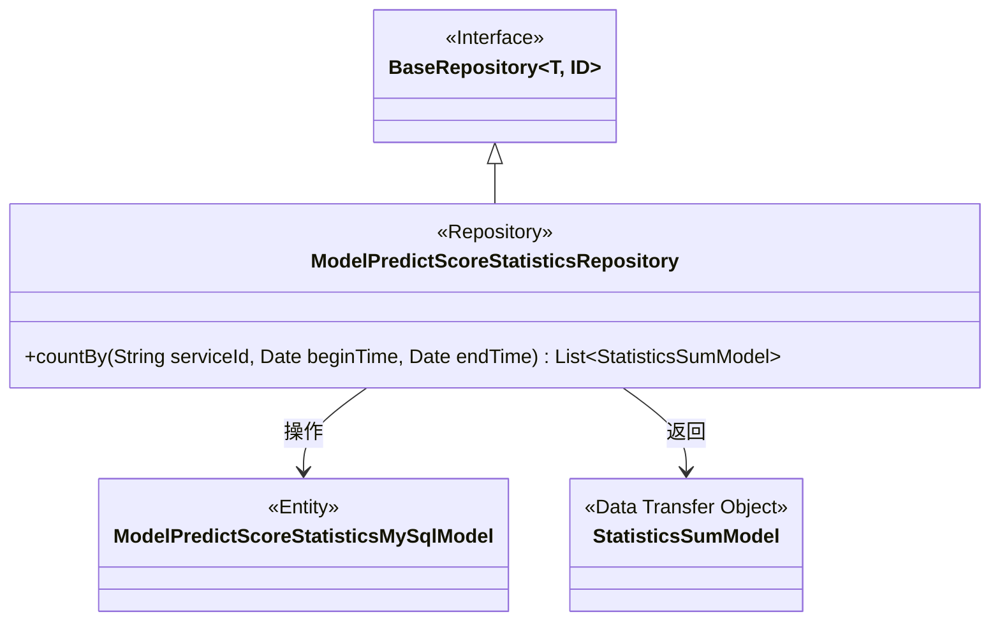
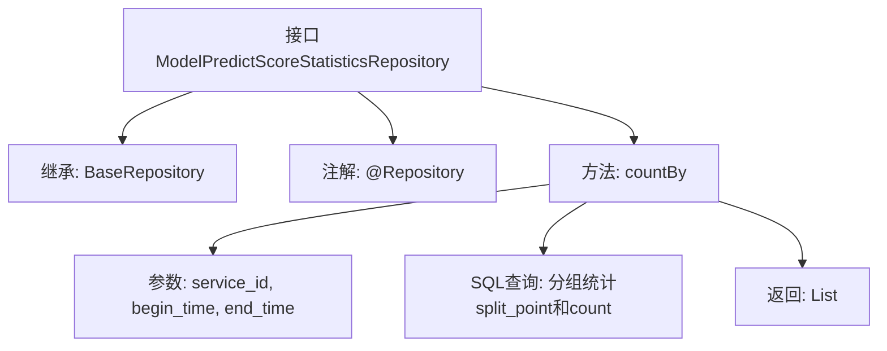

# 基础信息

|      |      |
|------|------|
| 名称 | ModelPredictScoreStatisticsRepository |
| 编码语言 | .java |
| 代码路径 | WeFe/serving/serving-service/src/main/java/com/welab/wefe/serving/service/database/repository/ModelPredictScoreStatisticsRepository.java |
| 包名 | com.welab.wefe.serving.service.database.repository |
| 依赖项 | ['com.welab.wefe.serving.service.database.entity.ModelPredictScoreStatisticsMySqlModel', 'com.welab.wefe.serving.service.database.entity.StatisticsSumModel', 'com.welab.wefe.serving.service.database.repository.base.BaseRepository', 'org.springframework.data.jpa.repository.Query', 'org.springframework.data.repository.query.Param', 'org.springframework.stereotype.Repository', 'java.util.Date', 'java.util.List', 'java.util.Map'] |
| 概述说明 | 该代码定义了一个Spring Data JPA仓库接口，用于查询模型预测分数统计。通过原生SQL按split_point分组统计数量，支持按服务ID和时间范围筛选。返回统计结果列表。 |

# 说明

该代码定义了一个名为ModelPredictScoreStatisticsRepository的Spring Data JPA仓库接口，继承自BaseRepository。接口包含一个原生SQL查询方法countBy，用于统计指定服务ID在特定时间范围内的模型预测分数分布情况。查询按split_point分组，计算每组的count总和，并返回包含splitPoint和count的StatisticsSumModel对象列表。时间范围参数支持默认值处理，若未提供开始时间则默认为1900年，未提供结束时间则默认为当前时间。

# 类列表 Class Summary

| 名称   | 类型  | 说明 |
|-------|------|-------------|
| ModelPredictScoreStatisticsRepository | interface | 该接口定义了一个查询方法，用于统计指定服务ID和时间范围内的模型预测分数分布情况，按分箱点分组并计算总数。 |

## 类 ModelPredictScoreStatisticsRepository

|      |      |
|------|------|
| 访问范围 | @Repository;public |
| 类型 | interface |
| 名称 | ModelPredictScoreStatisticsRepository |
| 说明 | 该接口定义了一个查询方法，用于统计指定服务ID和时间范围内的模型预测分数分布情况，按分箱点分组并计算总数。 |

### UML类图

该类图展示了一个Spring Data JPA仓库接口的结构。ModelPredictScoreStatisticsRepository继承自泛型接口BaseRepository，操作ModelPredictScoreStatisticsMySqlModel实体类，并通过原生SQL查询返回StatisticsSumModel统计结果对象。接口标注了@Repository注解，包含一个带参数绑定的countBy方法，用于按服务ID和时间范围统计预测分数分布情况。

### 内部方法调用关系图

该流程图展示了Spring Data JPA仓库接口的结构，主要包含继承关系、注解声明和核心查询方法。接口通过@Repository注解标记为持久层组件，继承BaseRepository获得基础CRUD能力，并定义了一个原生SQL查询方法countBy，该方法接收服务ID和时间范围参数，按split_point分组统计记录数，返回统计结果列表。查询逻辑包含时间范围动态处理（空值默认值）和条件过滤。

### 字段列表 Field List

| 名称  | 类型  | 说明 |
|-------|-------|------|

### 方法列表

| 名称  | 类型  | 说明 |
|-------|-------|------|
| countBy | List<StatisticsSumModel> | 查询统计指定服务ID在时间范围内的模型预测分数分布，按split_point分组并计算总数。 |

