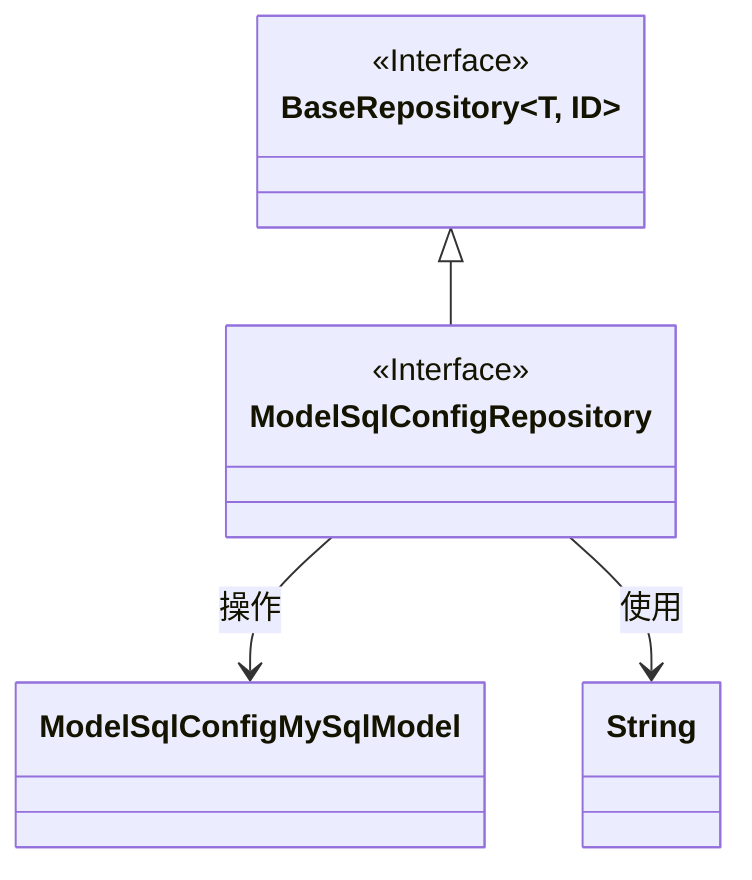
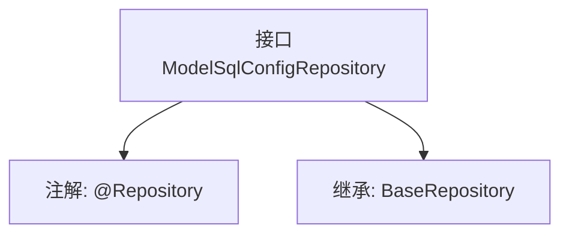

# 基础信息

|      |      |
|------|------|
| 名称 | ModelSqlConfigRepository |
| 编码语言 | .java |
| 代码路径 | WeFe/serving/serving-service/src/main/java/com/welab/wefe/serving/service/database/repository/ModelSqlConfigRepository.java |
| 包名 | com.welab.wefe.serving.service.database.repository |
| 依赖项 | ['com.welab.wefe.serving.service.database.entity.ModelSqlConfigMySqlModel', 'com.welab.wefe.serving.service.database.repository.base.BaseRepository', 'org.springframework.stereotype.Repository'] |
| 概述说明 | 接口ModelSqlConfigRepository继承BaseRepository，操作ModelSqlConfigMySqlModel类型数据，主键为String。 |

# 说明

该内容定义了一个名为ModelSqlConfigRepository的Spring数据仓库接口，使用@Repository注解标识。该接口继承自BaseRepository泛型基类，指定了实体类型为ModelSqlConfigMySqlModel，主键类型为String。这表明该仓库用于操作ModelSqlConfigMySqlModel类型的数据实体，并提供了基础的CRUD操作功能。

# 类列表 Class Summary

| 名称   | 类型  | 说明 |
|-------|------|-------------|
| ModelSqlConfigRepository | interface | 接口ModelSqlConfigRepository继承BaseRepository，用于操作ModelSqlConfigMySqlModel数据，主键类型为String。 |

## 类 ModelSqlConfigRepository

|      |      |
|------|------|
| 访问范围 | @Repository;public |
| 类型 | interface |
| 名称 | ModelSqlConfigRepository |
| 说明 | 接口ModelSqlConfigRepository继承BaseRepository，用于操作ModelSqlConfigMySqlModel数据，主键类型为String。 |

### UML类图

这段代码展示了一个Spring Data JPA的仓库接口结构。ModelSqlConfigRepository接口继承了BaseRepository泛型接口，指定了实体类型为ModelSqlConfigMySqlModel，ID类型为String。类图清晰地展示了接口继承关系和泛型参数的使用，其中BaseRepository作为泛型基接口，ModelSqlConfigRepository作为具体实现接口，与实体类ModelSqlConfigMySqlModel形成操作关系。这种结构是典型的数据访问层设计模式。

### 内部方法调用关系图

该流程图展示了ModelSqlConfigRepository接口的结构，它是一个带有@Repository注解的Spring数据仓库接口，继承了泛型基类BaseRepository，指定了实体类型ModelSqlConfigMySqlModel和主键类型String。这种设计用于实现数据库操作的基本CRUD功能，遵循Spring Data JPA的规范模式。

### 字段列表 Field List

| 名称  | 类型  | 说明 |
|-------|-------|------|

### 方法列表

| 名称  | 类型  | 说明 |
|-------|-------|------|

