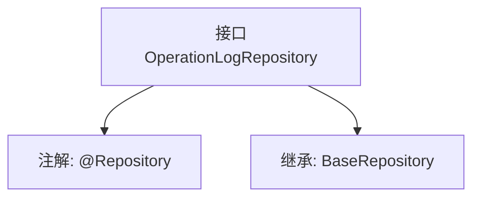

# 基础信息

|      |      |
|------|------|
| 名称 | OperationLogRepository |
| 编码语言 | .java |
| 代码路径 | WeFe/serving/serving-service/src/main/java/com/welab/wefe/serving/service/database/repository/OperationLogRepository.java |
| 包名 | com.welab.wefe.serving.service.database.repository |
| 依赖项 | ['org.springframework.stereotype.Repository', 'com.welab.wefe.serving.service.database.entity.OperationLogMysqlModel', 'com.welab.wefe.serving.service.database.repository.base.BaseRepository'] |
| 概述说明 | 这是一个操作日志的Spring数据仓库接口，继承基础仓库类，用于操作日志的MySQL模型数据访问。 |

# 说明

这是一个名为OperationLogRepository的Spring数据仓库接口，使用@Repository注解标识为持久层组件。该接口继承自BaseRepository泛型基类，指定了实体类型为OperationLogMysqlModel，主键类型为String。该设计表明系统采用MySQL数据库存储操作日志，通过继承基础仓库接口可直接获得标准CRUD操作能力，无需手动实现基础方法。

# 类列表 Class Summary

| 名称   | 类型  | 说明 |
|-------|------|-------------|
| OperationLogRepository | interface | 这是一个操作日志的Spring数据仓库接口，继承基础仓库类，用于操作日志的MySQL模型数据访问。 |


## 类 OperationLogRepository

|      |      |
|------|------|
| 访问范围 | @Repository;public |
| 类型 | interface |
| 名称 | OperationLogRepository |
| 说明 | 这是一个操作日志的Spring数据仓库接口，继承基础仓库类，用于操作日志的MySQL模型数据访问。 |


### UML类图

```mermaid
classDiagram
    class OperationLogRepository {
        <<Interface>>
    }
    class BaseRepository~T, ID~ {
        <<Interface>>
    }
    OperationLogRepository --|> BaseRepository : 继承
    // OperationLogRepository接口继承自泛型接口BaseRepository，指定泛型参数为OperationLogMysqlModel和String
```

该类图展示了一个Spring数据访问层的接口设计。OperationLogRepository作为仓库接口，通过继承泛型接口BaseRepository获得基础CRUD操作能力，其中泛型参数T被具体化为OperationLogMysqlModel实体类，ID类型为String。这种设计遵循了Spring Data JPA的规范，通过泛型继承避免了重复代码，同时保持了类型安全性。接口标注@Repository注解表明其作为数据访问组件被Spring管理。


### 内部方法调用关系图



该流程图展示了OperationLogRepository接口的结构，它是一个带有@Repository注解的Spring数据接口，继承自泛型基类BaseRepository。接口通过继承获得了对OperationLogMysqlModel实体类的CRUD操作能力，主键类型为String。这种设计遵循了Spring Data JPA的规范，实现了数据访问层的解耦和标准化操作。

### 字段列表 Field List

| 名称  | 类型  | 说明 |
|-------|-------|------|

### 方法列表

| 名称  | 类型  | 说明 |
|-------|-------|------|


