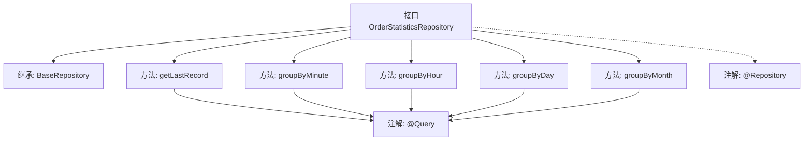

# 基础信息

|      |      |
|------|------|
| 名称 | OrderStatisticsRepository |
| 编码语言 | .java |
| 代码路径 | WeFe/serving/serving-service/src/main/java/com/welab/wefe/serving/service/database/repository/OrderStatisticsRepository.java |
| 包名 | com.welab.wefe.serving.service.database.repository |
| 依赖项 | ['com.welab.wefe.serving.service.database.entity.OrderStatisticsMysqlModel', 'com.welab.wefe.serving.service.database.repository.base.BaseRepository', 'org.springframework.data.jpa.repository.Query', 'org.springframework.data.repository.query.Param', 'org.springframework.stereotype.Repository', 'java.util.Date', 'java.util.List', 'java.util.Map'] |
| 概述说明 | OrderStatisticsRepository接口提供订单统计功能，包含获取最新记录和按分钟、小时、日、月粒度分组统计订单数据的方法，支持多条件筛选。 |

# 说明

OrderStatisticsRepository是一个Spring Data JPA仓库接口，继承自BaseRepository，用于操作OrderStatisticsMysqlModel实体。该接口提供了四个核心方法：getLastRecord查询最新一条记录；groupByMinute按分钟粒度统计订单数据，支持多条件筛选；groupByHour按小时粒度统计；groupByDay按日粒度统计；groupByMonth按月粒度统计。后四个方法均支持服务ID、名称、请求方/响应方ID及名称等条件过滤，并按时间范围分组汇总调用次数、成功次数和失败次数，结果按时间降序排列。所有查询均使用原生SQL实现。

# 类列表 Class Summary

| 名称   | 类型  | 说明 |
|-------|------|-------------|
| OrderStatisticsRepository | interface | OrderStatisticsRepository接口提供订单统计功能，包含获取最新记录及按分钟、小时、日、月粒度分组统计订单数据的方法，支持多条件筛选。 |


## 类 OrderStatisticsRepository

|      |      |
|------|------|
| 访问范围 | @Repository;public |
| 类型 | interface |
| 名称 | OrderStatisticsRepository |
| 说明 | OrderStatisticsRepository接口提供订单统计功能，包含获取最新记录及按分钟、小时、日、月粒度分组统计订单数据的方法，支持多条件筛选。 |


### UML类图

```mermaid
classDiagram
    class BaseRepository~T, ID~ {
        <<Interface>>
    }

    class OrderStatisticsRepository {
        <<Interface>>
        +OrderStatisticsMysqlModel getLastRecord()
        +List~Map~String, Object~~ groupByMinute(String serviceId, String serviceName, String requestPartnerId, String requestPartnerName, String responsePartnerId, String responsePartnerName, Date startTime, Date endTime)
        +List~Map~String, Object~~ groupByHour(String serviceId, String serviceName, String requestPartnerId, String requestPartnerName, String responsePartnerId, String responsePartnerName, Date startTime, Date endTime)
        +List~Map~String, Object~~ groupByDay(String serviceId, String serviceName, String requestPartnerId, String requestPartnerName, String responsePartnerId, String responsePartnerName, Date startTime, Date endTime)
        +List~Map~String, Object~~ groupByMonth(String serviceId, String serviceName, String requestPartnerId, String requestPartnerName, String responsePartnerId, String responsePartnerName, Date startTime, Date endTime)
    }

    OrderStatisticsRepository --|> BaseRepository : 继承
    // BaseRepository是泛型接口，OrderStatisticsRepository是其实现，指定了OrderStatisticsMysqlModel和String类型参数
```

这段类图展示了OrderStatisticsRepository接口继承自BaseRepository泛型接口的结构。OrderStatisticsRepository定义了四个核心聚合查询方法（按分钟/小时/日/月粒度统计订单数据）和一个获取最新记录的方法。所有方法都使用@Query注解直接执行原生SQL查询，通过条件过滤和分组聚合返回统计结果。该接口作为数据访问层组件，专门处理order_statistics表的复杂聚合查询需求。


### 内部方法调用关系图



这段代码定义了一个Spring Data JPA的Repository接口，用于处理订单统计数据的数据库操作。接口提供了五个主要方法：获取最新记录(getLastRecord)，以及按分钟(groupByMinute)、小时(groupByHour)、日(groupByDay)和月(groupByMonth)粒度分组统计订单数据的方法。每个方法都使用@Query注解定义了原生SQL查询，支持通过服务ID、名称、合作伙伴信息等条件进行筛选，并按时间范围过滤结果。接口继承了BaseRepository，具备基本的CRUD功能，同时通过@Repository注解标识为Spring管理的组件。

### 字段列表 Field List

| 名称  | 类型  | 说明 |
|-------|-------|------|

### 方法列表

| 名称  | 类型  | 说明 |
|-------|-------|------|
| groupByMinute | List<Map<String, Object>> | SQL查询统计订单数据，按分钟分组汇总调用、成功、失败次数，支持多条件筛选，包括服务ID/名称、请求/响应方ID/名称及时间范围，结果按时间降序排列。 |
| groupByDay | List<Map<String, Object>> | SQL查询按日期、服务ID、请求方ID和响应方ID分组统计订单数据，支持多条件筛选，并按日期降序返回结果。 |
| groupByMonth | List<Map<String, Object>> | SQL查询按月分组统计订单数据，包括调用次数、成功失败次数、服务及合作伙伴信息，支持多条件筛选并按月份降序排序。 |
| groupByHour | List<Map<String, Object>> | SQL查询按小时分组统计订单数据，汇总调用次数、成功失败次数，支持多条件筛选，并按小时降序排序。 |
| getLastRecord | OrderStatisticsMysqlModel | 查询order_statistics表按更新时间降序排列的第一条记录。 |


