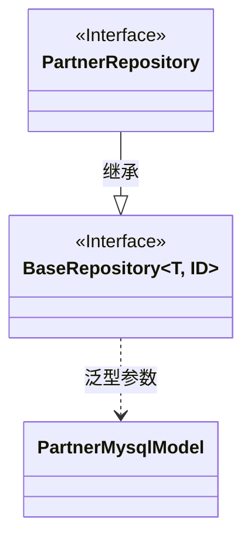
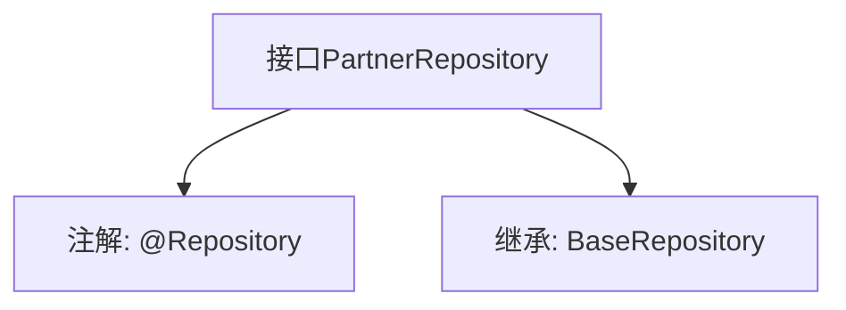

# 基础信息

|      |      |
|------|------|
| 名称 | PartnerRepository |
| 编码语言 | .java |
| 代码路径 | WeFe/serving/serving-service/src/main/java/com/welab/wefe/serving/service/database/repository/PartnerRepository.java |
| 包名 | com.welab.wefe.serving.service.database.repository |
| 依赖项 | ['org.springframework.stereotype.Repository', 'com.welab.wefe.serving.service.database.entity.PartnerMysqlModel', 'com.welab.wefe.serving.service.database.repository.base.BaseRepository'] |
| 概述说明 | 合作伙伴仓库接口，继承基础仓库，操作PartnerMysqlModel类型数据，主键为字符串类型。 |

# 说明

该内容描述了一个名为PartnerRepository的Java接口，使用@Repository注解标记，表明它是一个Spring数据访问层组件。该接口继承自BaseRepository泛型基类，指定了实体类型为PartnerMysqlModel，主键类型为String。这表示该仓库用于操作PartnerMysqlModel类型的数据实体，并提供了基础的CRUD操作功能。整个定义简洁明了，符合Spring Data JPA的标准仓库接口规范。

# 类列表 Class Summary

| 名称   | 类型  | 说明 |
|-------|------|-------------|
| PartnerRepository | interface | 接口PartnerRepository继承BaseRepository，操作PartnerMysqlModel类型数据，主键为String类型，标注为持久层组件。 |

## 类 PartnerRepository

|      |      |
|------|------|
| 访问范围 | @Repository;public |
| 类型 | interface |
| 名称 | PartnerRepository |
| 说明 | 接口PartnerRepository继承BaseRepository，操作PartnerMysqlModel类型数据，主键为String类型，标注为持久层组件。 |

### UML类图

这段代码描述了一个Spring Data JPA的仓库接口PartnerRepository，它继承自泛型接口BaseRepository。BaseRepository是一个通用仓库接口，接受两个泛型参数：实体类型T和ID类型。PartnerRepository特化为操作PartnerMysqlModel实体类，使用String类型作为主键。类图清晰地展示了接口间的继承关系和泛型参数的绑定，体现了Spring Data的通用仓库模式设计。PartnerMysqlModel作为持久化实体，将被PartnerRepository进行CRUD操作。

### 内部方法调用关系图

这段代码展示了一个Spring Data JPA的Repository接口定义。PartnerRepository接口通过@Repository注解标识为数据访问组件，并继承了泛型化的BaseRepository接口，指定了实体类型PartnerMysqlModel和主键类型String。该设计遵循了Spring Data的Repository模式，通过继承基础接口自动获得CRUD操作能力，无需手动实现基础数据访问逻辑。

### 字段列表 Field List

| 名称  | 类型  | 说明 |
|-------|-------|------|

### 方法列表

| 名称  | 类型  | 说明 |
|-------|-------|------|

