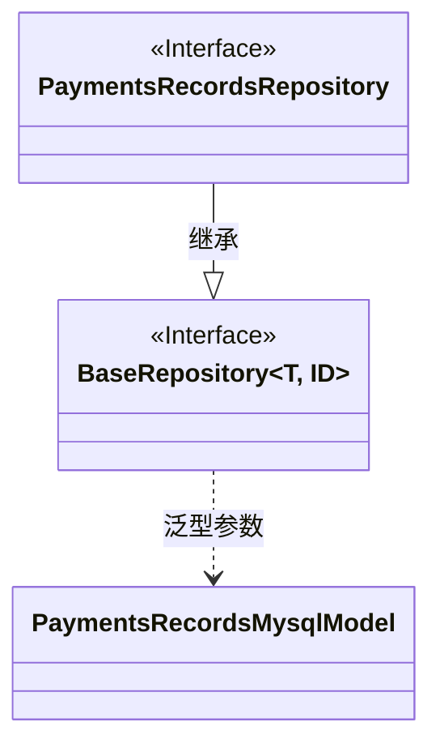
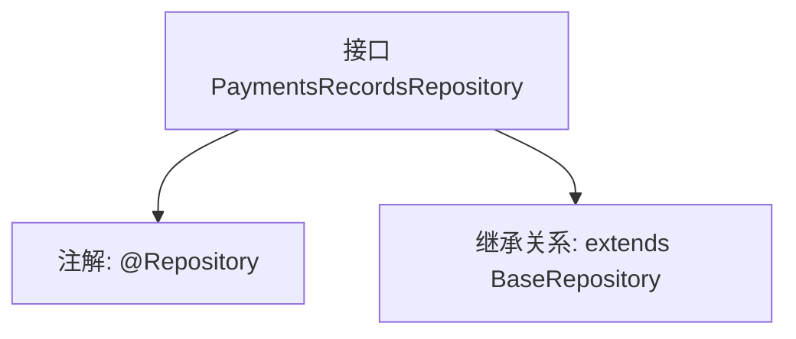

# 基础信息

|      |      |
|------|------|
| 名称 | PaymentsRecordsRepository |
| 编码语言 | .java |
| 代码路径 | WeFe/serving/serving-service/src/main/java/com/welab/wefe/serving/service/database/repository/PaymentsRecordsRepository.java |
| 包名 | com.welab.wefe.serving.service.database.repository |
| 依赖项 | ['com.welab.wefe.serving.service.database.entity.PaymentsRecordsMysqlModel', 'com.welab.wefe.serving.service.database.repository.base.BaseRepository', 'org.springframework.stereotype.Repository'] |
| 概述说明 | 支付记录仓库接口，继承基础仓库类，操作支付记录MySQL模型，主键类型为字符串。 |

# 说明

该内容定义了一个名为PaymentsRecordsRepository的Spring数据仓库接口，使用@Repository注解标记。该接口继承自BaseRepository泛型基类，指定PaymentsRecordsMysqlModel作为实体类型，String作为主键类型。接口体为空，表明完全依赖基类提供的标准CRUD操作方法。该设计遵循了Spring Data JPA的规范模式，通过继承基础仓库接口自动获得基本数据库操作能力，无需手动实现。

# 类列表 Class Summary

| 名称   | 类型  | 说明 |
|-------|------|-------------|
| PaymentsRecordsRepository | interface | 支付记录存储库接口，继承基础存储库，操作支付记录MySQL模型，主键类型为字符串。 |

## 类 PaymentsRecordsRepository

|      |      |
|------|------|
| 访问范围 | @Repository;public |
| 类型 | interface |
| 名称 | PaymentsRecordsRepository |
| 说明 | 支付记录存储库接口，继承基础存储库，操作支付记录MySQL模型，主键类型为字符串。 |

### UML类图

这段类图展示了PaymentsRecordsRepository接口继承自泛型接口BaseRepository的关系。BaseRepository定义了两个泛型参数T和ID，其中T被具体化为PaymentsRecordsMysqlModel实体类，ID为String类型。PaymentsRecordsRepository作为Spring数据访问层接口（通过@Repository标注），通过继承获得基础CRUD操作能力，专用于处理PaymentsRecordsMysqlModel类型数据的持久化。图中清晰体现了接口间的泛型特化和层级关系。

### 内部方法调用关系图

这段流程图描述了PaymentsRecordsRepository接口的结构。该接口被标记为Spring的@Repository组件，表明它是一个数据访问层组件。同时它继承了BaseRepository泛型接口，指定了实体类型为PaymentsRecordsMysqlModel，主键类型为String。这种设计模式是Spring Data JPA的典型实现方式，通过继承基础仓库接口自动获得CRUD操作能力，无需手动实现基础数据访问方法。

### 字段列表 Field List

| 名称  | 类型  | 说明 |
|-------|-------|------|

### 方法列表

| 名称  | 类型  | 说明 |
|-------|-------|------|

