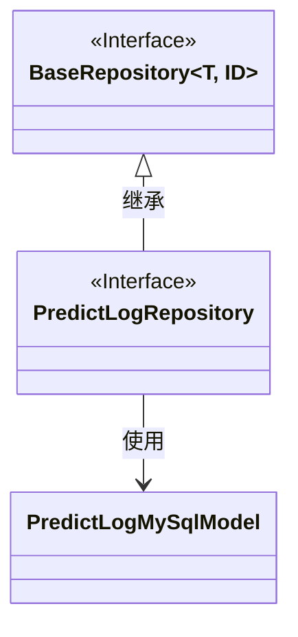
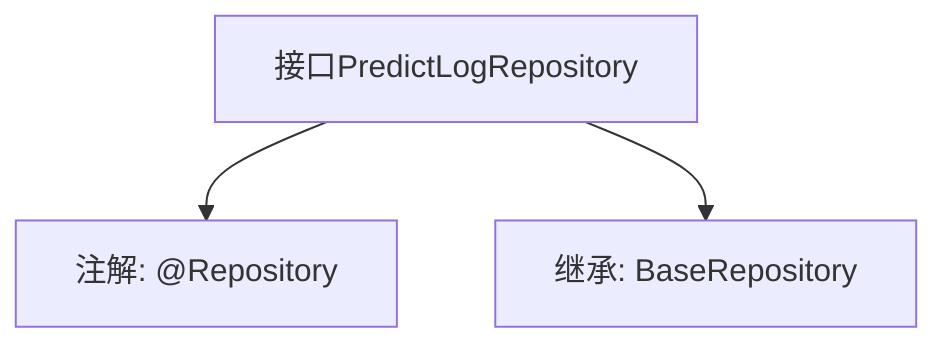

# 基础信息

|      |      |
|------|------|
| 名称 | PredictLogRepository |
| 编码语言 | .java |
| 代码路径 | WeFe/serving/serving-service/src/main/java/com/welab/wefe/serving/service/database/repository/PredictLogRepository.java |
| 包名 | com.welab.wefe.serving.service.database.repository |
| 依赖项 | ['com.welab.wefe.serving.service.database.entity.PredictLogMySqlModel', 'com.welab.wefe.serving.service.database.repository.base.BaseRepository', 'org.springframework.stereotype.Repository'] |
| 概述说明 | 这是一个Spring的仓库接口，继承基础仓库类，用于操作PredictLogMySqlModel类型数据，主键为String类型。 |

# 说明

该内容定义了一个名为PredictLogRepository的Spring数据仓库接口，使用@Repository注解标记。该接口继承自BaseRepository泛型接口，指定了实体类型为PredictLogMySqlModel，主键类型为String。这表明该仓库用于操作MySQL数据库中的PredictLog实体数据，提供了基础的CRUD操作方法。整个定义简洁明了，符合Spring Data JPA的规范设计。

# 类列表 Class Summary

| 名称   | 类型  | 说明 |
|-------|------|-------------|
| PredictLogRepository | interface | 这是一个Spring的仓库接口，继承基础仓库类，用于操作PredictLogMySqlModel类型数据，主键为String类型。 |

## 类 PredictLogRepository

|      |      |
|------|------|
| 访问范围 | @Repository;public |
| 类型 | interface |
| 名称 | PredictLogRepository |
| 说明 | 这是一个Spring的仓库接口，继承基础仓库类，用于操作PredictLogMySqlModel类型数据，主键为String类型。 |

### UML类图

这段类图展示了PredictLogRepository接口继承自BaseRepository泛型接口的关系。BaseRepository是一个泛型接口，接受类型参数T和ID，而PredictLogRepository特化为操作PredictLogMySqlModel实体类，主键类型为String。该设计遵循了Spring Data JPA的仓库模式，通过接口继承实现基础CRUD操作，同时保持类型安全性。

### 内部方法调用关系图

这段代码定义了一个Spring Data JPA的仓库接口PredictLogRepository，使用@Repository注解标识为持久层组件。该接口继承了BaseRepository泛型接口，指定了实体类型为PredictLogMySqlModel，主键类型为String。通过继承，该接口自动获得了基础的CRUD操作方法，无需手动实现。这种设计遵循了Spring Data的规范，实现了对数据库表的操作抽象。

### 字段列表 Field List

| 名称  | 类型  | 说明 |
|-------|-------|------|

### 方法列表

| 名称  | 类型  | 说明 |
|-------|-------|------|

