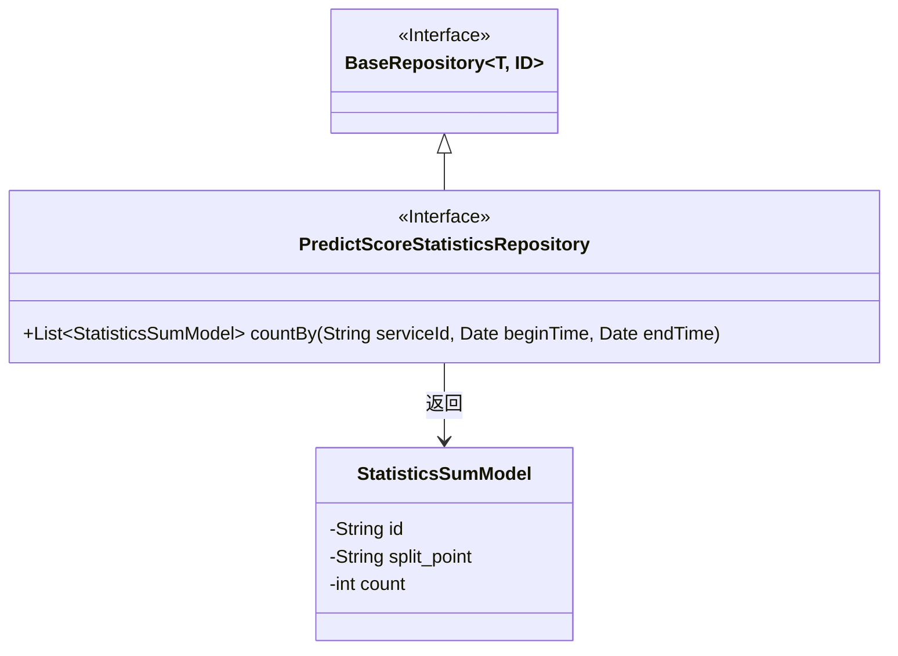
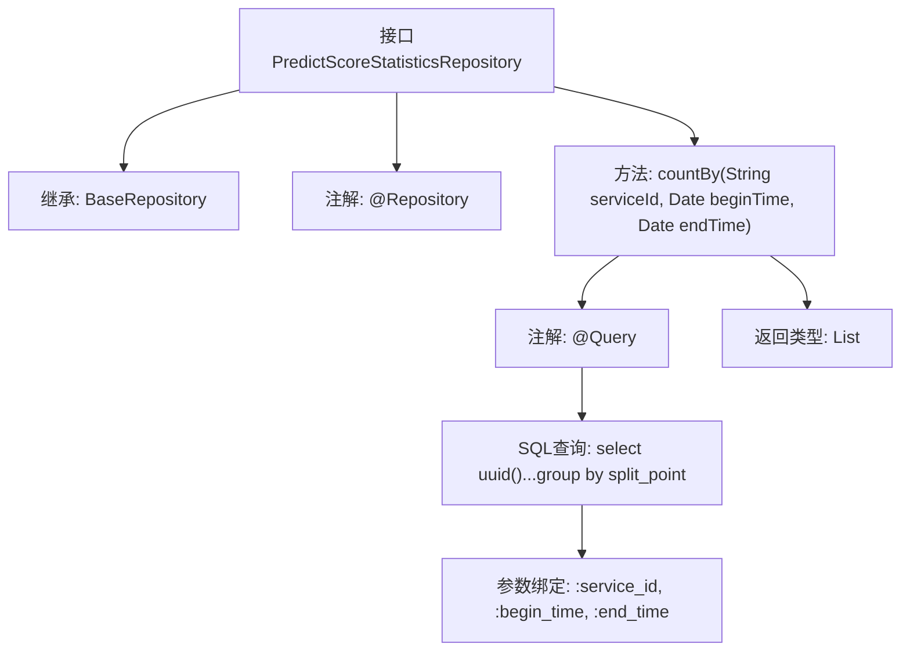

# 基础信息

|      |      |
|------|------|
| 名称 | PredictScoreStatisticsRepository |
| 编码语言 | .java |
| 代码路径 | WeFe/serving/serving-service/src/main/java/com/welab/wefe/serving/service/database/repository/PredictScoreStatisticsRepository.java |
| 包名 | com.welab.wefe.serving.service.database.repository |
| 依赖项 | ['com.welab.wefe.serving.service.database.entity.StatisticsSumModel', 'com.welab.wefe.serving.service.database.repository.base.BaseRepository', 'org.springframework.data.jpa.repository.Query', 'org.springframework.data.repository.query.Param', 'org.springframework.stereotype.Repository', 'java.util.Date', 'java.util.List'] |
| 概述说明 | 定义PredictScoreStatisticsRepository接口，继承BaseRepository，使用原生SQL查询按split_point分组统计指定服务ID和时间范围内的数据总和。 |

# 说明

该代码定义了一个名为PredictScoreStatisticsRepository的Spring Data JPA仓库接口，继承自BaseRepository，操作StatisticsSumModel实体类，主键类型为String。接口包含一个原生SQL查询方法countBy，用于统计指定服务ID在特定时间范围内的模型预测分数分布情况。查询通过group by按split_point分组，计算每组的count总和，并动态处理时间范围参数（未提供时使用默认值1900-01-01或当前时间）。结果以StatisticsSumModel列表形式返回，包含生成的UUID作为id、split_point字段和统计后的count值。

# 类列表 Class Summary

| 名称   | 类型  | 说明 |
|-------|------|-------------|
| PredictScoreStatisticsRepository | interface | 定义PredictScoreStatisticsRepository接口，继承BaseRepository，使用原生SQL查询按split_point分组统计指定服务ID和时间范围内的数据总和。 |

## 类 PredictScoreStatisticsRepository

|      |      |
|------|------|
| 访问范围 | @Repository;public |
| 类型 | interface |
| 名称 | PredictScoreStatisticsRepository |
| 说明 | 定义PredictScoreStatisticsRepository接口，继承BaseRepository，使用原生SQL查询按split_point分组统计指定服务ID和时间范围内的数据总和。 |

### UML类图

这段代码展示了一个Spring Data JPA仓库接口`PredictScoreStatisticsRepository`，它继承自泛型接口`BaseRepository`并操作`StatisticsSumModel`实体。该接口定义了一个原生SQL查询方法`countBy`，用于按服务ID和时间范围统计预测分数分布。类图清晰地呈现了接口继承关系、方法签名以及返回的实体类型，体现了JPA仓库模式中接口与实体之间的典型关联方式。

### 内部方法调用关系图

这段代码描述了一个Spring Data JPA仓库接口，该接口扩展了基础仓库并定义了一个原生SQL查询方法。流程图展示了接口的继承关系、关键注解配置以及查询方法的详细结构，包括参数绑定和返回类型。该方法通过动态时间范围条件统计服务ID关联的分箱点数据，使用UUID生成ID并聚合计数结果。

### 字段列表 Field List

| 名称  | 类型  | 说明 |
|-------|-------|------|

### 方法列表

| 名称  | 类型  | 说明 |
|-------|-------|------|
| countBy | List<StatisticsSumModel> | 查询服务ID在指定时间范围内的模型预测分数统计，按split_point分组汇总count值，时间未指定时默认从1900年或到当前时间。 |

