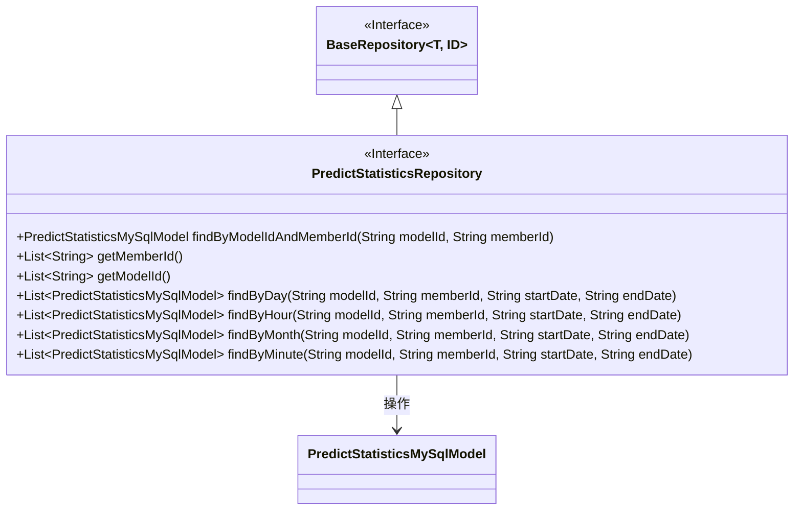
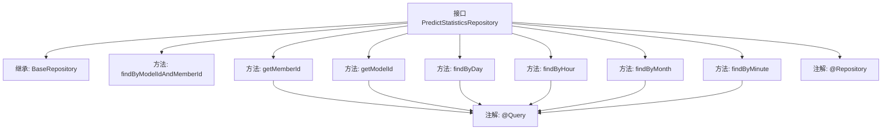

# 基础信息

|      |      |
|------|------|
| 名称 | PredictStatisticsRepository |
| 编码语言 | .java |
| 代码路径 | WeFe/serving/serving-service/src/main/java/com/welab/wefe/serving/service/database/repository/PredictStatisticsRepository.java |
| 包名 | com.welab.wefe.serving.service.database.repository |
| 依赖项 | ['com.welab.wefe.serving.service.database.entity.PredictStatisticsMySqlModel', 'com.welab.wefe.serving.service.database.repository.base.BaseRepository', 'org.springframework.data.jpa.repository.Query', 'org.springframework.data.repository.query.Param', 'org.springframework.stereotype.Repository', 'java.util.List'] |
| 概述说明 | PredictStatisticsRepository接口扩展BaseRepository，提供按模型ID和成员ID查询、获取所有成员ID和模型ID，以及按日、小时、月和分钟分组查询预测统计信息的方法。 |

# 说明

PredictStatisticsRepository是一个继承BaseRepository的Spring数据仓库接口，用于操作PredictStatisticsMySqlModel实体。它提供了多种查询方法：通过modelId和memberId查找单个记录；获取所有memberId和modelId的分组列表；以及按日、小时、月和分钟分组查询统计数据。这些分组查询支持根据modelId、memberId和日期范围进行筛选，并返回聚合后的统计结果，包括总数、成功数、失败数等字段。所有分组查询都使用原生SQL实现，并包含条件判断逻辑。

# 类列表 Class Summary

| 名称   | 类型  | 说明 |
|-------|------|-------------|
| PredictStatisticsRepository | interface | PredictStatisticsRepository接口提供按模型ID和成员ID查询数据、获取所有成员ID和模型ID，以及按日、小时、月和分钟分组查询统计信息的功能。 |

## 类 PredictStatisticsRepository

|      |      |
|------|------|
| 访问范围 | @Repository;public |
| 类型 | interface |
| 名称 | PredictStatisticsRepository |
| 说明 | PredictStatisticsRepository接口提供按模型ID和成员ID查询数据、获取所有成员ID和模型ID，以及按日、小时、月和分钟分组查询统计信息的功能。 |

### UML类图

这段代码展示了一个Spring Data JPA仓库接口`PredictStatisticsRepository`，它继承自泛型接口`BaseRepository`，专门用于操作`PredictStatisticsMySqlModel`实体类。该接口提供了多种查询方法，包括按模型ID和成员ID查找、获取所有成员ID和模型ID，以及按不同时间粒度（日、小时、月、分钟）分组统计预测数据。所有查询方法都使用原生SQL实现，通过`@Query`注解定义，支持条件过滤和分组聚合操作。

### 内部方法调用关系图

这段代码定义了一个Spring Data JPA的Repository接口，主要用于对预测统计数据进行各种查询操作。接口继承了BaseRepository，提供了基础CRUD功能，并扩展了多个自定义查询方法。这些方法包括按模型ID和成员ID查询、获取所有成员ID和模型ID列表，以及按不同时间粒度（天、小时、月、分钟）分组查询统计数据。每个查询方法都通过@Query注解指定了原生SQL查询语句，支持条件筛选和分组聚合操作。

### 字段列表 Field List

| 名称  | 类型  | 说明 |
|-------|-------|------|

### 方法列表

| 名称  | 类型  | 说明 |
|-------|-------|------|
| getModelId | List<String> | 查询predict_log表并按model_id分组，返回所有model_id列表。 |
| getMemberId | List<String> | 查询所有不重复的会员ID。 |
| findByHour | List<PredictStatisticsMySqlModel> | 查询预测统计数据，按小时分组，支持按模型ID、成员ID和时间范围筛选，返回各字段最大值和总和。 |
| findByDay | List<PredictStatisticsMySqlModel> | SQL查询按天分组统计预测数据，条件筛选模型ID、成员ID和日期范围，返回各字段最大值和汇总值。 |
| findByModelIdAndMemberId | PredictStatisticsMySqlModel | 根据模型ID和成员ID查询预测统计信息。 |
| findByMonth | List<PredictStatisticsMySqlModel> | SQL查询按月分组统计预测数据，条件筛选模型ID、成员ID和日期范围，返回最大ID、成员ID等字段及成功失败总数。 |
| findByMinute | List<PredictStatisticsMySqlModel> | 查询预测统计数据，按分钟分组，支持模型ID、成员ID、起止时间筛选，返回各字段最大值及成功失败总数。 |

