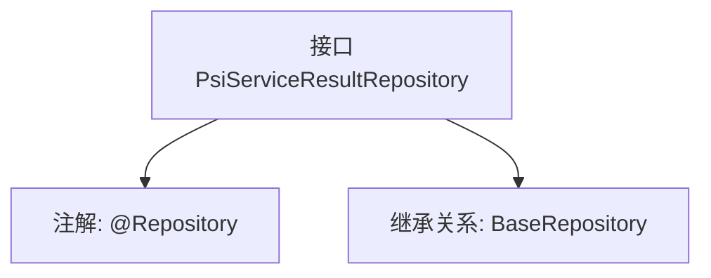

# 基础信息

|      |      |
|------|------|
| 名称 | PsiServiceResultRepository |
| 编码语言 | .java |
| 代码路径 | WeFe/serving/serving-service/src/main/java/com/welab/wefe/serving/service/database/repository/PsiServiceResultRepository.java |
| 包名 | com.welab.wefe.serving.service.database.repository |
| 依赖项 | ['org.springframework.stereotype.Repository', 'com.welab.wefe.serving.service.database.entity.PsiServiceResultMysqlModel', 'com.welab.wefe.serving.service.database.repository.base.BaseRepository'] |
| 概述说明 | 这是一个名为PsiServiceResultRepository的Spring仓库接口，继承自BaseRepository，用于操作PsiServiceResultMysqlModel类型数据，主键类型为String。 |

# 说明

该内容定义了一个名为PsiServiceResultRepository的Spring数据仓库接口，使用@Repository注解标识。该接口继承自BaseRepository泛型基类，指定了实体类型为PsiServiceResultMysqlModel，主键类型为String。这表明该仓库用于操作数据库中的PsiServiceResultMysqlModel实体数据，提供了基础的CRUD操作功能。

# 类列表 Class Summary

| 名称   | 类型  | 说明 |
|-------|------|-------------|
| PsiServiceResultRepository | interface | 这是一个名为PsiServiceResultRepository的Spring仓库接口，继承自BaseRepository，用于操作PsiServiceResultMysqlModel类型数据，主键类型为String。 |


## 类 PsiServiceResultRepository

|      |      |
|------|------|
| 访问范围 | @Repository;public |
| 类型 | interface |
| 名称 | PsiServiceResultRepository |
| 说明 | 这是一个名为PsiServiceResultRepository的Spring仓库接口，继承自BaseRepository，用于操作PsiServiceResultMysqlModel类型数据，主键类型为String。 |


### UML类图

```mermaid
classDiagram
    class BaseRepository~T, ID~ {
        <<Interface>>
    }
    
    class PsiServiceResultMysqlModel {
    }
    
    class PsiServiceResultRepository {
        <<Interface>>
    }
    
    BaseRepository <|-- PsiServiceResultRepository : 继承
    // PsiServiceResultRepository 使用 PsiServiceResultMysqlModel 作为泛型参数
    PsiServiceResultRepository --> PsiServiceResultMysqlModel : 泛型关联
```

这段类图展示了PSI服务结果存储库的接口层级关系。PsiServiceResultRepository是一个标记了@Repository的Spring数据接口，它继承了泛型接口BaseRepository，其中泛型参数T被指定为PsiServiceResultMysqlModel实体类，ID类型为String。该设计遵循了Spring Data JPA的Repository模式，通过继承基础接口获得了基本的CRUD操作能力，同时保持了类型安全性。接口间的继承关系体现了JPA仓库的标准实现方式，使得具体实现可以交由Spring框架自动处理。


### 内部方法调用关系图



这段代码定义了一个名为PsiServiceResultRepository的Spring数据仓库接口，使用@Repository注解标记为持久层组件。该接口继承了BaseRepository泛型接口，指定了实体类型为PsiServiceResultMysqlModel，主键类型为String。流程图展示了接口的核心结构，包括类级别注解和继承关系，体现了Spring Data JPA中简化数据库操作的典型设计模式，通过继承基础仓库接口自动获得CRUD等基础操作方法。

### 字段列表 Field List

| 名称  | 类型  | 说明 |
|-------|-------|------|

### 方法列表

| 名称  | 类型  | 说明 |
|-------|-------|------|


