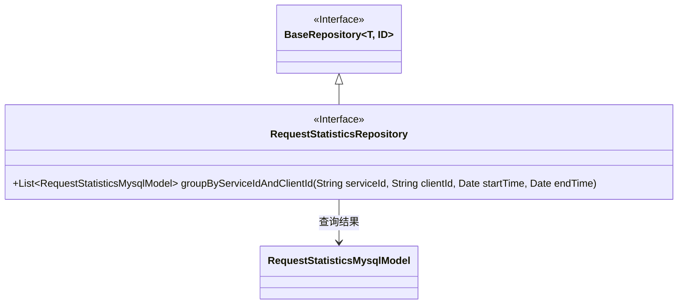
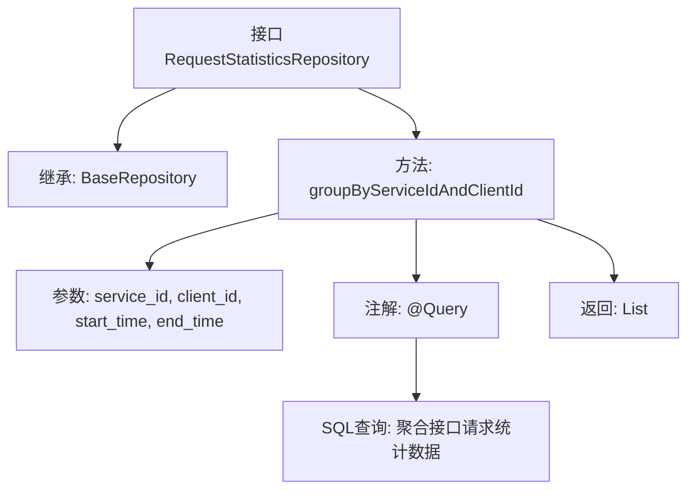

# 基础信息

|      |      |
|------|------|
| 名称 | RequestStatisticsRepository |
| 编码语言 | .java |
| 代码路径 | WeFe/serving/serving-service/src/main/java/com/welab/wefe/serving/service/database/repository/RequestStatisticsRepository.java |
| 包名 | com.welab.wefe.serving.service.database.repository |
| 依赖项 | ['com.welab.wefe.serving.service.database.entity.RequestStatisticsMysqlModel', 'com.welab.wefe.serving.service.database.repository.base.BaseRepository', 'org.springframework.data.jpa.repository.Query', 'org.springframework.data.repository.query.Param', 'org.springframework.stereotype.Repository', 'java.util.Date', 'java.util.List'] |
| 概述说明 | RequestStatisticsRepository接口扩展BaseRepository，通过原生SQL查询按服务ID和客户端ID分组的接口请求统计结果，包括成功、失败和总请求次数。 |

# 说明

该代码定义了一个名为RequestStatisticsRepository的Spring数据仓库接口，继承自BaseRepository，用于操作RequestStatisticsMysqlModel实体类。接口包含一个原生SQL查询方法groupByServiceIdAndClientId，通过serviceId、clientId、startTime和endTime参数查询接口请求统计结果。查询统计了成功请求次数、总请求次数、失败请求次数，并按serviceId和clientId分组。查询条件支持参数为空时的默认处理，时间范围默认为1900-01-01至当前时间。

# 类列表 Class Summary

| 名称   | 类型  | 说明 |
|-------|------|-------------|
| RequestStatisticsRepository | interface | 定义RequestStatisticsRepository接口，继承BaseRepository，包含按服务ID、客户端ID、时间范围分组统计接口请求结果的原生SQL查询方法。 |

## 类 RequestStatisticsRepository

|      |      |
|------|------|
| 访问范围 | @Repository;public |
| 类型 | interface |
| 名称 | RequestStatisticsRepository |
| 说明 | 定义RequestStatisticsRepository接口，继承BaseRepository，包含按服务ID、客户端ID、时间范围分组统计接口请求结果的原生SQL查询方法。 |

### UML类图

这段代码描述了一个Spring Data JPA仓库接口RequestStatisticsRepository，它继承自泛型接口BaseRepository，用于操作RequestStatisticsMysqlModel实体类。该接口定义了一个原生SQL查询方法groupByServiceIdAndClientId，通过服务ID、客户端ID和时间范围等参数，统计API请求记录并按服务ID和客户端ID分组返回结果。类图清晰地展示了接口继承关系和实体类依赖，体现了JPA仓库模式的设计结构。

### 内部方法调用关系图

这段代码定义了一个Spring Data JPA仓库接口，用于查询接口请求统计信息。流程图展示了该接口继承自BaseRepository，包含一个带@Query注解的聚合查询方法，该方法接收4个参数并返回统计结果列表。核心是通过原生SQL对api_request_record表进行多条件筛选和分组聚合，计算成功/失败请求次数等指标。

### 字段列表 Field List

| 名称  | 类型  | 说明 |
|-------|-------|------|

### 方法列表

| 名称  | 类型  | 说明 |
|-------|-------|------|
| groupByServiceIdAndClientId | List<RequestStatisticsMysqlModel> | SQL查询统计API请求记录，按服务ID和客户端ID分组，返回成功/失败次数及详情，支持时间、服务ID和客户端ID筛选。 |

