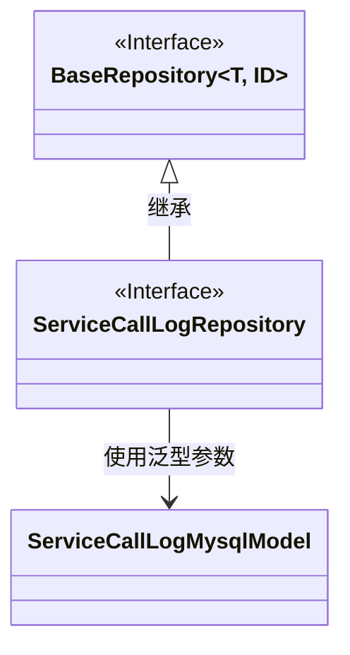
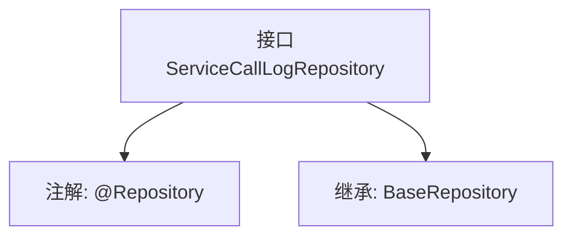

# 基础信息

|      |      |
|------|------|
| 名称 | ServiceCallLogRepository |
| 编码语言 | .java |
| 代码路径 | WeFe/serving/serving-service/src/main/java/com/welab/wefe/serving/service/database/repository/ServiceCallLogRepository.java |
| 包名 | com.welab.wefe.serving.service.database.repository |
| 依赖项 | ['com.welab.wefe.serving.service.database.entity.ServiceCallLogMysqlModel', 'com.welab.wefe.serving.service.database.repository.base.BaseRepository', 'org.springframework.stereotype.Repository'] |
| 概述说明 | 接口ServiceCallLogRepository继承BaseRepository，用于操作ServiceCallLogMysqlModel数据，主键类型为String。 |

# 说明

这是一个名为ServiceCallLogRepository的Spring数据仓库接口，使用@Repository注解标记。它继承了BaseRepository泛型接口，指定了实体类型为ServiceCallLogMysqlModel，主键类型为String。该接口主要用于数据库操作，但未定义额外方法，可能仅使用基类提供的CRUD功能。

# 类列表 Class Summary

| 名称   | 类型  | 说明 |
|-------|------|-------------|
| ServiceCallLogRepository | interface | 这是一个Spring的Repository接口，继承自BaseRepository，用于操作ServiceCallLogMysqlModel类型的数据，主键类型为String。 |

## 类 ServiceCallLogRepository

|      |      |
|------|------|
| 访问范围 | @Repository;public |
| 类型 | interface |
| 名称 | ServiceCallLogRepository |
| 说明 | 这是一个Spring的Repository接口，继承自BaseRepository，用于操作ServiceCallLogMysqlModel类型的数据，主键类型为String。 |

### UML类图

这段类图展示了Spring Data JPA中的仓库接口继承关系。ServiceCallLogRepository是一个标记了@Repository的接口，继承了泛型接口BaseRepository，其中T被指定为ServiceCallLogMysqlModel实体类，ID类型为String。BaseRepository是一个泛型接口，定义了基本的CRUD操作，而ServiceCallLogRepository通过继承获得了这些能力，专门用于操作ServiceCallLogMysqlModel类型的数据实体。这种设计遵循了Spring Data的仓库模式，实现了数据访问层的抽象。

### 内部方法调用关系图

该流程图展示了Spring Data JPA中一个典型的数据访问层接口定义。ServiceCallLogRepository通过@Repository注解标记为Spring管理的Bean，并继承BaseRepository获得基础的CRUD操作能力，泛型参数指定了实体类型ServiceCallLogMysqlModel和主键类型String。这种设计遵循了JPA的"接口即实现"范式，无需编写具体实现即可自动生成数据库操作逻辑。

### 字段列表 Field List

| 名称  | 类型  | 说明 |
|-------|-------|------|

### 方法列表

| 名称  | 类型  | 说明 |
|-------|-------|------|

