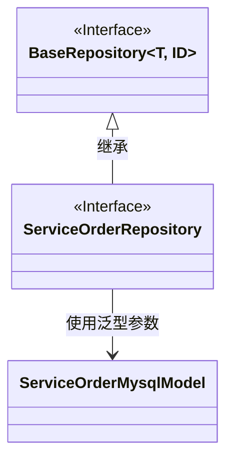
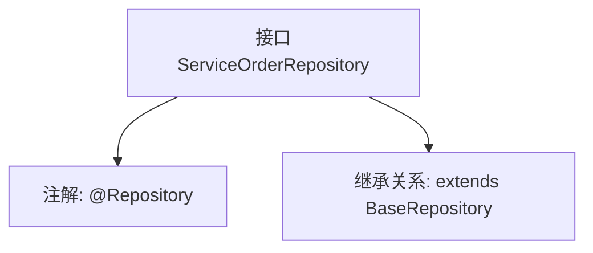

# 基础信息

|      |      |
|------|------|
| 名称 | ServiceOrderRepository |
| 编码语言 | .java |
| 代码路径 | WeFe/serving/serving-service/src/main/java/com/welab/wefe/serving/service/database/repository/ServiceOrderRepository.java |
| 包名 | com.welab.wefe.serving.service.database.repository |
| 依赖项 | ['com.welab.wefe.serving.service.database.entity.ServiceOrderMysqlModel', 'com.welab.wefe.serving.service.database.repository.base.BaseRepository', 'org.springframework.stereotype.Repository'] |
| 概述说明 | 这是一个Spring的Repository接口，继承自BaseRepository，用于操作ServiceOrderMysqlModel类型的数据，主键类型为String。 |

# 说明

这是一个名为ServiceOrderRepository的Spring数据仓库接口，使用@Repository注解标记。它继承自BaseRepository基类，指定了实体类型为ServiceOrderMysqlModel，主键类型为String。该接口用于数据库操作，但未定义额外方法，仅依赖基类提供的通用CRUD功能。

# 类列表 Class Summary

| 名称   | 类型  | 说明 |
|-------|------|-------------|
| ServiceOrderRepository | interface | 服务订单仓库接口，继承基础仓库，操作服务订单MySQL模型，主键类型为字符串。 |

## 类 ServiceOrderRepository

|      |      |
|------|------|
| 访问范围 | @Repository;public |
| 类型 | interface |
| 名称 | ServiceOrderRepository |
| 说明 | 服务订单仓库接口，继承基础仓库，操作服务订单MySQL模型，主键类型为字符串。 |

### UML类图

这段类图展示了三个主要组件：BaseRepository是一个泛型接口，ServiceOrderRepository是继承自BaseRepository的接口，并使用ServiceOrderMysqlModel作为其泛型类型参数。BaseRepository接口定义了基本的仓储操作，而ServiceOrderRepository专门用于处理ServiceOrderMysqlModel类型的数据持久化。这种设计遵循了Spring Data的仓储模式，通过泛型实现了类型安全的数据库操作接口。

### 内部方法调用关系图

这段代码定义了一个Spring Data JPA的Repository接口，使用@Repository注解标记为数据访问组件。该接口继承自泛型的BaseRepository，指定了实体类型为ServiceOrderMysqlModel，主键类型为String。通过继承基础仓库接口，自动获得了基本的CRUD操作方法，无需手动实现。这种设计遵循了Spring Data的"约定优于配置"原则，简化了数据库访问层的开发工作。

### 字段列表 Field List

| 名称  | 类型  | 说明 |
|-------|-------|------|

### 方法列表

| 名称  | 类型  | 说明 |
|-------|-------|------|

