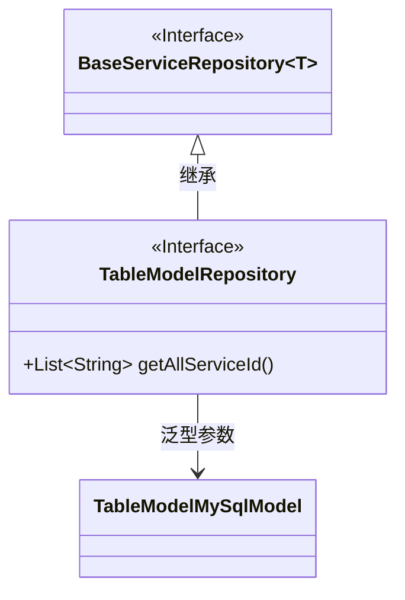
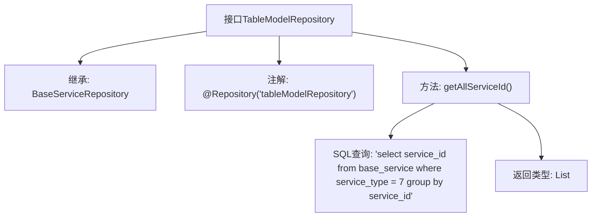

# 基础信息

|      |      |
|------|------|
| 名称 | TableModelRepository |
| 编码语言 | .java |
| 代码路径 | WeFe/serving/serving-service/src/main/java/com/welab/wefe/serving/service/database/repository/TableModelRepository.java |
| 包名 | com.welab.wefe.serving.service.database.repository |
| 依赖项 | ['org.springframework.data.jpa.repository.Query', 'org.springframework.data.repository.query.Param', 'org.springframework.stereotype.Repository', 'com.welab.wefe.serving.service.database.entity.TableModelMySqlModel', 'java.util.List'] |
| 概述说明 | 这是一个Spring Data JPA仓库接口，继承基础服务仓库，用于操作表模型数据。包含一个原生SQL查询方法，获取服务类型为7的所有服务ID列表。 |

# 说明

这是一个名为TableModelRepository的Spring数据仓库接口，使用@Repository注解标记并指定名称为tableModelRepository。该接口继承自BaseServiceRepository，泛型类型为TableModelMySqlModel。接口中定义了一个名为getAllServiceId的方法，该方法通过@Query注解指定了一个原生SQL查询，用于从base_service表中查询service_type等于7的所有service_id并按service_id分组去重，返回结果为字符串列表。方法的功能描述注释表明其用途是获取所有成员ID。整个接口设计简洁明了，专注于数据访问层的特定查询操作。

# 类列表 Class Summary

| 名称   | 类型  | 说明 |
|-------|------|-------------|
| TableModelRepository | interface | 这是一个Spring Data JPA仓库接口，继承基础服务仓库，包含原生SQL查询方法，用于获取服务类型为7的所有服务ID列表。 |

## 类 TableModelRepository

|      |      |
|------|------|
| 访问范围 | @Repository("tableModelRepository");public |
| 类型 | interface |
| 名称 | TableModelRepository |
| 说明 | 这是一个Spring Data JPA仓库接口，继承基础服务仓库，包含原生SQL查询方法，用于获取服务类型为7的所有服务ID列表。 |

### UML类图

类图描述：该图展示了一个Spring Data JPA仓库接口的继承关系。TableModelRepository接口继承自泛型接口BaseServiceRepository，并指定泛型参数为TableModelMySqlModel。接口中定义了一个原生SQL查询方法getAllServiceId()，用于获取特定类型的服务ID列表。通过@Repository注解标识这是一个数据访问组件，体现了JPA仓库模式的设计。

### 内部方法调用关系图

该流程图展示了Spring Data JPA接口TableModelRepository的结构，重点描述其继承关系、注解配置和核心查询方法。接口通过@Repository注解声明为存储库组件，继承基础仓储接口并定义原生SQL查询方法，用于获取特定类型的服务ID列表。流程清晰呈现了从接口定义到SQL语句执行的逻辑链路。

### 字段列表 Field List

| 名称  | 类型  | 说明 |
|-------|-------|------|

### 方法列表

| 名称  | 类型  | 说明 |
|-------|-------|------|
| getAllServiceId | List<String> | 查询类型为7的所有服务ID并按服务ID分组。 |

