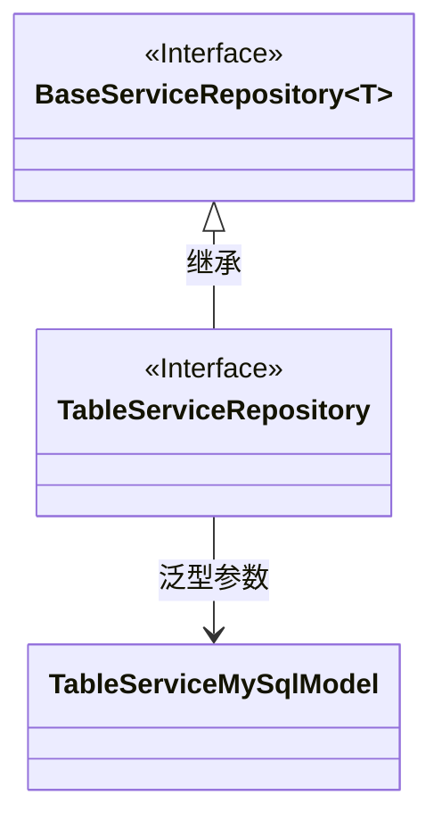
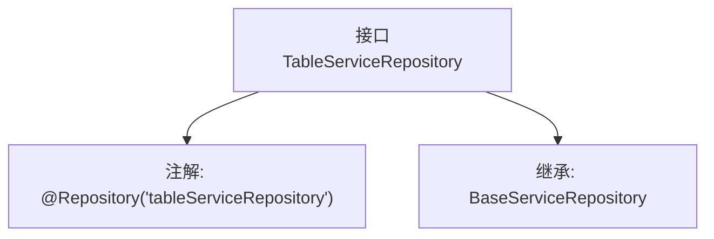

# 基础信息

|      |      |
|------|------|
| 名称 | TableServiceRepository |
| 编码语言 | .java |
| 代码路径 | WeFe/serving/serving-service/src/main/java/com/welab/wefe/serving/service/database/repository/TableServiceRepository.java |
| 包名 | com.welab.wefe.serving.service.database.repository |
| 依赖项 | ['org.springframework.stereotype.Repository', 'com.welab.wefe.serving.service.database.entity.TableServiceMySqlModel'] |
| 概述说明 | 接口TableServiceRepository继承BaseServiceRepository，使用@Repository注解标记为表服务仓库。 |

# 说明

该内容定义了一个名为TableServiceRepository的Java接口，使用@Repository注解标记为Spring框架的仓库组件，并指定了bean名称为"tableServiceRepository"。该接口继承了BaseServiceRepository泛型接口，泛型类型参数指定为TableServiceMySqlModel，表明该仓库专门处理TableServiceMySqlModel类型的数据实体。这是一个典型的Spring Data仓库接口定义，用于数据库操作。

# 类列表 Class Summary

| 名称   | 类型  | 说明 |
|-------|------|-------------|
| TableServiceRepository | interface | 接口TableServiceRepository继承BaseServiceRepository，使用@Repository注解命名为tableServiceRepository，泛型为TableServiceMySqlModel。 |

## 类 TableServiceRepository

|      |      |
|------|------|
| 访问范围 | @Repository("tableServiceRepository");public |
| 类型 | interface |
| 名称 | TableServiceRepository |
| 说明 | 接口TableServiceRepository继承BaseServiceRepository，使用@Repository注解命名为tableServiceRepository，泛型为TableServiceMySqlModel。 |

### UML类图

这段类图展示了TableServiceRepository接口继承自泛型接口BaseServiceRepository，并指定泛型参数为TableServiceMySqlModel。BaseServiceRepository是一个泛型接口（用~T~表示），TableServiceRepository通过继承并指定具体类型参数来实现特化。整体结构体现了Spring框架中常见的Repository模式设计，其中接口层与具体模型类分离，符合依赖倒置原则。

### 内部方法调用关系图

这段代码定义了一个名为TableServiceRepository的Spring数据仓库接口，通过@Repository注解将其标记为Spring组件并指定bean名称为"tableServiceRepository"。该接口继承了泛型基类BaseServiceRepository，其泛型类型为TableServiceMySqlModel，表明该仓库专门用于操作TableServiceMySqlModel类型的数据实体。整个结构体现了Spring Data JPA的典型仓库接口定义模式，为特定模型提供基础CRUD操作能力。

### 字段列表 Field List

| 名称  | 类型  | 说明 |
|-------|-------|------|

### 方法列表

| 名称  | 类型  | 说明 |
|-------|-------|------|

