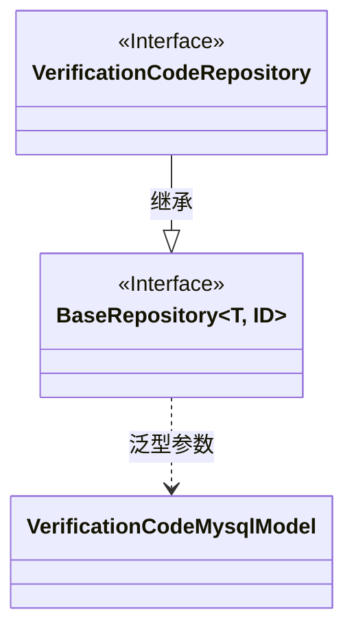
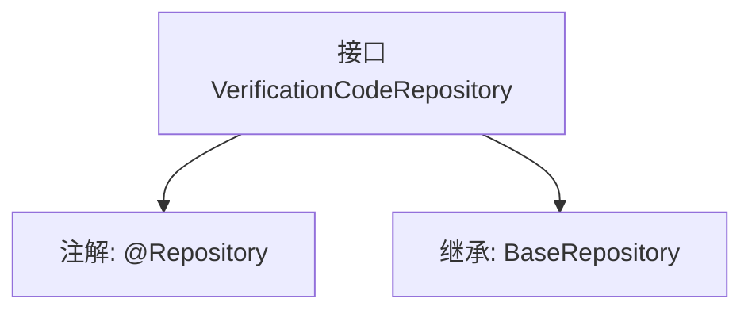

# 基础信息

|      |      |
|------|------|
| 名称 | VerificationCodeRepository |
| 编码语言 | .java |
| 代码路径 | WeFe/serving/serving-service/src/main/java/com/welab/wefe/serving/service/database/repository/VerificationCodeRepository.java |
| 包名 | com.welab.wefe.serving.service.database.repository |
| 依赖项 | ['org.springframework.stereotype.Repository', 'com.welab.wefe.serving.service.database.entity.VerificationCodeMysqlModel', 'com.welab.wefe.serving.service.database.repository.base.BaseRepository'] |
| 概述说明 | 接口VerificationCodeRepository继承BaseRepository，用于操作VerificationCodeMysqlModel数据，主键类型为String。 |

# 说明

该内容定义了一个名为VerificationCodeRepository的Spring数据仓库接口，使用@Repository注解标识。该接口继承自BaseRepository，指定了实体类型为VerificationCodeMysqlModel，主键类型为String。这表明该仓库用于操作验证码相关的MySQL数据库表，提供了基础的CRUD操作功能。

# 类列表 Class Summary

| 名称   | 类型  | 说明 |
|-------|------|-------------|
| VerificationCodeRepository | interface | 这是一个验证码存储库接口，继承基础存储库，用于操作验证码的MySQL模型数据。 |

## 类 VerificationCodeRepository

|      |      |
|------|------|
| 访问范围 | @Repository;public |
| 类型 | interface |
| 名称 | VerificationCodeRepository |
| 说明 | 这是一个验证码存储库接口，继承基础存储库，用于操作验证码的MySQL模型数据。 |

### UML类图

这段类图展示了VerificationCodeRepository接口继承自BaseRepository泛型接口的关系。BaseRepository是一个泛型接口，接受两个类型参数T和ID，其中T被具体化为VerificationCodeMysqlModel实体类，ID为String类型。VerificationCodeRepository作为数据访问层接口，通过继承BaseRepository获得了基础的CRUD操作能力，专门用于处理VerificationCodeMysqlModel类型数据的持久化操作。这种设计遵循了Spring Data JPA的Repository模式，实现了数据访问层的抽象和解耦。

### 内部方法调用关系图

这段代码定义了一个Spring Data JPA的仓库接口VerificationCodeRepository，通过@Repository注解标记为持久层组件。该接口继承自泛型基类BaseRepository，指定了实体类型为VerificationCodeMysqlModel，主键类型为String。流程图展示了接口的核心结构：注解标记和父类继承关系，这是Spring Data JPA实现自动化CRUD操作的典型设计模式，通过继承预定义的泛型仓库接口即可获得基础数据库操作方法。

### 字段列表 Field List

| 名称  | 类型  | 说明 |
|-------|-------|------|

### 方法列表

| 名称  | 类型  | 说明 |
|-------|-------|------|

