# 基础信息

|      |      |
|------|------|
| 名称 | repository |
| 编码语言 | .java |
| 代码路径 | WeFe/serving/serving-service/src/main/java/com/welab/wefe/serving/service/database/repository |
| 包名 | docs.serving.serving-service.src.main.java.com.welab.wefe.serving.service.database.repository |
| 概述说明 | 多个Spring Data JPA仓库接口，继承BaseRepository，提供账户管理、计费记录、客户端服务、预测统计等数据库操作，支持原生SQL查询、分页筛选和事务管理。 |

# 说明

## 概述  
该模块是基于Spring Data JPA的增强型仓储层实现，核心职责为提供统一的数据访问能力与扩展CRUD功能。通过BaseRepository基类与工厂模式实现审计追踪（如自动记录操作时间）、动态字段更新及原生SQL查询转换，类似JPA模板模式。关键数据结构包括泛型实体模型（如PredictStatisticsMySqlModel）和统计DTO（如StatisticsSumModel），依赖Spring Data JPA核心库与EntityManager。例如AccountRepository支持账户状态自动管理，OrderStatisticsRepository实现多粒度时间分组统计。

## 主要业务场景  
典型应用于需要复杂查询与统一审计的持久层场景，如账户管理（自动禁用不活跃账户）、计费统计（多维度聚合分析）和预测日志分析（按模型/成员分组）。交互模式为：继承BaseRepository获得基础CRUD→通过@Query定义原生SQL→工厂注入增强功能（如自动分页/缓存清除）。例如FeeRecordRepository联合多表分页查询，PredictScoreStatisticsRepository动态统计分数分布。完整功能覆盖事务管理、动态条件筛选、多表关联及跨库聚合，适用于金融级数据服务场景。

### 包内部结构视图

```mermaid
graph TD
    repository --> AccountRepository.java
    repository --> BaseServiceRepository.java
    repository --> FeeRecordRepository.java
    repository --> ClientServiceQueryRepository.java
    repository --> FeeDetailRepository.java
    repository --> ServiceOrderRepository.java
    repository --> base
    repository --> MemberRepository.java
    repository --> MessageRepository.java
    repository --> DataSourceRepository.java
    repository --> PredictStatisticsRepository.java
    repository --> ModelSqlConfigRepository.java
    repository --> TableModelRepository.java
    repository --> OperationLogRepository.java
    repository --> PaymentsRecordsRepository.java
    repository --> GlobalConfigRepository.java
    repository --> GlobalSettingRepository.java
    repository --> TableServiceRepository.java
    repository --> PredictLogRepository.java
    repository --> OrderStatisticsRepository.java
    repository --> ModelMemberRepository.java
    repository --> PartnerRepository.java
    repository --> ModelPredictScoreStatisticsRepository.java
    repository --> ClientRepository.java
    repository --> RequestStatisticsRepository.java
    repository --> PredictScoreStatisticsRepository.java
    repository --> ServiceCallLogRepository.java
    repository --> ApiRequestRecordRepository.java
    repository --> PsiServiceResultRepository.java
    repository --> FeeConfigRepository.java
    repository --> ClientServiceRepository.java
    repository --> VerificationCodeRepository.java
    repository --> ModelMemberBaseRepository.java
    repository --> ModelPredictScoreRecordRepository.java
    base --> BaseRepositoryFactoryBean.java
    base --> BaseRepositoryImpl.java
    base --> BaseRepository.java
```

该流程图展示了Java项目中repository目录下的文件结构，包含34个文件节点和1个子目录节点。所有Repository类文件直接隶属于repository目录，其中base子目录包含3个基础Repository相关文件。整个结构清晰地呈现了数据访问层的组织方式，各Repository类按功能平铺排列，基础实现类则集中在base子目录中。

# 文件列表

| 名称   | 类型  | 说明 |
|-------|------|-------------|
| [AccountRepository.java](AccountRepository.md) | file | AccountRepository接口扩展BaseRepository，提供通过手机号查询账号、取消超级管理员权限、更新最后操作时间、禁用90天未活动账号及注销180天未活动账号的功能。 |
| [BaseServiceRepository.java](BaseServiceRepository.md) | file | 接口BaseServiceRepository继承BaseRepository，泛型T需继承BaseServiceMySqlModel，使用@Repository注解命名。 |
| [FeeRecordRepository.java](FeeRecordRepository.md) | file | FeeRecordRepository接口扩展BaseRepository，提供查询计费详情列表和计数的原生SQL方法，支持多条件筛选和分页。 |
| [ClientServiceQueryRepository.java](ClientServiceQueryRepository.md) | file | ClientServiceQueryRepository接口提供客户服务数据查询功能，包含分页查询列表、统计总数和按ID查询详情三个方法，使用原生SQL实现多表联合查询和条件过滤。 |
| [FeeDetailRepository.java](FeeDetailRepository.md) | file | FeeDetailRepository接口继承BaseRepository，用于操作FeeDetailMysqlModel数据。包含原生SQL查询方法getLastRecord，按updated_time降序获取fee_detail表最后一条记录。 |
| [ServiceOrderRepository.java](ServiceOrderRepository.md) | file | 这是一个Spring的Repository接口，继承自BaseRepository，用于操作ServiceOrderMysqlModel类型的数据，主键类型为String。 |
| [MemberRepository.java](MemberRepository.md) | file | 成员仓库接口继承基础仓库，操作MemberMySqlModel类型数据，主键为String类型。 |
| [MessageRepository.java](MessageRepository.md) | file | 消息仓库接口继承基础仓库，操作消息模型和字符串类型主键。 |
| [DataSourceRepository.java](DataSourceRepository.md) | file | DataSourceRepository接口继承BaseRepository，提供按名称统计数量的方法countByName，使用原生SQL查询。 |
| [PredictStatisticsRepository.java](PredictStatisticsRepository.md) | file | PredictStatisticsRepository接口扩展BaseRepository，提供按模型ID和成员ID查询、获取所有成员ID和模型ID，以及按日、小时、月和分钟分组查询预测统计信息的方法。 |
| [ModelSqlConfigRepository.java](ModelSqlConfigRepository.md) | file | 接口ModelSqlConfigRepository继承BaseRepository，操作ModelSqlConfigMySqlModel类型数据，主键为String。 |
| [TableModelRepository.java](TableModelRepository.md) | file | 这是一个Spring Data JPA仓库接口，继承基础服务仓库，用于操作表模型数据。包含一个原生SQL查询方法，获取服务类型为7的所有服务ID列表。 |
| [OperationLogRepository.java](OperationLogRepository.md) | file | 这是一个操作日志的Spring数据仓库接口，继承基础仓库类，用于操作日志的MySQL模型数据访问。 |
| [PaymentsRecordsRepository.java](PaymentsRecordsRepository.md) | file | 支付记录仓库接口，继承基础仓库类，操作支付记录MySQL模型，主键类型为字符串。 |
| [GlobalConfigRepository.java](GlobalConfigRepository.md) | file | 这是一个Spring Data JPA仓库接口，继承基础仓库并定义按组查询方法。 |
| [GlobalSettingRepository.java](GlobalSettingRepository.md) | file | GlobalSettingRepository接口继承BaseRepository，通过@Query注解实现单例查询方法singleton()，返回GlobalSettingMySqlModel。 |
| [TableServiceRepository.java](TableServiceRepository.md) | file | 接口TableServiceRepository继承BaseServiceRepository，使用@Repository注解标记为表服务仓库。 |
| [PredictLogRepository.java](PredictLogRepository.md) | file | 这是一个Spring的仓库接口，继承基础仓库类，用于操作PredictLogMySqlModel类型数据，主键为String类型。 |
| [OrderStatisticsRepository.java](OrderStatisticsRepository.md) | file | OrderStatisticsRepository接口提供订单统计功能，包含获取最新记录和按分钟、小时、日、月粒度分组统计订单数据的方法，支持多条件筛选。 |
| [ModelMemberRepository.java](ModelMemberRepository.md) | file | ModelMemberRepository接口扩展BaseRepository，提供按modelId、memberId及role查询ModelMemberMySqlModel的方法。 |
| [PartnerRepository.java](PartnerRepository.md) | file | 合作伙伴仓库接口，继承基础仓库，操作PartnerMysqlModel类型数据，主键为字符串类型。 |
| [ModelPredictScoreStatisticsRepository.java](ModelPredictScoreStatisticsRepository.md) | file | 该代码定义了一个Spring Data JPA仓库接口，用于查询模型预测分数统计。通过原生SQL按split_point分组统计数量，支持按服务ID和时间范围筛选。返回统计结果列表。 |
| [ClientRepository.java](ClientRepository.md) | file | 客户端仓库接口，继承基础仓库类，操作ClientMysqlModel实体，主键类型为String。 |
| [RequestStatisticsRepository.java](RequestStatisticsRepository.md) | file | RequestStatisticsRepository接口扩展BaseRepository，通过原生SQL查询按服务ID和客户端ID分组的接口请求统计结果，包括成功、失败和总请求次数。 |
| [PredictScoreStatisticsRepository.java](PredictScoreStatisticsRepository.md) | file | 定义PredictScoreStatisticsRepository接口，继承BaseRepository，使用原生SQL查询按split_point分组统计指定服务ID和时间范围内的数据总和。 |
| [ServiceCallLogRepository.java](ServiceCallLogRepository.md) | file | 接口ServiceCallLogRepository继承BaseRepository，用于操作ServiceCallLogMysqlModel数据，主键类型为String。 |
| [ApiRequestRecordRepository.java](ApiRequestRecordRepository.md) | file | 接口ApiRequestRecordRepository继承BaseRepository，用于操作ApiRequestRecordMysqlModel数据，主键类型为String。 |
| [PsiServiceResultRepository.java](PsiServiceResultRepository.md) | file | 这是一个名为PsiServiceResultRepository的Spring仓库接口，继承自BaseRepository，用于操作PsiServiceResultMysqlModel类型数据，主键类型为String。 |
| [FeeConfigRepository.java](FeeConfigRepository.md) | file | FeeConfigRepository接口扩展BaseRepository，提供通过serviceId和clientId更新unitPrice、payType等字段的原生SQL方法，支持自动清除缓存和事务管理。 |
| [ClientServiceRepository.java](ClientServiceRepository.md) | file | 客户端服务仓库接口，扩展基础仓库，提供根据服务ID、客户ID更新状态、修改人和时间的原生SQL方法。 |
| [VerificationCodeRepository.java](VerificationCodeRepository.md) | file | 接口VerificationCodeRepository继承BaseRepository，用于操作VerificationCodeMysqlModel数据，主键类型为String。 |
| [ModelMemberBaseRepository.java](ModelMemberBaseRepository.md) | file | ModelMemberBaseRepository接口扩展BaseRepository，提供通过modelId和role查询ModelMemberBaseModel列表的native SQL方法。 |
| [ModelPredictScoreRecordRepository.java](ModelPredictScoreRecordRepository.md) | file | 这是一个Spring数据仓库接口，继承基础仓库类，用于操作ModelPredictScoreRecordMySqlModel实体，主键类型为String。 |
| [base](base/_module.md) | package | 自定义Spring Data JPA仓库工厂Bean实现，扩展JpaRepositoryFactoryBean，创建自定义仓库实例。BaseRepositoryImpl提供CRUD扩展功能，支持字段查询、批量更新、分页及原生SQL。BaseRepository接口标记为NoRepositoryBean，扩展JPA功能，含事务注解。 |

