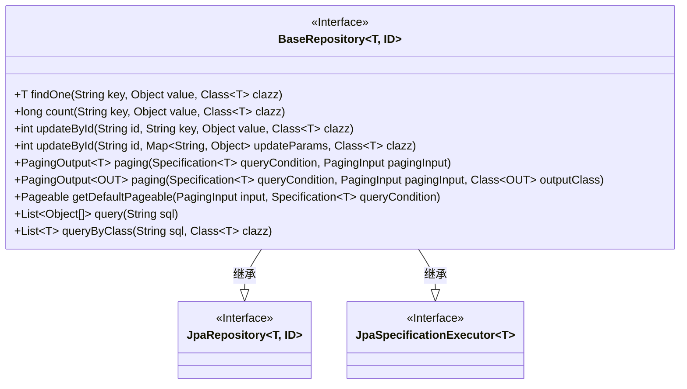

# 基础信息

|      |      |
|------|------|
| 名称 | BaseRepository |
| 编码语言 | .java |
| 代码路径 | WeFe/serving/serving-service/src/main/java/com/welab/wefe/serving/service/database/repository/base/BaseRepository.java |
| 包名 | com.welab.wefe.serving.service.database.repository.base |
| 依赖项 | ['com.welab.wefe.common.data.mysql.MySpecification', 'com.welab.wefe.serving.service.dto.PagingInput', 'com.welab.wefe.serving.service.dto.PagingOutput', 'org.springframework.data.domain.PageRequest', 'org.springframework.data.domain.Pageable', 'org.springframework.data.domain.Sort', 'org.springframework.data.jpa.domain.Specification', 'org.springframework.data.jpa.repository.JpaRepository', 'org.springframework.data.jpa.repository.JpaSpecificationExecutor', 'org.springframework.data.repository.NoRepositoryBean', 'org.springframework.lang.Nullable', 'org.springframework.transaction.annotation.Transactional', 'java.io.Serializable', 'java.util.List', 'java.util.Map'] |
| 概述说明 | BaseRepository接口扩展JPA功能，提供按字段查询、计数、更新、分页及原生SQL查询方法，支持事务回滚和默认排序。 |

# 说明

这是一个标记为NoRepositoryBean的基础仓库接口BaseRepository，扩展了JpaRepository和JpaSpecificationExecutor。它提供了多种数据操作方法：通过指定字段查询单条数据或统计数量，根据ID更新单个或多个字段，支持分页查询并可转换为DTO对象，包含默认分页逻辑，以及基于原生SQL的查询功能。所有更新操作都带有事务注解确保异常回滚。

# 类列表 Class Summary

| 名称   | 类型  | 说明 |
|-------|------|-------------|
| BaseRepository | interface | BaseRepository接口扩展JPA功能，提供按字段查询、计数、更新、分页及原生SQL查询方法，支持事务和默认排序。 |

## 类 BaseRepository

|      |      |
|------|------|
| 访问范围 | @NoRepositoryBean;public |
| 类型 | interface |
| 名称 | BaseRepository |
| 说明 | BaseRepository接口扩展JPA功能，提供按字段查询、计数、更新、分页及原生SQL查询方法，支持事务和默认排序。 |

### UML类图

该代码定义了一个泛型接口`BaseRepository`，它扩展了Spring Data JPA的`JpaRepository`和`JpaSpecificationExecutor`接口，提供了丰富的自定义数据访问方法。接口包含单条数据查询、计数、更新、分页查询和原生SQL查询等功能，其中分页查询支持结果类型转换，更新操作带有事务注解。接口使用泛型T表示实体类型，ID表示主键类型，并通过默认方法实现了默认分页逻辑，当未指定排序字段时默认按createdTime降序排列。

### 内部方法调用关系图

```mermaid
graph TD
    A["接口BaseRepository<T, ID>"]
    B["继承: JpaRepository<T, ID>"]
    C["继承: JpaSpecificationExecutor<T>"]
    D["方法: T findOne(key, value, clazz)"]
    E["方法: long count(key, value, clazz)"]
    F["方法: int updateById(id, key, value, clazz)"]
    G["方法: int updateById(id, updateParams, clazz)"]
    H["方法: PagingOutput<T> paging(queryCondition, pagingInput)"]
    I["方法: <OUT> PagingOutput<OUT> paging(queryCondition, pagingInput, outputClass)"]
    J["默认方法: Pageable getDefaultPageable(input, queryCondition)"]
    K["方法: List<Object[]> query(sql)"]
    L["方法: List<T> queryByClass(sql, clazz)"]

    A --> B
    A --> C
    A --> D
    A --> E
    A --> F
    A --> G
    A --> H
    A --> I
    A --> J
    A --> K
    A --> L
```

该流程图展示了BaseRepository接口的结构及其方法关系。作为Spring Data JPA的扩展接口，它继承了JpaRepository和JpaSpecificationExecutor的核心功能，并添加了12个自定义方法，包括按字段查询(findOne/count)、ID更新(updateById)、分页查询(paging)、原生SQL查询(query/queryByClass)等。特别值得注意的是getDefaultPageable默认方法实现了带排序逻辑的分页参数构建，体现了对分页查询的通用处理能力。所有方法都围绕泛型实体T和ID类型展开，形成统一的JPA扩展规范。

### 字段列表 Field List

| 名称  | 类型  | 说明 |
|-------|-------|------|

### 方法列表

| 名称  | 类型  | 说明 |
|-------|-------|------|
| getDefaultPageable | Pageable | 该方法根据输入参数和查询条件生成可分页对象。若查询条件包含排序规则则使用，否则默认按createdTime降序排序。返回包含页码、页大小和排序规则的分页请求。 |
| count | long | 方法`long count`统计键值对数量，参数为键`key`、值`value`和类型`clazz`，返回长整型结果。 |
| paging | PagingOutput<OUT> | 分页查询方法，接收查询条件、分页参数和输出类，返回分页结果。 |
| updateById | int | 使用事务注解的方法，根据ID更新对象属性，异常时回滚。 |
| queryByClass | List<T> | 该方法通过SQL查询数据库，返回指定类类型的对象列表。参数为SQL语句和目标类对象。 |
| paging | PagingOutput<T> | 分页查询方法，接收查询条件和分页参数，返回分页结果。 |
| findOne | T | 根据键值对查找指定类型的单个对象。 |
| query | List<Object[]> | 执行SQL查询并返回对象数组列表。 |
| updateById | int | 带事务的根据ID更新方法，异常时回滚，参数为ID、键、值和类类型。 |

