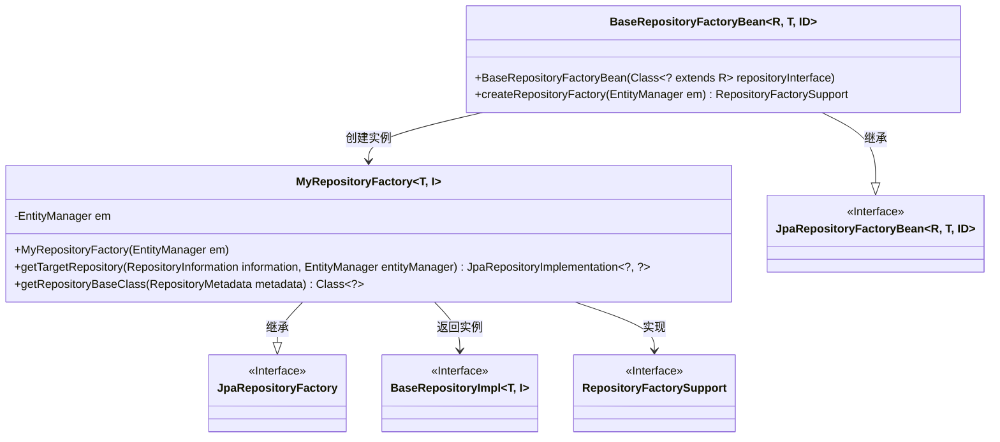
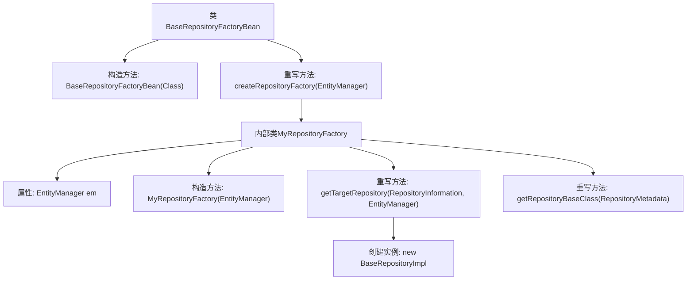

# 基础信息

|      |      |
|------|------|
| 名称 | BaseRepositoryFactoryBean |
| 编码语言 | .java |
| 代码路径 | WeFe/serving/serving-service/src/main/java/com/welab/wefe/serving/service/database/repository/base/BaseRepositoryFactoryBean.java |
| 包名 | com.welab.wefe.serving.service.database.repository.base |
| 依赖项 | ['org.springframework.data.jpa.repository.JpaRepository', 'org.springframework.data.jpa.repository.support.JpaRepositoryFactory', 'org.springframework.data.jpa.repository.support.JpaRepositoryFactoryBean', 'org.springframework.data.jpa.repository.support.JpaRepositoryImplementation', 'org.springframework.data.repository.core.RepositoryInformation', 'org.springframework.data.repository.core.RepositoryMetadata', 'org.springframework.data.repository.core.support.RepositoryFactorySupport', 'javax.persistence.EntityManager', 'java.io.Serializable'] |
| 概述说明 | 自定义JPA仓库工厂Bean，扩展JpaRepositoryFactoryBean，重写工厂创建逻辑，返回自定义BaseRepositoryImpl实现类。 |

# 说明

这是一个自定义的Spring Data JPA仓库工厂Bean实现。它扩展了JpaRepositoryFactoryBean，用于创建自定义的仓库实例。主要功能包括：通过构造函数接收仓库接口类型，重写createRepositoryFactory方法返回自定义的MyRepositoryFactory。内部类MyRepositoryFactory继承JpaRepositoryFactory，重写getTargetRepository方法返回BaseRepositoryImpl实例，并指定BaseRepositoryImpl作为仓库基类。整个实现围绕自定义仓库创建逻辑展开，与EntityManager紧密集成。

# 类列表 Class Summary

| 名称   | 类型  | 说明 |
|-------|------|-------------|
| BaseRepositoryFactoryBean | class | 自定义JPA仓库工厂Bean，扩展JpaRepositoryFactoryBean，重写工厂创建逻辑，返回自定义实现类BaseRepositoryImpl。 |

## 类 BaseRepositoryFactoryBean

|      |      |
|------|------|
| 访问范围 | public |
| 类型 | class |
| 名称 | BaseRepositoryFactoryBean |
| 说明 | 自定义JPA仓库工厂Bean，扩展JpaRepositoryFactoryBean，重写工厂创建逻辑，返回自定义实现类BaseRepositoryImpl。 |

### UML类图

这段代码展示了一个Spring Data JPA的工厂模式实现，其中BaseRepositoryFactoryBean作为基础仓库工厂Bean，通过内部类MyRepositoryFactory创建自定义的JPA仓库实现。类图清晰地呈现了泛型参数传递(R/T/ID和T/I)、继承关系(JpaRepositoryFactoryBean/JpaRepositoryFactory)以及工厂方法创建BaseRepositoryImpl的过程，体现了Spring Data对JPA仓库的动态代理机制。

### 内部方法调用关系图

该流程图展示了Spring Data JPA中自定义仓库工厂Bean的实现结构。BaseRepositoryFactoryBean继承JpaRepositoryFactoryBean，通过重写createRepositoryFactory方法创建自定义的MyRepositoryFactory内部类工厂。该工厂类进一步重写getTargetRepository和getRepositoryBaseClass方法，用于生成BaseRepositoryImpl实例并返回基础仓库类类型，实现了对JPA仓库的扩展定制。

### 字段列表 Field List

| 名称  | 类型  | 说明 |
|-------|-------|------|

### 方法列表

| 名称  | 类型  | 说明 |
|-------|-------|------|
| createRepositoryFactory | RepositoryFactorySupport | 代码重写父类方法，创建返回基于EntityManager的自定义仓库工厂实例。 |

