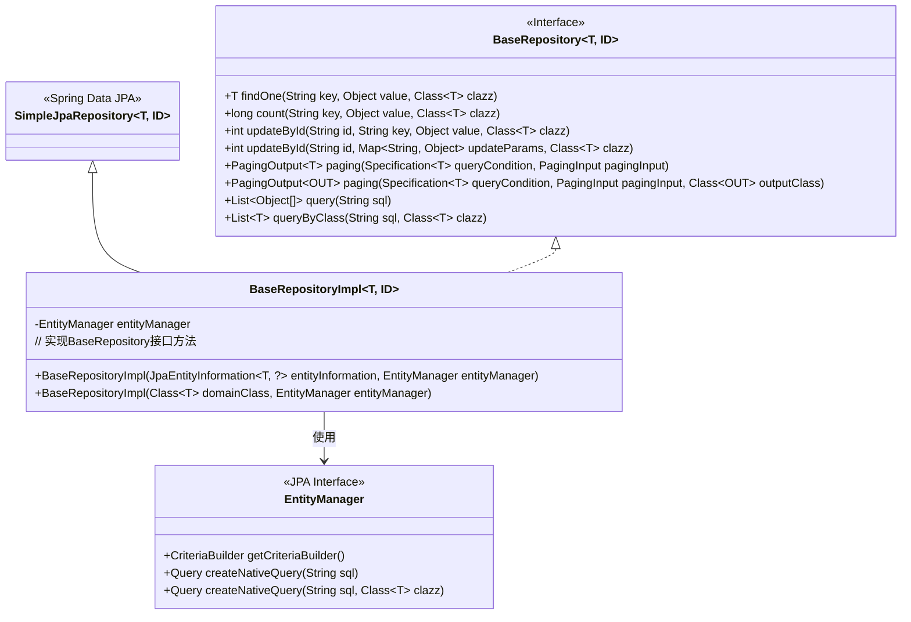

# 基础信息

|      |      |
|------|------|
| 名称 | BaseRepositoryImpl |
| 编码语言 | .java |
| 代码路径 | WeFe/serving/serving-service/src/main/java/com/welab/wefe/serving/service/database/repository/base/BaseRepositoryImpl.java |
| 包名 | com.welab.wefe.serving.service.database.repository.base |
| 依赖项 | ['com.welab.wefe.common.web.util.CurrentAccountUtil', 'com.welab.wefe.serving.service.dto.PagingInput', 'com.welab.wefe.serving.service.dto.PagingOutput', 'org.apache.commons.collections4.CollectionUtils', 'org.springframework.data.domain.Page', 'org.springframework.data.jpa.domain.Specification', 'org.springframework.data.jpa.repository.support.JpaEntityInformation', 'org.springframework.data.jpa.repository.support.SimpleJpaRepository', 'org.springframework.lang.Nullable', 'javax.persistence.EntityManager', 'javax.persistence.Query', 'javax.persistence.criteria.CriteriaBuilder', 'javax.persistence.criteria.CriteriaQuery', 'javax.persistence.criteria.CriteriaUpdate', 'javax.persistence.criteria.Root', 'java.io.Serializable', 'java.util.Date', 'java.util.List', 'java.util.Map'] |
| 概述说明 | BaseRepositoryImpl是JPA仓库实现类，提供通用CRUD操作，包括按条件查询、分页、更新及原生SQL执行功能。 |

# 说明

BaseRepositoryImpl是一个泛型JPA仓库实现类，继承SimpleJpaRepository并实现BaseRepository接口。它通过EntityManager提供基础CRUD操作扩展功能，包含按字段查询单个实体、统计数量、根据ID更新字段（支持单字段和批量更新）、分页查询（支持原生类型和DTO转换）以及执行原生SQL查询（返回数组或映射实体）。所有更新操作自动设置修改时间和操作人ID，分页查询支持条件筛选和自定义分页参数。

# 类列表 Class Summary

| 名称   | 类型  | 说明 |
|-------|------|-------------|
| BaseRepositoryImpl | class | BaseRepositoryImpl是一个通用JPA仓库实现类，提供CRUD、分页查询、动态更新和原生SQL查询功能。包含按条件查询、计数、ID更新、分页输出及多类型转换等方法，利用EntityManager和CriteriaBuilder实现灵活操作。 |

## 类 BaseRepositoryImpl

|      |      |
|------|------|
| 访问范围 | public |
| 类型 | class |
| 名称 | BaseRepositoryImpl |
| 说明 | BaseRepositoryImpl是一个通用JPA仓库实现类，提供CRUD、分页查询、动态更新和原生SQL查询功能。包含按条件查询、计数、ID更新、分页输出及多类型转换等方法，利用EntityManager和CriteriaBuilder实现灵活操作。 |

### UML类图

类图描述：
BaseRepositoryImpl是一个泛型JPA仓库实现类，继承自Spring Data JPA的SimpleJpaRepository并实现了自定义的BaseRepository接口。它通过EntityManager执行各种数据库操作，包括条件查询、分页查询、原生SQL查询和更新操作。类图中清晰地展示了继承关系（SimpleJpaRepository）、接口实现关系（BaseRepository）以及依赖关系（EntityManager），体现了该实现类对JPA标准API的封装和扩展能力。

### 内部方法调用关系图

```mermaid
graph TD
    A["类BaseRepositoryImpl<T, ID>"]
    B["属性: EntityManager entityManager"]
    C["构造方法1: BaseRepositoryImpl(JpaEntityInformation<T, ?>, EntityManager)"]
    D["构造方法2: BaseRepositoryImpl(Class<T>, EntityManager)"]
    E["方法: T findOne(String key, Object value, Class<T> clazz)"]
    F["方法: long count(String key, Object value, Class<T> clazz)"]
    G["方法: int updateById(String id, String key, Object value, Class<T> clazz)"]
    H["方法: int updateById(String id, Map<String, Object> updateParams, Class<T> clazz)"]
    I["方法: PagingOutput<T> paging(Specification<T>, PagingInput)"]
    J["方法: PagingOutput<OUT> paging(Specification<T>, PagingInput, Class<OUT>)"]
    K["方法: List<Object[]> query(String sql)"]
    L["方法: List<T> queryByClass(String sql, Class<T> clazz)"]

    A --> B
    A --> C
    A --> D
    A --> E
    A --> F
    A --> G
    A --> H
    A --> I
    A --> J
    A --> K
    A --> L
```

该流程图展示了BaseRepositoryImpl类的结构和主要方法。该类继承SimpleJpaRepository并实现BaseRepository接口，包含两个构造方法和多个数据操作方法。核心功能包括通过条件查询单个实体(findOne)、统计数量(count)、按ID更新字段(updateById)、分页查询(paging)以及执行原生SQL查询(query/queryByClass)。所有操作均通过EntityManager实现JPA规范的数据访问，支持泛型和动态条件构造。

### 字段列表 Field List

| 名称  | 类型  | 说明 |
|-------|-------|------|
| entityManager | EntityManager | 私有不可变的EntityManager实例。 |

### 方法列表

| 名称  | 类型  | 说明 |
|-------|-------|------|
| findOne | T | 该方法通过JPA Criteria API查询数据库，根据指定字段和值返回匹配的第一个实体对象，若无结果则返回null。 |
| queryByClass | List<T> | 该方法通过原生SQL查询数据库，返回指定类类型的实体列表。 |
| paging | PagingOutput<OUT> | 分页查询方法，根据条件查询数据并分页返回，包含总数和转换后的结果列表。 |
| updateById | int | 该方法通过ID更新实体，使用CriteriaBuilder构建更新操作，遍历参数设置字段值，自动更新时间和操作人，最后执行更新并返回影响行数。 |
| count | long | 该方法通过JPA Criteria API统计数据库中指定字段值等于给定值的记录数，返回统计结果。 |
| paging | PagingOutput<T> | 分页查询方法，根据条件查询数据并返回分页结果，包含总数和内容列表。 |
| query | List<Object[]> | 该方法执行原生SQL查询，返回结果列表。输入为SQL字符串，输出为Object数组列表。 |
| updateById | int | 该方法通过ID更新实体属性，同时设置更新时间与操作人，返回影响行数。 |

