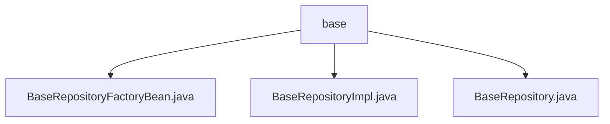

# 基础信息

|      |      |
|------|------|
| 名称 | base |
| 编码语言 | .java |
| 代码路径 | WeFe/serving/serving-service/src/main/java/com/welab/wefe/serving/service/database/repository/base |
| 包名 | docs.serving.serving-service.src.main.java.com.welab.wefe.serving.service.database.repository.base |
| 概述说明 | 自定义Spring Data JPA仓库工厂Bean实现，扩展JpaRepositoryFactoryBean，创建自定义仓库实例。BaseRepositoryImpl提供CRUD扩展功能，支持字段查询、批量更新、分页及原生SQL。BaseRepository接口标记为NoRepositoryBean，扩展JPA功能，含事务注解。 |

# 说明

## 概述  
该模块是Spring Data JPA的自定义扩展实现，核心职责为提供增强型泛化仓库操作能力。通过BaseRepositoryFactoryBean工厂动态创建具备审计追踪（如自动记录修改时间）和扩展CRUD功能的仓库实例，类似JPA模板模式。关键数据结构包括泛型基类BaseRepositoryImpl和标记接口BaseRepository，依赖Spring Data JPA核心库与EntityManager。例如BaseRepositoryImpl支持原生SQL转DTO分页查询，BaseRepository定义批量字段更新规范。

## 主要业务场景  
典型应用于需要统一审计字段（如操作人ID）管理的JPA持久层场景，通过工厂模式自动装配增强型仓库。交互流程为：工厂Bean解析接口类型→构建自定义RepositoryFactory→生成集成审计功能的BaseRepositoryImpl实例。例如按字段条件分页查询时，自动注入修改时间并支持原生SQL/DTO转换。完整功能覆盖基础CRUD、动态字段更新、分页封装及原生查询，适用于需要扩展JPA默认行为的业务模块。

### 包内部结构视图

该流程图展示了WeFe项目中base目录下的三个Java文件：BaseRepositoryFactoryBean.java、BaseRepositoryImpl.java和BaseRepository.java。这三个文件都直接隶属于base目录，没有更深层次的嵌套关系，属于同一层级的代码文件，共同构成了基础仓库层的实现结构。

# 文件列表

| 名称   | 类型  | 说明 |
|-------|------|-------------|
| [BaseRepositoryFactoryBean.java](BaseRepositoryFactoryBean.md) | file | 自定义JPA仓库工厂Bean，扩展JpaRepositoryFactoryBean，重写工厂创建逻辑，返回自定义BaseRepositoryImpl实现类。 |
| [BaseRepositoryImpl.java](BaseRepositoryImpl.md) | file | BaseRepositoryImpl是JPA仓库实现类，提供通用CRUD操作，包括按条件查询、分页、更新及原生SQL执行功能。 |
| [BaseRepository.java](BaseRepository.md) | file | BaseRepository接口扩展JPA功能，提供按字段查询、计数、更新、分页及原生SQL查询方法，支持事务回滚和默认排序。 |

