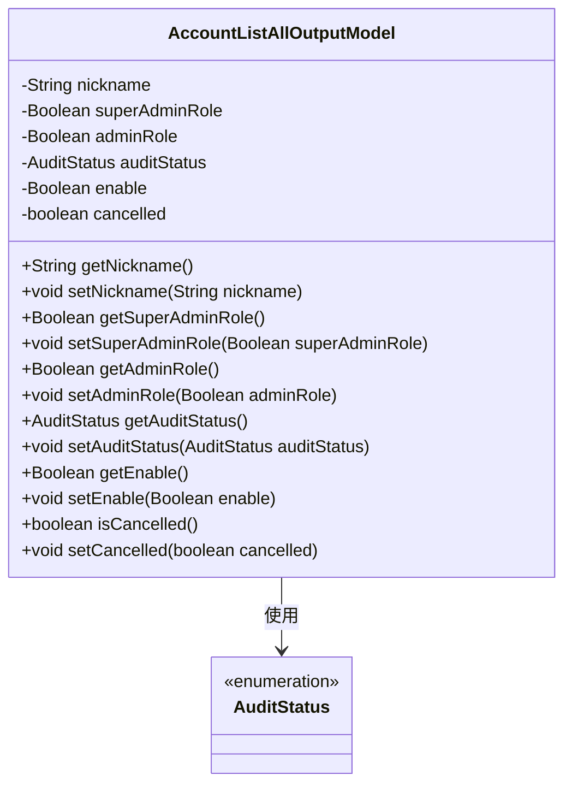

# 基础信息

|      |      |
|------|------|
| 名称 | AccountListAllOutputModel |
| 编码语言 | .java |
| 代码路径 | WeFe/serving/serving-service/src/main/java/com/welab/wefe/serving/service/dto/AccountListAllOutputModel.java |
| 包名 | com.welab.wefe.serving.service.dto |
| 依赖项 | ['com.welab.wefe.common.fieldvalidate.annotation.Check', 'com.welab.wefe.common.wefe.enums.AuditStatus'] |
| 概述说明 | AccountListAllOutputModel类包含昵称、超级管理员、管理员、审核状态、可用性和注销状态等属性及其getter/setter方法。 |

# 说明

AccountListAllOutputModel类定义了账户列表输出的数据模型，包含昵称、超级管理员标识、管理员标识、审核状态、可用状态和注销状态等字段。超级管理员通常是系统初始化创建者，管理员拥有更多权限如设置成员可见性。每个字段都有对应的getter和setter方法用于数据存取。

# 类列表 Class Summary

| 名称   | 类型  | 说明 |
|-------|------|-------------|
| AccountListAllOutputModel | class | 账户列表输出模型类，包含昵称、超级管理员标识、管理员标识、审核状态、可用状态及注销状态字段及其getter/setter方法。 |

## 类 AccountListAllOutputModel

|      |      |
|------|------|
| 访问范围 | public |
| 类型 | class |
| 名称 | AccountListAllOutputModel |
| 说明 | 账户列表输出模型类，包含昵称、超级管理员标识、管理员标识、审核状态、可用状态及注销状态字段及其getter/setter方法。 |

### UML类图

这段代码定义了一个名为AccountListAllOutputModel的类，用于表示账户列表的输出模型。该类包含多个私有字段，如昵称、超级管理员角色标志、管理员角色标志、审核状态、启用标志和注销标志，并为这些字段提供了相应的getter和setter方法。其中，auditStatus字段使用了枚举类型AuditStatus。该类主要用于封装账户信息，便于在系统中传递和处理账户数据。

### 内部方法调用关系图

```mermaid
graph TD
    A["类AccountListAllOutputModel"]
    B["属性: String nickname"]
    C["属性: Boolean superAdminRole"]
    D["属性: Boolean adminRole"]
    E["属性: AuditStatus auditStatus"]
    F["属性: Boolean enable"]
    G["属性: boolean cancelled"]
    H["方法: getNickname()/setNickname()"]
    I["方法: getSuperAdminRole()/setSuperAdminRole()"]
    J["方法: getAdminRole()/setAdminRole()"]
    K["方法: getAuditStatus()/setAuditStatus()"]
    L["方法: getEnable()/setEnable()"]
    M["方法: isCancelled()/setCancelled()"]

    A --> B
    A --> C
    A --> D
    A --> E
    A --> F
    A --> G
    A --> H
    A --> I
    A --> J
    A --> K
    A --> L
    A --> M
```

该流程图展示了AccountListAllOutputModel类的完整结构，包含6个属性和对应的12个getter/setter方法。所有属性均带有@Check注解或注释说明，其中nickname、superAdminRole等5个属性使用包装类型，cancelled使用基本类型boolean。每个属性都严格遵循JavaBean规范，通过get/set方法访问私有字段，auditStatus使用自定义枚举类型AuditStatus。流程图清晰呈现了类成员与方法的从属关系。

### 字段列表 Field List

| 名称  | 类型  | 说明 |
|-------|-------|------|
| adminRole | Boolean | 检查管理员权限，控制成员可见性等高级功能。 |
| superAdminRole | Boolean | 检查是否为超级管理员，即系统初始创建者。 |
| nickname | String | Java字段注解：检查昵称的字符串类型私有变量。 |
| cancelled | boolean | 布尔变量cancelled，表示取消状态。 |
| enable | Boolean | 定义私有布尔变量enable，使用@Check注解标记为"是否可用"。 |
| auditStatus | AuditStatus | 类成员变量auditStatus，标注为审核状态检查，类型为AuditStatus。 |

### 方法列表

| 名称  | 类型  | 说明 |
|-------|-------|------|
| setAuditStatus | void | 设置审核状态的方法，将传入的auditStatus赋值给当前对象的auditStatus字段。 |
| setAdminRole | void | 定义方法setAdminRole，接受布尔参数adminRole，用于设置类的adminRole属性值。 |
| getNickname | String | 这是一个Java方法，返回字符串类型的昵称变量值。 |
| setSuperAdminRole | void | 设置用户是否为超级管理员角色的方法。 |
| getAuditStatus | AuditStatus | 获取当前审核状态的方法，返回auditStatus属性值。 |
| getAdminRole | Boolean | 方法返回管理员角色状态布尔值。 |
| getSuperAdminRole | Boolean | 获取超级管理员角色状态的方法，返回布尔值。 |
| setNickname | void | 这是一个Java方法，用于设置对象的昵称属性。方法接受一个字符串参数nickname，并将其赋值给对象的同名成员变量。 |
| getEnable | Boolean | 方法getEnable返回布尔值enable。 |
| setEnable | void | 定义了一个公共方法setEnable，用于设置布尔类型的enable属性值。 |
| isCancelled | boolean | 检查是否已取消，返回布尔值cancelled的状态。 |
| setCancelled | void | 设置取消状态的公共方法，参数为布尔值cancelled，用于更新内部状态。 |

