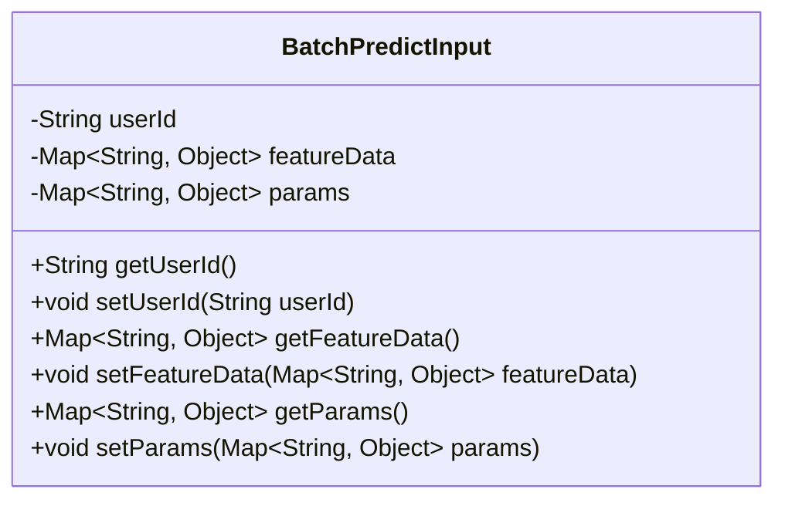
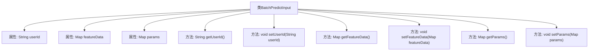

# 基础信息

|      |      |
|------|------|
| 名称 | BatchPredictInput |
| 编码语言 | .java |
| 代码路径 | WeFe/serving/serving-service/src/main/java/com/welab/wefe/serving/service/dto/BatchPredictInput.java |
| 包名 | com.welab.wefe.serving.service.dto |
| 依赖项 | ['java.util.Map'] |
| 概述说明 | BatchPredictInput类包含userId、featureData和params字段，提供getter和setter方法。 |

# 说明

BatchPredictInput是一个Java类，用于批量预测的输入数据封装。该类包含三个主要字段：userId表示用户标识，featureData存储特征数据的键值对，params保存预测参数的键值对。每个字段都有对应的getter和setter方法，用于访问和修改这些属性。

# 类列表 Class Summary

| 名称   | 类型  | 说明 |
|-------|------|-------------|
| BatchPredictInput | class | BatchPredictInput类包含userId、featureData和params三个属性，提供对应的getter和setter方法。 |

## 类 BatchPredictInput

|      |      |
|------|------|
| 访问范围 | public |
| 类型 | class |
| 名称 | BatchPredictInput |
| 说明 | BatchPredictInput类包含userId、featureData和params三个属性，提供对应的getter和setter方法。 |

### UML类图

该代码定义了一个名为BatchPredictInput的类，用于封装批量预测的输入数据。类中包含三个私有成员变量：userId（用户ID）、featureData（特征数据）和params（参数），分别通过getter和setter方法进行访问和修改。featureData和params都是Map类型，键为String，值为Object，可以存储灵活的数据结构。这个类主要用于数据传输和封装，便于在批量预测过程中管理和操作输入数据。

### 内部方法调用关系图

该流程图展示了BatchPredictInput类的完整结构，包含三个核心属性(userId、featureData和params)及其对应的getter/setter方法。这是一个典型的数据传输对象(DTO)设计，用于封装批量预测所需的输入数据，其中featureData存储特征数据，params存储预测参数，userId标识用户身份。所有属性都通过公共方法暴露，符合JavaBean规范，便于序列化和反序列化操作。

### 字段列表 Field List

| 名称  | 类型  | 说明 |
|-------|-------|------|
| featureData | Map<String, Object> | 私有成员变量featureData，类型为Map，键为String，值为Object。 |
| params | Map<String, Object> | 声明一个私有Map变量params，键为String类型，值为Object类型。 |
| userId | String | 声明一个私有字符串变量userId。 |

### 方法列表

| 名称  | 类型  | 说明 |
|-------|-------|------|
| setParams | void | 设置参数方法，接收Map类型参数并赋值给类成员变量params。 |
| getUserId | String | 获取用户ID的方法，返回字符串类型的userId。 |
| setUserId | void | 设置用户ID的方法，将参数userId赋值给当前对象的userId属性。 |
| getFeatureData | Map<String, Object> | 获取featureData的公开方法，返回Map类型数据。 |
| getParams | Map<String, Object> | 获取参数映射的方法，返回键值对集合。 |
| setFeatureData | void | 设置特征数据的方法，接收字符串到对象的映射参数，并赋值给类成员变量featureData。 |

