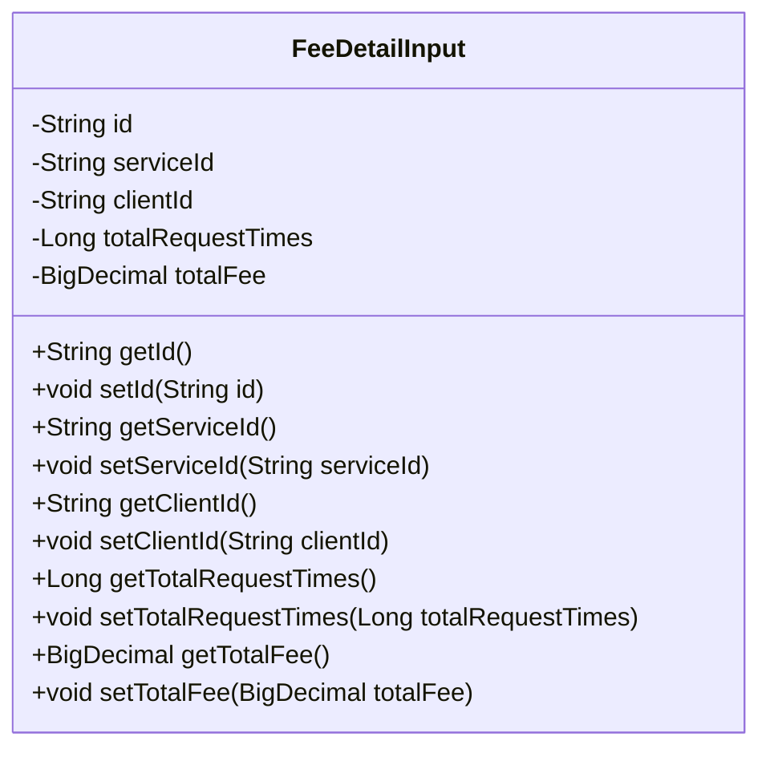

# 基础信息

|      |      |
|------|------|
| 名称 | FeeDetailInput |
| 编码语言 | .java |
| 代码路径 | WeFe/serving/serving-service/src/main/java/com/welab/wefe/serving/service/dto/FeeDetailInput.java |
| 包名 | com.welab.wefe.serving.service.dto |
| 依赖项 | ['java.math.BigDecimal', 'java.util.UUID'] |
| 概述说明 | FeeDetailInput类包含ID、服务ID、客户ID、总请求次数和总费用字段，提供getter和setter方法。 |

# 说明

FeeDetailInput类是一个用于存储费用明细输入数据的Java类。它包含五个私有属性：id（自动生成的UUID字符串，去除连字符）、serviceId（服务ID）、clientId（客户端ID）、totalRequestTimes（总请求次数）和totalFee（总费用）。每个属性都有对应的getter和setter方法，用于访问和修改属性值。

# 类列表 Class Summary

| 名称   | 类型  | 说明 |
|-------|------|-------------|
| FeeDetailInput | class | FeeDetailInput类包含ID、服务ID、客户ID、总请求次数和总费用字段，提供各属性的getter和setter方法。 |

## 类 FeeDetailInput

|      |      |
|------|------|
| 访问范围 | public |
| 类型 | class |
| 名称 | FeeDetailInput |
| 说明 | FeeDetailInput类包含ID、服务ID、客户ID、总请求次数和总费用字段，提供各属性的getter和setter方法。 |

### UML类图

该代码定义了一个名为FeeDetailInput的类，用于存储费用明细的输入数据。类中包含5个私有字段：id（自动生成的UUID）、serviceId（服务ID）、clientId（客户端ID）、totalRequestTimes（总请求次数）和totalFee（总费用），以及对应的getter和setter方法。这个类主要用于封装费用相关的数据，便于在系统中传递和处理。

### 内部方法调用关系图

```mermaid
graph TD
    A["类FeeDetailInput"]
    B["属性: String id = UUID.randomUUID().toString().replaceAll('-', '')"]
    C["属性: String serviceId"]
    D["属性: String clientId"]
    E["属性: Long totalRequestTimes"]
    F["属性: BigDecimal totalFee"]
    G["方法: String getId()"]
    H["方法: void setId(String id)"]
    I["方法: String getServiceId()"]
    J["方法: void setServiceId(String serviceId)"]
    K["方法: String getClientId()"]
    L["方法: void setClientId(String clientId)"]
    M["方法: Long getTotalRequestTimes()"]
    N["方法: void setTotalRequestTimes(Long totalRequestTimes)"]
    O["方法: BigDecimal getTotalFee()"]
    P["方法: void setTotalFee(BigDecimal totalFee)"]

    A --> B
    A --> C
    A --> D
    A --> E
    A --> F
    A --> G
    A --> H
    A --> I
    A --> J
    A --> K
    A --> L
    A --> M
    A --> N
    A --> O
    A --> P
```

该流程图展示了FeeDetailInput类的完整结构，包含5个私有属性和对应的getter/setter方法。特别值得注意的是id属性在初始化时通过UUID生成唯一标识符并移除连字符，其他属性均为可空状态。所有方法均遵循标准JavaBean规范，提供对属性的读写控制。类设计主要用于封装费用明细数据，包含服务ID、客户端ID、请求次数和总费用等核心字段。

### 字段列表 Field List

| 名称  | 类型  | 说明 |
|-------|-------|------|
| totalFee | BigDecimal | 私有BigDecimal类型变量totalFee，用于存储总费用。 |
| totalRequestTimes | Long | 私有长整型变量，记录总请求次数。 |
| clientId | String | 私有字符串变量clientId |
| serviceId | String | 私有字符串变量serviceId，用于存储服务标识。 |
| id = UUID.randomUUID().toString().replaceAll("-", "") | String | 生成随机UUID并去除连字符的字符串赋值给id变量。 |

### 方法列表

| 名称  | 类型  | 说明 |
|-------|-------|------|
| getTotalFee | BigDecimal | 获取总费用的方法，返回BigDecimal类型的totalFee值。 |
| setTotalRequestTimes | void | 这是一个Java方法，用于设置总请求次数的属性值。 |
| setClientId | void | 设置客户端ID的方法，将参数clientId赋值给当前对象的clientId属性。 |
| getServiceId | String | 获取serviceId的方法，直接返回serviceId字符串。 |
| setId | void | 设置对象ID的方法，将参数id赋值给当前对象的id属性。 |
| getId | String | 方法getId返回字符串类型的id。 |
| getClientId | String | 这是一个Java方法，返回字符串类型的clientId变量值。 |
| getTotalRequestTimes | Long | 获取请求总数的方法，返回值为长整型。 |
| setServiceId | void | 设置服务ID的方法，将输入参数赋值给类的serviceId成员变量。 |
| setTotalFee | void | 这是一个Java方法，用于设置类的totalFee属性，参数类型为BigDecimal。 |

