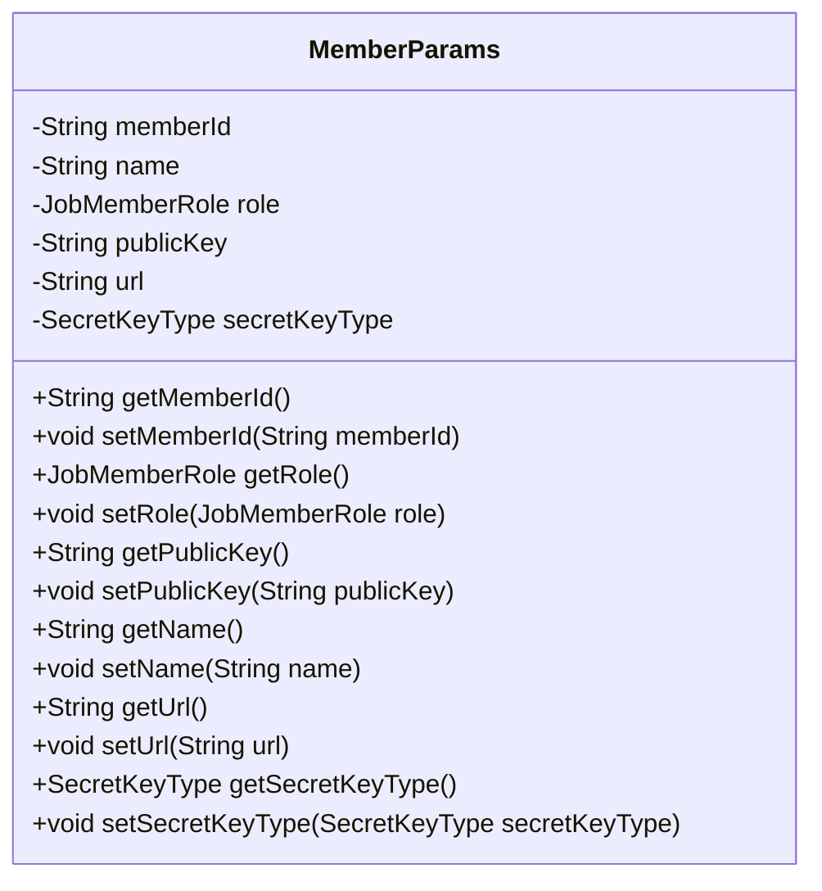

# 基础信息

|      |      |
|------|------|
| 名称 | MemberParams |
| 编码语言 | .java |
| 代码路径 | WeFe/serving/serving-service/src/main/java/com/welab/wefe/serving/service/dto/MemberParams.java |
| 包名 | com.welab.wefe.serving.service.dto |
| 依赖项 | ['com.welab.wefe.common.constant.SecretKeyType', 'com.welab.wefe.common.wefe.enums.JobMemberRole'] |
| 概述说明 | MemberParams类包含成员ID、名称、角色、公钥、URL和密钥类型属性，提供各属性的getter和setter方法。 |

# 说明

MemberParams类定义了成员参数的数据结构，包含成员ID、名称、角色、公钥、URL和密钥类型等属性。每个属性都有对应的getter和setter方法，用于获取和设置属性值。该类用于封装和管理成员相关的信息。

# 类列表 Class Summary

| 名称   | 类型  | 说明 |
|-------|------|-------------|
| MemberParams | class | MemberParams类包含成员ID、名称、角色、公钥、URL和密钥类型属性，提供各属性的getter和setter方法。 |

## 类 MemberParams

|      |      |
|------|------|
| 访问范围 | public |
| 类型 | class |
| 名称 | MemberParams |
| 说明 | MemberParams类包含成员ID、名称、角色、公钥、URL和密钥类型属性，提供各属性的getter和setter方法。 |

### UML类图

该代码定义了一个名为MemberParams的类，用于封装成员参数信息。类中包含六个私有字段：memberId、name、role、publicKey、url和secretKeyType，分别表示成员ID、名称、角色、公钥、URL和密钥类型。每个字段都有对应的getter和setter方法，用于获取和设置字段值。该类主要用于存储和传递成员相关的配置或属性数据，适用于需要管理多个成员信息的场景。

### 内部方法调用关系图

```mermaid
graph TD
    A["类MemberParams"]
    B["属性: String memberId"]
    C["属性: String name"]
    D["属性: JobMemberRole role"]
    E["属性: String publicKey"]
    F["属性: String url"]
    G["属性: SecretKeyType secretKeyType"]
    H["方法: getMemberId()"]
    I["方法: setMemberId(String)"]
    J["方法: getRole()"]
    K["方法: setRole(JobMemberRole)"]
    L["方法: getPublicKey()"]
    M["方法: setPublicKey(String)"]
    N["方法: getName()"]
    O["方法: setName(String)"]
    P["方法: getUrl()"]
    Q["方法: setUrl(String)"]
    R["方法: getSecretKeyType()"]
    S["方法: setSecretKeyType(SecretKeyType)"]

    A --> B
    A --> C
    A --> D
    A --> E
    A --> F
    A --> G
    A --> H
    A --> I
    A --> J
    A --> K
    A --> L
    A --> M
    A --> N
    A --> O
    A --> P
    A --> Q
    A --> R
    A --> S
```

这段代码定义了一个名为MemberParams的类，包含6个私有属性和对应的getter/setter方法。属性包括memberId、name、role、publicKey、url和secretKeyType，分别用于存储成员ID、名称、角色、公钥、URL和密钥类型。每个属性都有对应的获取和设置方法，提供了对这些属性的访问和修改接口。这是一个典型的数据传输对象（DTO）设计，用于封装和传递成员相关的参数信息。

### 字段列表 Field List

| 名称  | 类型  | 说明 |
|-------|-------|------|
| secretKeyType | SecretKeyType | 私有密钥类型变量secretKeyType。 |
| role | JobMemberRole | 私有成员变量role，类型为JobMemberRole。 |
| memberId | String | 定义私有字符串类型变量memberId。 |
| url | String | 声明一个私有字符串变量url。 |
| publicKey | String | 私有字符串变量publicKey，用于存储公钥。 |
| name | String | 私有字符串类型变量name。 |

### 方法列表

| 名称  | 类型  | 说明 |
|-------|-------|------|
| setPublicKey | void | 设置公钥的方法，将输入字符串赋值给类的publicKey成员变量。 |
| getMemberId | String | 方法返回成员ID字符串。 |
| getRole | JobMemberRole | 获取当前对象的角色信息。 |
| getName | String | 这是一个Java方法，返回私有变量name的值。 |
| setName | void | 这是一个Java方法，用于设置对象的名称属性。方法接受一个字符串参数name，并将其赋值给当前对象的name字段。 |
| getPublicKey | String | 获取公钥的方法，返回publicKey变量值。 |
| setMemberId | void | 设置成员ID的方法，将输入参数赋值给类的成员变量memberId。 |
| setRole | void | 方法setRole用于设置成员角色，参数为JobMemberRole类型，赋值给当前对象的role属性。 |
| getUrl | String | 方法返回字符串类型的url变量值。 |
| setUrl | void | 设置URL地址的方法，将传入的url参数赋值给类的url成员变量。 |
| getSecretKeyType | SecretKeyType | 获取密钥类型的方法，返回secretKeyType字段值。 |
| setSecretKeyType | void | 设置密钥类型的方法，将参数secretKeyType赋值给当前对象的secretKeyType属性。 |

