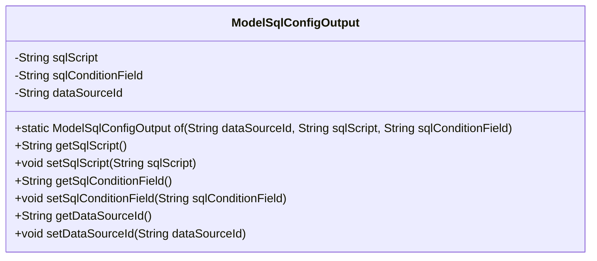
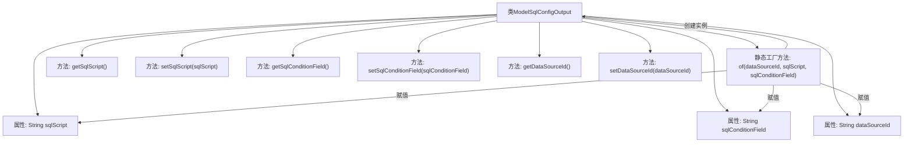

# 基础信息

|      |      |
|------|------|
| 名称 | ModelSqlConfigOutput |
| 编码语言 | .java |
| 代码路径 | WeFe/serving/serving-service/src/main/java/com/welab/wefe/serving/service/dto/ModelSqlConfigOutput.java |
| 包名 | com.welab.wefe.serving.service.dto |
| 依赖项 | [] |
| 概述说明 | ModelSqlConfigOutput类包含sqlScript、sqlConditionField和dataSourceId字段，提供getter/setter方法和静态工厂方法of。 |

# 说明

ModelSqlConfigOutput类用于封装SQL配置输出信息，包含三个私有字段：sqlScript表示SQL脚本，sqlConditionField表示SQL条件字段，dataSourceId表示数据源ID。提供静态工厂方法of用于创建实例，并为每个字段提供getter和setter方法以实现数据的读取和修改。

# 类列表 Class Summary

| 名称   | 类型  | 说明 |
|-------|------|-------------|
| ModelSqlConfigOutput | class | ModelSqlConfigOutput类包含sqlScript、sqlConditionField和dataSourceId字段，提供getter/setter方法和静态工厂方法of。 |

## 类 ModelSqlConfigOutput

|      |      |
|------|------|
| 访问范围 | public |
| 类型 | class |
| 名称 | ModelSqlConfigOutput |
| 说明 | ModelSqlConfigOutput类包含sqlScript、sqlConditionField和dataSourceId字段，提供getter/setter方法和静态工厂方法of。 |

### UML类图

这段代码定义了一个名为ModelSqlConfigOutput的类，用于存储SQL配置相关的输出信息。该类包含三个私有字段：sqlScript（SQL脚本）、sqlConditionField（SQL条件字段）和dataSourceId（数据源ID），并提供了对应的getter和setter方法。此外，还定义了一个静态工厂方法of，用于创建并初始化ModelSqlConfigOutput对象。这个类主要用于封装与SQL配置相关的数据，便于在程序中进行传递和处理。

### 内部方法调用关系图

该流程图展示了ModelSqlConfigOutput类的完整结构，包含三个私有属性和对应的getter/setter方法。核心是静态工厂方法of()，它通过链式操作完成对象创建和属性初始化。所有方法均围绕数据源ID、SQL脚本和条件字段这三个核心配置项展开，形成标准的数据封装模式。类设计符合JavaBean规范，支持灵活的参数设置和获取。

### 字段列表 Field List

| 名称  | 类型  | 说明 |
|-------|-------|------|
| dataSourceId | String | 私有字符串变量dataSourceId，用于标识数据源。 |
| sqlConditionField | String | 私有字符串变量sqlConditionField，用于存储SQL条件字段。 |
| sqlScript | String | 私有字符串变量sqlScript，用于存储SQL脚本。 |

### 方法列表

| 名称  | 类型  | 说明 |
|-------|-------|------|
| getDataSourceId | String | 获取数据源ID的方法，返回成员变量dataSourceId的值。 |
| getSqlConditionField | String | 方法返回sqlConditionField字符串。 |
| of | ModelSqlConfigOutput | 创建ModelSqlConfigOutput实例，设置数据源ID、SQL脚本和条件字段并返回。 |
| setSqlScript | void | 设置SQL脚本的方法，将输入参数赋值给类的sqlScript变量。 |
| setSqlConditionField | void | Java方法：设置SQL条件字段属性值。 |
| getSqlScript | String | 方法返回字符串类型的sqlScript属性值。 |
| setDataSourceId | void | 设置数据源ID的方法，将输入参数赋值给类的成员变量dataSourceId。 |

