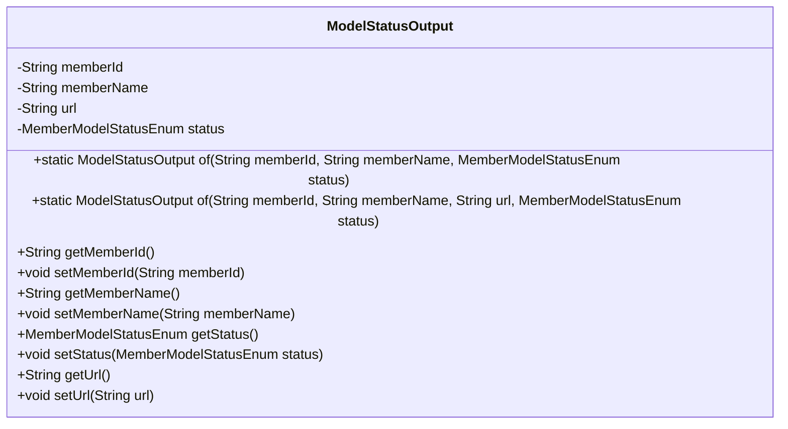

# 基础信息

|      |      |
|------|------|
| 名称 | ModelStatusOutput |
| 编码语言 | .java |
| 代码路径 | WeFe/serving/serving-service/src/main/java/com/welab/wefe/serving/service/dto/ModelStatusOutput.java |
| 包名 | com.welab.wefe.serving.service.dto |
| 依赖项 | ['com.welab.wefe.serving.service.enums.MemberModelStatusEnum'] |
| 概述说明 | ModelStatusOutput类包含成员ID、名称、URL和状态字段，提供两种静态构建方法和对应的getter/setter方法。 |

# 说明

ModelStatusOutput类用于表示成员模型状态信息，包含成员ID、名称、URL和状态枚举属性。提供两种静态工厂方法of，分别支持带URL和不带URL的实例创建。类中包含各属性的getter和setter方法，便于访问和修改成员变量。

# 类列表 Class Summary

| 名称   | 类型  | 说明 |
|-------|------|-------------|
| ModelStatusOutput | class | ModelStatusOutput类包含成员ID、名称、URL和状态枚举，提供两种静态构建方法和对应的getter/setter。 |

## 类 ModelStatusOutput

|      |      |
|------|------|
| 访问范围 | public |
| 类型 | class |
| 名称 | ModelStatusOutput |
| 说明 | ModelStatusOutput类包含成员ID、名称、URL和状态枚举，提供两种静态构建方法和对应的getter/setter。 |

### UML类图

这段代码定义了一个名为ModelStatusOutput的类，用于封装成员模型状态信息。该类包含四个私有字段：memberId、memberName、url和status，分别表示成员ID、成员名称、URL链接和状态枚举。提供了两个静态工厂方法of()用于创建对象实例，以及各字段的getter和setter方法。该类的主要作用是统一封装和传递成员模型的状态信息，支持通过不同参数组合创建对象实例。

### 内部方法调用关系图

```mermaid
graph TD
    A["类ModelStatusOutput"]
    B["属性: String memberId"]
    C["属性: String memberName"]
    D["属性: String url"]
    E["属性: MemberModelStatusEnum status"]
    F["静态方法: of(memberId, memberName, status)"]
    G["静态方法: of(memberId, memberName, url, status)"]
    H["方法: getMemberId()"]
    I["方法: setMemberId()"]
    J["方法: getMemberName()"]
    K["方法: setMemberName()"]
    L["方法: getStatus()"]
    M["方法: setStatus()"]
    N["方法: getUrl()"]
    O["方法: setUrl()"]

    A --> B
    A --> C
    A --> D
    A --> E
    A --> F
    A --> G
    A --> H
    A --> I
    A --> J
    A --> K
    A --> L
    A --> M
    A --> N
    A --> O
```

该流程图展示了ModelStatusOutput类的完整结构，包含4个私有属性和10个方法。两个静态工厂方法of()用于不同参数组合的对象创建，8个标准getter/setter方法用于属性访问控制。类设计采用Builder模式思想，通过重载of()方法提供灵活的对象构造方式，同时封装属性保证数据安全性。所有方法均围绕成员状态管理展开，形成高内聚的类结构。

### 字段列表 Field List

| 名称  | 类型  | 说明 |
|-------|-------|------|
| memberId | String | 成员ID字符串变量 |
| memberName | String | 成员变量名称为memberName，类型为String，访问权限为private。 |
| url | String | 声明一个私有字符串变量url。 |
| status | MemberModelStatusEnum | 成员状态枚举类型私有变量。 |

### 方法列表

| 名称  | 类型  | 说明 |
|-------|-------|------|
| of | ModelStatusOutput | 静态方法of创建ModelStatusOutput实例，设置memberId、memberName和status属性后返回。 |
| getMemberName | String | 获取成员名称的方法，返回成员变量memberName的值。 |
| of | ModelStatusOutput | 静态方法of创建ModelStatusOutput实例，设置memberId、memberName、url和status字段并返回。 |
| setUrl | void | 设置URL字符串的方法，将参数url赋值给类的url成员变量。 |
| getMemberId | String | 获取成员ID的方法，返回字符串类型的memberId。 |
| setMemberName | void | 设置成员变量memberName的值。 |
| getStatus | MemberModelStatusEnum | 获取成员状态枚举值的方法。 |
| setStatus | void | 设置成员模型状态的方法，参数为状态枚举类型。 |
| getUrl | String | 获取URL的公共方法，返回字符串类型的url变量。 |
| setMemberId | void | 设置成员ID的方法，将参数memberId赋值给当前对象的memberId属性。 |

