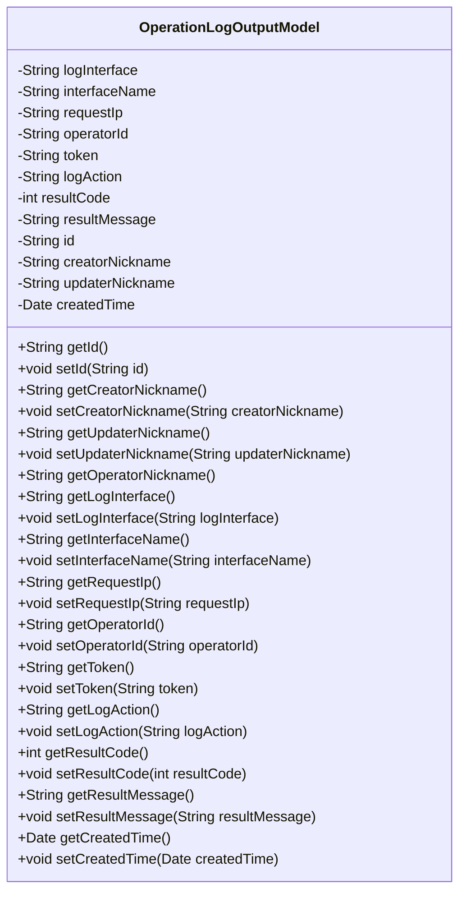
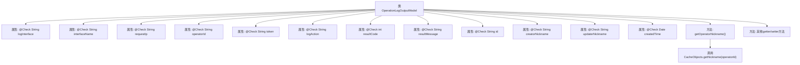

# 基础信息

|      |      |
|------|------|
| 名称 | OperationLogOutputModel |
| 编码语言 | .java |
| 代码路径 | WeFe/serving/serving-service/src/main/java/com/welab/wefe/serving/service/dto/OperationLogOutputModel.java |
| 包名 | com.welab.wefe.serving.service.dto |
| 依赖项 | ['java.util.Date', 'com.welab.wefe.common.fieldvalidate.annotation.Check', 'com.welab.wefe.serving.service.service.CacheObjects'] |
| 概述说明 | 操作日志输出模型类，包含接口、IP、操作人、行为、结果等字段及getter/setter方法。 |

# 说明

OperationLogOutputModel类定义了操作日志输出的数据模型，包含请求接口、接口名称、请求IP、操作人员编号、请求token、操作行为、请求结果编码、请求结果、全局唯一标识、创建者昵称、修改者昵称和创建时间等字段。每个字段都有对应的getter和setter方法，用于获取和设置字段值。其中operatorNickname通过CacheObjects.getNickname方法动态获取。该类用于记录和传输操作日志的详细信息。

# 类列表 Class Summary

| 名称   | 类型  | 说明 |
|-------|------|-------------|
| OperationLogOutputModel | class | 操作日志输出模型类，包含接口、IP、操作人、行为、结果等字段及getter/setter方法。 |

## 类 OperationLogOutputModel

|      |      |
|------|------|
| 访问范围 | public |
| 类型 | class |
| 名称 | OperationLogOutputModel |
| 说明 | 操作日志输出模型类，包含接口、IP、操作人、行为、结果等字段及getter/setter方法。 |

### UML类图

这段代码定义了一个名为`OperationLogOutputModel`的类，用于记录操作日志的输出模型。该类包含多个私有字段，如日志接口、接口名称、请求IP、操作人员编号等，每个字段都有对应的getter和setter方法。其中`getOperatorNickname`方法通过`operatorId`从缓存中获取操作人员昵称。该类主要用于封装操作日志的相关信息，便于在系统中传递和处理日志数据。

### 内部方法调用关系图

该流程图展示了OperationLogOutputModel类的结构，包含12个带有@Check注解的属性和对应的getter/setter方法。其中getOperatorNickname()方法通过operatorId调用CacheObjects.getNickname()获取昵称，其他属性均为标准封装字段。类设计用于记录操作日志的详细数据模型，每个字段都通过注解标注了业务含义。

### 字段列表 Field List

| 名称  | 类型  | 说明 |
|-------|-------|------|
| logAction | String | 代码定义了一个私有字符串变量logAction，用于记录操作行为，并通过@Check注解进行校验。 |
| createdTime | Date | 字段createdTime标注为检查项"创建时间"，类型为Date。 |
| token | String | 代码定义私有字符串变量token，并添加请求token的检查注解。 |
| resultCode | int | 私有整型变量resultCode，用于存储请求结果编码，标注为@Check。 |
| id | String | 私有字符串变量id，标注为全局唯一标识。 |
| requestIp | String | 字段requestIp用于校验请求IP，标注为@Check。 |
| updaterNickname | String | 字段updaterNickname用于存储修改者昵称，通过@Check注解进行校验。 |
| resultMessage | String | 类成员变量resultMessage，用于存储请求结果，标注为@Check校验。 |
| creatorNickname | String | 定义了一个私有字符串变量creatorNickname，并添加了名为"创建者昵称"的检查注解。 |
| interfaceName | String | 定义接口名称检查注解字段。 |
| logInterface | String | 代码定义了一个名为logInterface的私有字符串变量，并标注了请求接口的检查注解。 |
| operatorId | String | 字段operatorId标注了检查注解，用于验证操作人员编号。 |

### 方法列表

| 名称  | 类型  | 说明 |
|-------|-------|------|
| getOperatorId | String | 获取操作员ID的方法，返回字符串类型的operatorId。 |
| getOperatorNickname | String | 方法getOperatorNickname通过operatorId从缓存获取昵称并返回。 |
| setUpdaterNickname | void | 设置更新者昵称的方法，将参数赋值给成员变量updaterNickname。 |
| setId | void | 设置对象ID的方法，将参数id赋值给当前对象的id属性。 |
| getToken | String | 获取token的字符串方法。 |
| setResultMessage | void | 这是一个Java方法，用于设置类的resultMessage属性值。方法接收一个字符串参数resultMessage，并将其赋值给类的同名成员变量。 |
| setResultCode | void | 这是一个Java方法，用于设置类的resultCode属性值。方法接收一个整型参数resultCode，并将其赋值给类的同名成员变量。 |
| getRequestIp | String | 获取请求IP的方法，返回requestIp变量值。 |
| getLogAction | String | 这是一个Java方法，返回字符串类型的logAction属性值。 |
| getLogInterface | String | 获取日志接口的方法，返回logInterface变量。 |
| setToken | void | 设置token字符串值的方法。 |
| getCreatorNickname | String | 获取创建者昵称的方法，返回字符串类型的creatorNickname值。 |
| setCreatorNickname | void | 设置创建者昵称的方法，将输入参数赋值给类成员变量creatorNickname。 |
| getUpdaterNickname | String | 获取更新者昵称的方法，返回字符串类型的updaterNickname值。 |
| getId | String | 获取对象ID的方法，返回字符串类型的id值。 |
| getResultMessage | String | 获取结果消息的方法，返回字符串类型变量resultMessage。 |
| setRequestIp | void | 这是一个Java方法，用于设置请求IP地址，将传入的requestIp参数赋值给类的成员变量requestIp。 |
| setLogAction | void | 这是一个Java方法，用于设置logAction属性的值。方法接受一个字符串参数logAction，并将其赋值给类的同名成员变量。 |
| getResultCode | int | 获取返回结果代码的方法，直接返回resultCode值。 |
| setLogInterface | void | 定义了一个公共方法setLogInterface，用于设置logInterface属性的值。 |
| setOperatorId | void | 设置操作员ID的方法，将参数operatorId赋值给类的同名成员变量。 |
| getInterfaceName | String | 获取接口名称的方法，返回字符串类型变量interfaceName。 |
| setInterfaceName | void | 设置接口名称的方法，将参数interfaceName赋值给类的成员变量interfaceName。 |
| getCreatedTime | Date | 获取创建时间的方法，返回Date类型变量createdTime。 |
| setCreatedTime | void | 设置创建时间的方法，参数为Date类型。 |

