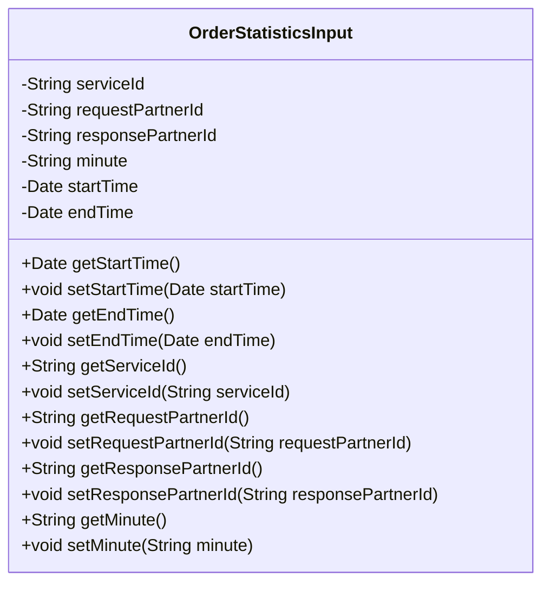

# 基础信息

|      |      |
|------|------|
| 名称 | OrderStatisticsInput |
| 编码语言 | .java |
| 代码路径 | WeFe/serving/serving-service/src/main/java/com/welab/wefe/serving/service/dto/OrderStatisticsInput.java |
| 包名 | com.welab.wefe.serving.service.dto |
| 依赖项 | ['java.util.Date'] |
| 概述说明 | OrderStatisticsInput类包含服务ID、请求方ID、响应方ID、分钟、开始时间和结束时间字段，提供各字段的getter和setter方法。 |

# 说明

OrderStatisticsInput类定义了订单统计查询的输入参数，包含服务ID、请求合作方ID、响应合作方ID、分钟数、开始时间和结束时间等字段。每个字段都有对应的getter和setter方法用于访问和修改属性值。

# 类列表 Class Summary

| 名称   | 类型  | 说明 |
|-------|------|-------------|
| OrderStatisticsInput | class | 订单统计输入类，包含服务ID、请求方ID、响应方ID、分钟、开始时间和结束时间字段及其getter和setter方法。 |

## 类 OrderStatisticsInput

|      |      |
|------|------|
| 访问范围 | public |
| 类型 | class |
| 名称 | OrderStatisticsInput |
| 说明 | 订单统计输入类，包含服务ID、请求方ID、响应方ID、分钟、开始时间和结束时间字段及其getter和setter方法。 |

### UML类图

该类图展示了一个名为OrderStatisticsInput的Java类，主要用于封装订单统计相关的输入参数。该类包含6个私有字段：serviceId（服务ID）、requestPartnerId（请求方ID）、responsePartnerId（响应方ID）、minute（分钟）、startTime（开始时间）和endTime（结束时间），并为每个字段提供了对应的getter和setter方法。这些方法允许外部代码访问和修改这些私有字段的值，实现了数据的封装和安全性。

### 内部方法调用关系图

```mermaid
graph TD
    A["类OrderStatisticsInput"]
    B["属性: String serviceId"]
    C["属性: String requestPartnerId"]
    D["属性: String responsePartnerId"]
    E["属性: String minute"]
    F["属性: Date startTime"]
    G["属性: Date endTime"]
    H["方法: Date getStartTime()"]
    I["方法: void setStartTime(Date startTime)"]
    J["方法: Date getEndTime()"]
    K["方法: void setEndTime(Date endTime)"]
    L["方法: String getServiceId()"]
    M["方法: void setServiceId(String serviceId)"]
    N["方法: String getRequestPartnerId()"]
    O["方法: void setRequestPartnerId(String requestPartnerId)"]
    P["方法: String getResponsePartnerId()"]
    Q["方法: void setResponsePartnerId(String responsePartnerId)"]
    R["方法: String getMinute()"]
    S["方法: void setMinute(String minute)"]

    A --> B
    A --> C
    A --> D
    A --> E
    A --> F
    A --> G
    A --> H
    A --> I
    A --> J
    A --> K
    A --> L
    A --> M
    A --> N
    A --> O
    A --> P
    A --> Q
    A --> R
    A --> S
```

这段代码定义了一个名为OrderStatisticsInput的类，主要用于存储和获取订单统计相关的输入参数。该类包含7个私有属性，分别是serviceId、requestPartnerId、responsePartnerId、minute、startTime和endTime，并为每个属性提供了对应的getter和setter方法。这些方法允许外部代码安全地访问和修改这些属性值，实现了良好的封装性。整个类结构清晰，功能明确，适合用于订单统计数据的传递和处理。

### 字段列表 Field List

| 名称  | 类型  | 说明 |
|-------|-------|------|
| minute | String | 声明一个私有字符串变量minute。 |
| endTime | Date | 私有日期类型变量endTime |
| responsePartnerId | String | 声明一个私有字符串变量responsePartnerId。 |
| requestPartnerId | String | 声明私有字符串变量requestPartnerId。 |
| serviceId | String | 私有字符串变量serviceId，用于存储服务标识。 |
| startTime | Date | 私有日期类型变量startTime，用于记录起始时间。 |

### 方法列表

| 名称  | 类型  | 说明 |
|-------|-------|------|
| getStartTime | Date | 获取开始时间的公共方法，返回Date类型。 |
| getResponsePartnerId | String | 获取响应合作方ID的方法，返回值为responsePartnerId。 |
| setResponsePartnerId | void | 设置响应合作方ID的方法，将输入参数赋值给类的成员变量responsePartnerId。 |
| getMinute | String | 获取分钟值的字符串方法。 |
| setMinute | void | 设置分钟值的方法，将参数minute赋值给当前对象的minute属性。 |
| setEndTime | void | 设置结束时间的方法，将传入的日期参数赋值给对象的endTime属性。 |
| getServiceId | String | 获取serviceId的公共方法，返回字符串类型的serviceId。 |
| setStartTime | void | 设置开始时间的方法，将参数startTime赋值给类的成员变量startTime。 |
| setRequestPartnerId | void | 设置请求合作方ID的方法，将参数requestPartnerId赋值给类的同名成员变量。 |
| getEndTime | Date | 方法getEndTime返回endTime日期对象。 |
| getRequestPartnerId | String | 获取请求合作方ID的方法，返回字符串类型的requestPartnerId。 |
| setServiceId | void | 设置服务ID的方法，将输入参数赋值给类的serviceId成员变量。 |

