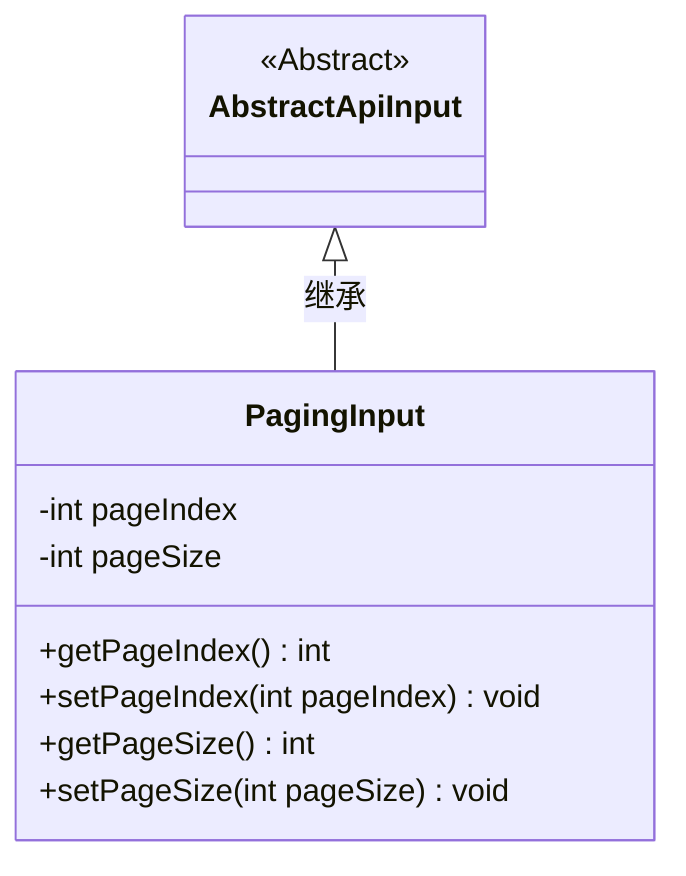
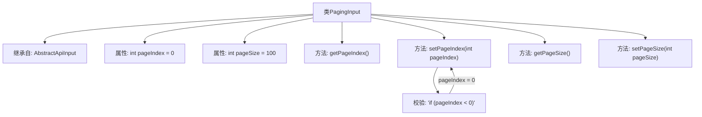

# 基础信息

|      |      |
|------|------|
| 名称 | PagingInput |
| 编码语言 | .java |
| 代码路径 | WeFe/serving/serving-service/src/main/java/com/welab/wefe/serving/service/dto/PagingInput.java |
| 包名 | com.welab.wefe.serving.service.dto |
| 依赖项 | ['com.welab.wefe.common.fieldvalidate.annotation.Check', 'com.welab.wefe.common.web.dto.AbstractApiInput'] |
| 概述说明 | 分页输入类，包含页码和每页数量，页码默认为0，最小为0，每页数量默认为100。 |

# 说明

PagingInput类继承自AbstractApiInput，用于处理分页输入参数。包含两个属性：pageIndex表示页码，0为第一页，默认值为0，若设置值小于0会自动修正为0；pageSize表示每页大小，默认值为100。提供getter和setter方法，setPageIndex方法包含参数校验逻辑。

# 类列表 Class Summary

| 名称   | 类型  | 说明 |
|-------|------|-------------|
| PagingInput | class | 分页输入类，包含页码和页大小属性，页码默认为0（第一页），页大小默认为100，提供getter/setter方法，页码小于0时自动设为0。 |

## 类 PagingInput

|      |      |
|------|------|
| 访问范围 | public |
| 类型 | class |
| 名称 | PagingInput |
| 说明 | 分页输入类，包含页码和页大小属性，页码默认为0（第一页），页大小默认为100，提供getter/setter方法，页码小于0时自动设为0。 |

### UML类图

这段代码展示了一个分页输入类PagingInput，它继承自抽象类AbstractApiInput。PagingInput包含两个私有属性：pageIndex表示页码（0为第一页），pageSize表示每页大小（默认100）。类中提供了这两个属性的getter和setter方法，其中setPageIndex方法包含输入验证，确保页码不小于0。这个类主要用于封装分页查询参数，是API输入参数的基类实现。

### 内部方法调用关系图

该流程图展示了PagingInput类的结构，它是一个继承自AbstractApiInput的分页输入参数类。主要包含pageIndex和pageSize两个属性，分别表示页码和每页大小，其中pageIndex默认值为0且通过setter方法确保不小于0。流程图清晰地呈现了类继承关系、属性定义、方法调用以及参数校验逻辑，体现了对分页参数的封装和基本验证机制。

### 字段列表 Field List

| 名称  | 类型  | 说明 |
|-------|-------|------|
| pageSize = 100 | int | 定义私有整型变量pageSize，初始值为100。 |
| pageIndex = 0 | int | 页码索引，0表示第一页。 |

### 方法列表

| 名称  | 类型  | 说明 |
|-------|-------|------|
| getPageSize | int | 获取pageSize值的公共方法，返回整数类型。 |
| setPageIndex | void | 设置页码，若小于0则设为0。 |
| getPageIndex | int | 获取当前页码的方法，返回整型变量pageIndex的值。 |
| setPageSize | void | 设置每页显示数量的方法，参数为pageSize。 |

