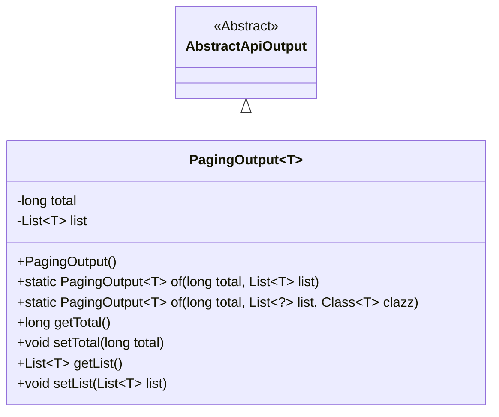
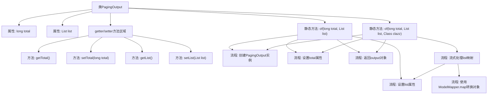

# 基础信息

|      |      |
|------|------|
| 名称 | PagingOutput |
| 编码语言 | .java |
| 代码路径 | WeFe/serving/serving-service/src/main/java/com/welab/wefe/serving/service/dto/PagingOutput.java |
| 包名 | com.welab.wefe.serving.service.dto |
| 依赖项 | ['com.welab.wefe.common.web.dto.AbstractApiOutput', 'com.welab.wefe.common.web.util.ModelMapper', 'java.util.List', 'java.util.stream.Collectors'] |
| 概述说明 | 分页输出类，包含总数和列表数据，提供两种创建方法：直接赋值和自动映射数据库实体到DTO。支持总数和列表的获取与设置。 |

# 说明

PagingOutput是一个泛型类，继承自AbstractApiOutput，用于封装分页数据。包含两个核心属性：total表示总记录数，list存储当前页数据列表。提供了两个静态工厂方法：of(long total, List<T> list)直接创建实例；of(long total, List<?> list, Class<T> clazz)支持通过ModelMapper将数据库实体自动映射为DTO对象。类中还包含标准的getter和setter方法用于访问和修改属性。

# 类列表 Class Summary

| 名称   | 类型  | 说明 |
|-------|------|-------------|
| PagingOutput | class | 分页输出类PagingOutput，包含总数和列表数据，提供两种创建方法：直接赋值和自动映射数据库实体到DTO。支持getter/setter操作。 |

## 类 PagingOutput

|      |      |
|------|------|
| 访问范围 | public |
| 类型 | class |
| 名称 | PagingOutput |
| 说明 | 分页输出类PagingOutput，包含总数和列表数据，提供两种创建方法：直接赋值和自动映射数据库实体到DTO。支持getter/setter操作。 |

### UML类图

类图描述：
PagingOutput<T>是一个泛型类，继承自AbstractApiOutput抽象类，用于处理分页数据输出。它包含两个核心字段：total表示总记录数，list存储当前页的数据列表。类提供了两个静态工厂方法of()，其中一个支持直接传入数据列表，另一个支持通过ModelMapper将原始对象列表映射为指定类型。类还包含标准的getter/setter方法用于字段访问和修改。

### 内部方法调用关系图

这段代码是用于分页输出的通用类，继承自AbstractApiOutput。它提供了两种静态工厂方法：一种直接接收列表数据，另一种通过ModelMapper自动映射数据库实体到DTO。类包含total和list两个核心属性，分别表示总记录数和当前页数据列表，并提供了相应的getter/setter方法。流程图清晰展示了类的结构、方法调用关系和数据处理流程，特别是第二种工厂方法中的流式映射处理过程。

### 字段列表 Field List

| 名称  | 类型  | 说明 |
|-------|-------|------|
| total | long | 私有长整型变量total，用于存储总数。 |
| list | List<T> | 私有泛型列表变量list。 |

### 方法列表

| 名称  | 类型  | 说明 |
|-------|-------|------|
| of | PagingOutput<T> | 这是一个静态工厂方法，用于创建分页输出对象，设置总记录数和数据列表后返回该对象。 |
| getTotal | long | 获取total值的公共方法，返回long类型。 |
| of | PagingOutput<T> | 这是一个静态泛型方法，用于创建分页输出对象。方法接收总记录数、数据列表和目标类类型，通过流处理将列表元素映射为目标类型，最终返回包含总数和转换后列表的分页输出对象。 |
| setTotal | void | 这是一个Java方法，用于设置类成员变量total的值。方法接受一个long类型参数，并将其赋值给this.total。 |
| getList | List<T> | 返回列表list的引用。 |
| setList | void | 这是一个Java方法，用于设置类的List类型成员变量list的值。方法接受一个泛型List参数，并将其赋值给当前对象的list属性。 |

